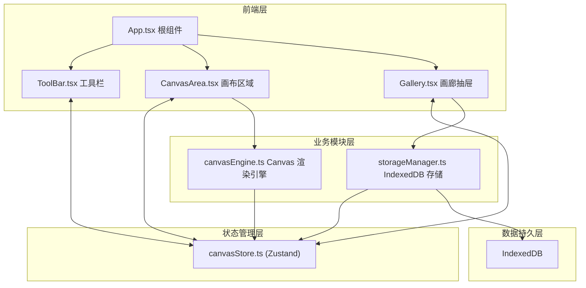
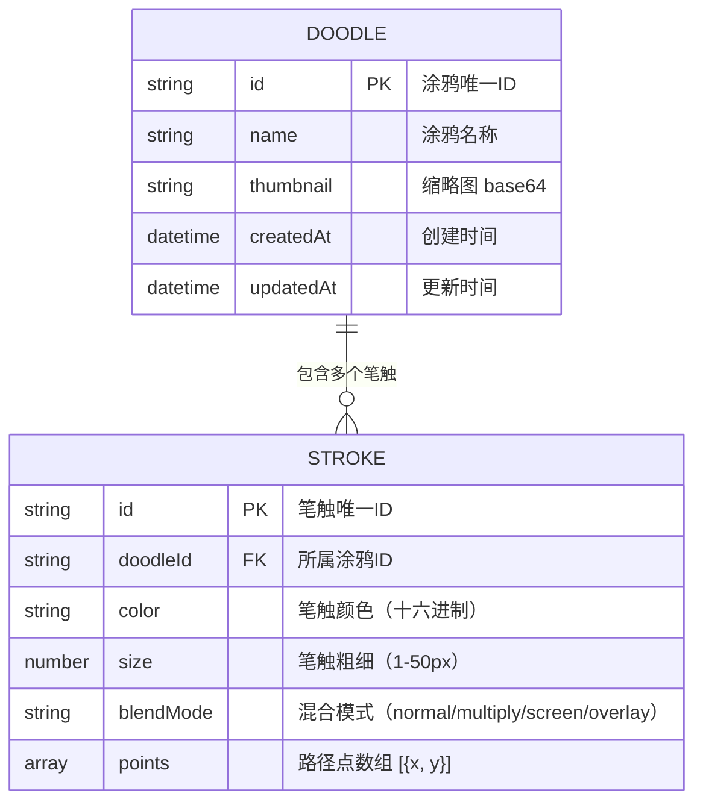

## 1. 架构设计



## 2. 技术描述

- **前端框架**：React@18 + React-DOM@18
- **构建工具**：Vite（含 @vitejs/plugin-react）
- **开发语言**：TypeScript（严格模式，target es2020）
- **状态管理**：Zustand（单一 Store 共享画布状态）
- **数据存储**：IndexedDB（封装为 storageManager 模块，异步操作不阻塞 UI）
- **唯一 ID**：uuid
- **图标库**：lucide-react（线性图标）

## 3. 路由定义

| 路由 | 用途 |
|-----|------|
| / | 主页面，包含工具栏、画布、画廊 |

本应用为单页面应用，不涉及多路由切换。

## 4. 数据模型

### 4.1 数据模型定义



### 4.2 TypeScript 类型定义

```typescript
type BlendMode = 'normal' | 'multiply' | 'screen' | 'overlay';

interface Point {
  x: number;
  y: number;
}

interface Stroke {
  id: string;
  color: string;
  size: number;
  blendMode: BlendMode;
  points: Point[];
}

interface Doodle {
  id: string;
  name: string;
  thumbnail: string;
  strokes: Stroke[];
  createdAt: number;
  updatedAt: number;
}

interface Viewport {
  offsetX: number;
  offsetY: number;
}

interface BrushSettings {
  color: string;
  size: number;
  blendMode: BlendMode;
}
```

### 4.3 Zustand Store 结构

```typescript
interface CanvasState {
  // 画笔设置
  brush: BrushSettings;
  setBrushColor: (color: string) => void;
  setBrushSize: (size: number) => void;
  setBlendMode: (mode: BlendMode) => void;

  // 当前涂鸦
  currentDoodleId: string | null;
  strokes: Stroke[];
  undoStack: Stroke[][];
  redoStack: Stroke[][];

  // 视口
  viewport: Viewport;
  setViewport: (vp: Viewport) => void;

  // 笔触操作
  startStroke: (stroke: Stroke) => void;
  appendStrokePoint: (point: Point) => void;
  finishStroke: () => void;
  undo: () => void;
  redo: () => void;

  // 涂鸦操作
  saveDoodle: () => Promise<void>;
  loadDoodle: (id: string) => Promise<void>;
  deleteDoodle: (id: string) => Promise<void>;
  exportDoodle: (id: string) => void;

  // 画廊
  gallery: Doodle[];
  galleryPage: number;
  galleryTotal: number;
  loadGallery: (page?: number) => Promise<void>;
  toggleGallery: () => void;
  isGalleryOpen: boolean;
}
```

### 4.4 IndexedDB Schema

```javascript
// 数据库：flowscape_db，版本：1
// Object Store：doodles（主键：id，索引：createdAt）
{
  id: string,           // 主键
  name: string,
  thumbnail: string,    // 100x80 base64
  strokes: Stroke[],    // 所有笔触数据
  createdAt: number,    // 索引，倒序排列
  updatedAt: number
}
```

## 5. 核心模块说明

### 5.1 canvasEngine.ts（Canvas 渲染引擎）
- `initialize(canvas: HTMLCanvasElement, ctx: CanvasRenderingContext2D)`：初始化画布尺寸 2000x2000
- `drawStroke(ctx, stroke, viewport)`：绘制单条笔触（含视口坐标转换）
- `redrawAll(ctx, strokes, viewport)`：重绘全部笔触（撤销/重做后）
- `clearCanvas(ctx)`：清空画布
- `generateThumbnail(canvas, size)`：生成 100x80 缩略图
- 使用 `requestAnimationFrame` 保证 60FPS 渲染

### 5.2 storageManager.ts（IndexedDB 存储管理）
- `initDB()`：初始化数据库和 ObjectStore
- `saveDoodle(doodle: Doodle)`：异步保存/更新涂鸦
- `getDoodle(id: string)`：获取单条涂鸦详情
- `listDoodles(page, pageSize)`：分页获取涂鸦列表（每页 20 条）
- `deleteDoodle(id: string)`：删除涂鸦
- `exportDoodle(id: string)`：导出为 JSON 文件下载

### 5.3 性能优化策略
- 绘制使用 `requestAnimationFrame` 防抖
- 缩略图生成异步执行
- IndexedDB 所有操作封装为 Promise，异步不阻塞 UI
- 画廊分页加载（每页 20 条）
- 撤销/重做栈限制最多 20 步，防止内存溢出
