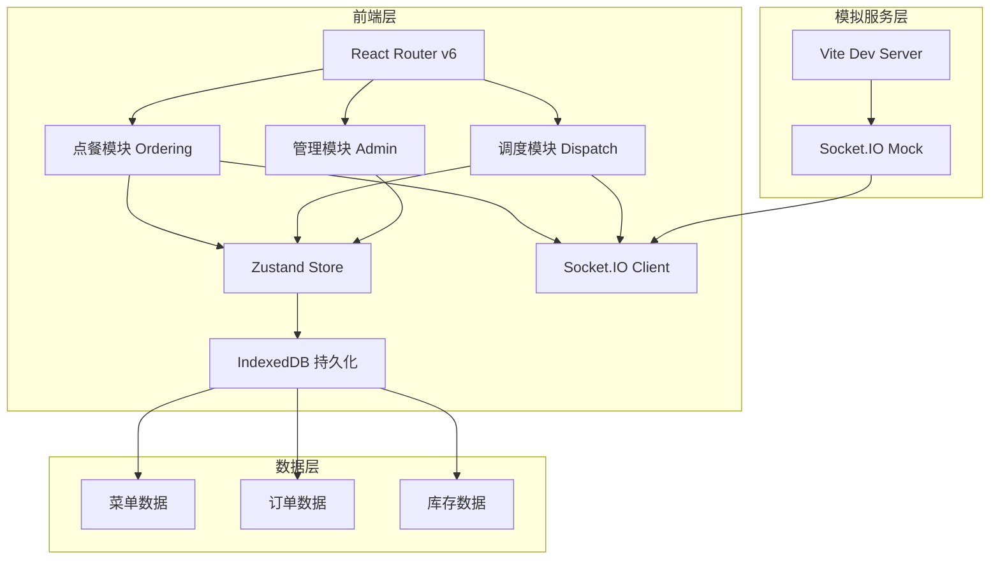
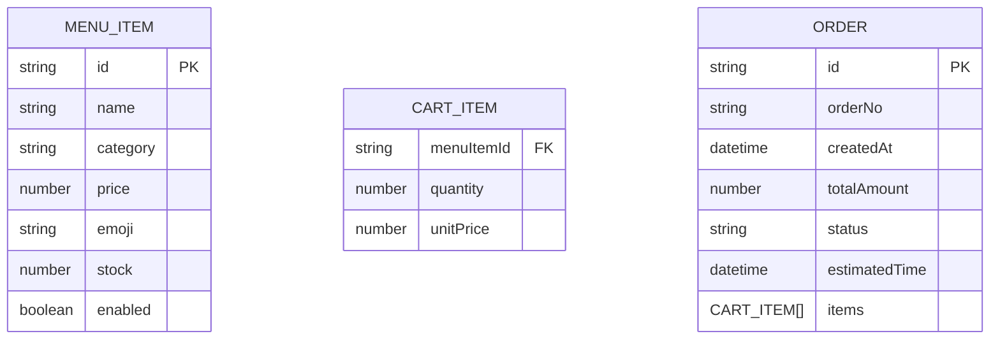

## 1. 架构设计



## 2. 技术描述
- 前端：React@18 + TypeScript + Vite
- 状态管理：Zustand（封装IndexedDB持久化）
- 路由：React Router v6
- 实时通信：socket.io-client@4（模拟服务端）
- 数据持久化：IndexedDB（浏览器本地存储）
- 工具库：uuid（订单号生成）
- UI框架：原生CSS + CSS Variables（无Tailwind，遵循用户需求）
- 图标：Google Material Design Icons

## 3. 路由定义
| 路由 | 组件 | 用途 |
|------|------|------|
| / | CustomerScreen | 顾客点餐主页面 |
| /order-confirmation/:orderId | OrderConfirmation | 订单确认页面 |
| /kitchen | KitchenDisplay | 厨师调度大屏 |
| /admin | AdminPanel | 经理后台管理 |

## 4. 数据模型

### 4.1 数据模型定义



### 4.2 类型定义
```typescript
export enum OrderStatus {
  PENDING = 'pending',
  COOKING = 'cooking',
  COMPLETED = 'completed'
}

export interface MenuItem {
  id: string;
  name: string;
  category: 'burger' | 'snack' | 'drink';
  price: number;
  emoji: string;
  stock: number;
  enabled: boolean;
}

export interface CartItem {
  menuItemId: string;
  name: string;
  quantity: number;
  unitPrice: number;
  emoji: string;
}

export interface Order {
  id: string;
  orderNo: string;
  createdAt: number;
  totalAmount: number;
  status: OrderStatus;
  estimatedTime: number;
  items: CartItem[];
}
```

## 5. 模块结构

```
src/
├── main.tsx              # 应用入口
├── shared/
│   └── types.ts          # 共用类型定义
├── ordering/
│   ├── CustomerScreen.tsx    # 点餐界面
│   ├── CartStore.ts          # 购物车状态管理
│   └── OrderConfirmation.tsx # 订单确认页
├── dispatch/
│   ├── KitchenDisplay.tsx    # 厨师大屏
│   └── OrderManager.ts       # 订单调度逻辑
├── admin/
│   └── AdminPanel.tsx        # 经理后台
└── components/
    ├── RoleSwitcher.tsx      # 角色切换
    ├── Toast.tsx             # Toast通知
    └── MenuCard.tsx          # 商品卡片组件
```

## 6. 核心数据流

1. **点餐流程**：CustomerScreen → CartStore.addItem → CartStore.submitOrder → Socket.IO emit 'new_order' → IndexedDB 存储
2. **调度流程**：OrderManager 监听 'new_order' 事件 → 分配预计时间 → KitchenDisplay 更新视图 → completeOrder → 状态更新
3. **跨模块通信**：Zustand Store 作为单一数据源，所有模块订阅同一 store
4. **数据同步**：每2秒轮询 IndexedDB 检查新订单，模拟多标签页实时同步

## 7. 性能优化策略
- 购物车操作使用 Zustand 不可变更新，确保<50ms响应
- 订单卡片动画使用 CSS transform，保证60fps帧率
- 菜单列表使用 React.memo 优化重渲染
- IndexedDB 操作异步化，避免阻塞主线程
- 图片使用占位符，避免网络请求延迟
