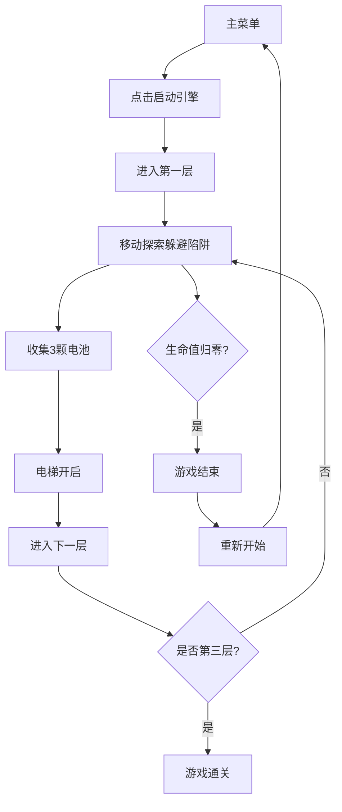

## 1. 产品概述

SteamGearPunks是一款蒸汽朋克风格的2D解谜冒险游戏，玩家控制地精探险家在一座被遗忘的多层机械工厂中探索，躲避陷阱、破解机关、收集电池碎片为电梯充能。

- 面向热爱解谜和平台跳跃类游戏的玩家，提供沉浸式的蒸汽朋克工业风冒险体验
- 产品价值：结合精巧的机关设计与流畅的操作手感，打造独特的维多利亚工业美学游戏体验

## 2. 核心功能

### 2.1 用户角色

| 角色 | 注册方式 | 核心权限 |
|------|----------|----------|
| 玩家 | 无需注册，直接开始 | 完整游戏体验，包含所有关卡与功能 |

### 2.2 功能模块

1. **主菜单界面**：蒸汽朋克风格启动界面，背景齿轮动画，开始按钮
2. **游戏主界面**：三层关卡地图探索，Canvas实时渲染
3. **HUD界面**：生命值显示、层数与电池收集数、小地图
4. **游戏结束界面**：失败/通关画面，重新开始按钮

### 2.3 页面详情

| 页面名称 | 模块名称 | 功能描述 |
|----------|----------|----------|
| 主菜单 | 背景齿轮动画 | 多尺寸齿轮缓慢旋转，营造工业氛围 |
| 主菜单 | 启动按钮 | 点击后切换游戏状态为playing，进入第一层 |
| 游戏主界面 | 关卡渲染 | Canvas绘制20x15格子地图，包含墙壁、地板、陷阱 |
| 游戏主界面 | 玩家控制 | WASD移动、空格跳跃、E键互动拉杆 |
| 游戏主界面 | 陷阱系统 | 旋转齿轮、蒸汽阀门、巡逻机械臂 |
| 游戏主界面 | 收集系统 | 3颗金色电池，自动拾取并充能电梯 |
| 游戏主界面 | 关卡过渡 | 卷轴式淡出动画切换三层关卡 |
| HUD界面 | 生命值 | 左上角3颗铜齿轮图标，扣血时闪烁红色 |
| HUD界面 | 状态栏 | 右上角显示当前层数和电池收集数 |
| HUD界面 | 小地图 | 左下角80x80px圆形小地图 |
| 游戏结束 | 失败画面 | 暗色叠加层，显示"锅炉熄火了"文字 |
| 游戏结束 | 重新开始 | 重置游戏状态，返回主菜单 |

## 3. 核心流程

玩家从主菜单开始，点击"启动引擎"进入第一层关卡。在每层中躲避齿轮陷阱，拉动拉杆操作蒸汽阀门，收集3颗电池后进入电梯前往下一层。三层全部通过即通关，生命值归零则游戏结束。

## 4. 用户界面设计

### 4.1 设计风格

- **主色调**：深棕色#3E2723、古铜色#6D4C41的暖色工业风
- **危险色**：黄铜#B8860B、铁锈红#8B0000突出陷阱区域
- **角色色**：鲜亮棕色#8B4513、米色#DEB887塑造地精亲和力
- **HUD背景**：半透明rgba(30,20,10,0.7)，不遮挡操作区域
- **边框装饰**：上下工厂墙砖纹理，16:9比例居中显示

### 4.2 页面设计概述

| 页面名称 | 模块名称 | UI元素 |
|----------|----------|--------|
| 主菜单 | 标题区域 | 维多利亚风格金属质感标题，蒸汽管道装饰 |
| 主菜单 | 启动按钮 | 黄铜色3D按钮，悬停发光，点击凹陷效果 |
| 主菜单 | 背景动画 | 多层齿轮缓慢旋转，大小交错 |
| 游戏界面 | 地图渲染 | 砖块纹理墙壁，金属地板，蒸汽管道装饰 |
| 游戏界面 | 玩家角色 | 地精形象，棕色外衣皮帽，行走动画，跳跃时帽子飘动 |
| 游戏界面 | 陷阱动画 | 旋转锯齿齿轮，蒸汽粒子效果，移动机械臂 |
| 游戏界面 | 电池道具 | 金色发光，自动拾取叮当音效 |
| 游戏界面 | 电梯门 | 灰色关闭/绿色开启状态变化 |
| HUD界面 | 生命值 | 3颗铜齿轮，扣血时红色闪烁 |
| HUD界面 | 状态栏 | 古铜色边框，白色文字 |
| HUD界面 | 小地图 | 圆形半透明背景，白色玩家点 |
| 游戏结束 | 遮罩层 | 半透明黑色，中央缓慢旋转齿轮 |
| 游戏结束 | 文字 | 铁锈红色"锅炉熄火了"大标题 |
| 游戏结束 | 按钮 | 重新开始按钮，样式与主菜单一致 |

### 4.3 动画效果

- **关卡过渡**：自上而下卷轴滚动，1.5秒完成
- **拉杆交互**：青铜摇杆45度倾斜，喷出10个半透明蒸汽粒子，0.8秒消散
- **受伤效果**：屏幕边缘红色闪烁，0.15秒淡入淡出
- **悬停效果**：可交互物体微微发光轮廓，0.3秒循环动画
- **齿轮旋转**：每2秒旋转一周，锯齿动画
- **角色行走**：A/D键左右翻转，腿部交替动画

### 4.4 响应式

- 桌面端优先，Canvas画布保持16:9比例居中
- 自适应浏览器窗口尺寸，上下添加装饰边框
- 键盘操作，无触摸优化需求

## 5. 性能约束

- 游戏循环稳定60FPS，使用requestAnimationFrame驱动
- 1080p下单帧渲染耗时不超过10ms
- 陷阱和粒子更新间隔16ms以内
- 粒子数量任何时候不超过50个
