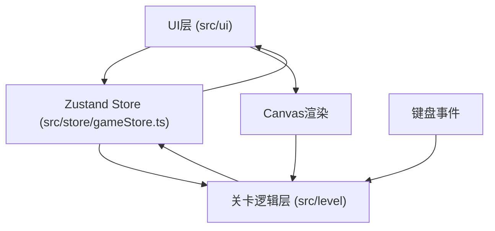

## 1. 架构设计



**模块说明**：
- **Store层**：Zustand状态管理，作为UI和Level模块的通信桥梁
- **Level层**：关卡生成、陷阱管理、碰撞检测、玩家控制
- **UI层**：React组件，HUD显示、主菜单、游戏结束界面
- **渲染层**：Canvas 2D API绘制所有游戏元素

## 2. 技术描述

- **前端框架**：React@18 + TypeScript
- **构建工具**：Vite@5
- **状态管理**：Zustand@4
- **工具库**：uuid@9
- **渲染引擎**：HTML5 Canvas 2D
- **项目初始化**：Vite react-ts模板

## 3. 文件结构

```
d:\P\tasks\auto20\
├── package.json
├── index.html
├── tsconfig.json
├── vite.config.js
└── src/
    ├── main.tsx
    ├── App.tsx
    ├── store/
    │   └── gameStore.ts          # Zustand状态管理
    ├── level/
    │   ├── LevelEngine.ts        # 关卡引擎：地图生成、陷阱管理、碰撞检测
    │   └── PlayerController.ts   # 玩家控制：键盘输入、物理移动
    └── ui/
        ├── GameCanvas.tsx        # Canvas游戏画面渲染
        ├── GameHud.tsx           # HUD界面
        └── MainMenu.tsx          # 主菜单/游戏结束界面
```

## 4. 数据模型

### 4.1 状态定义（Zustand Store）

```typescript
// 游戏状态
type GameState = 'menu' | 'playing' | 'gameover' | 'levelTransition' | 'victory';

// 位置坐标
interface Position { x: number; y: number; }

// 陷阱类型
type TrapType = 'gear' | 'lever' | 'arm';

// 陷阱状态
interface Trap {
  id: string;
  type: TrapType;
  x: number;
  y: number;
  rotation: number;
  active: boolean;
  timer: number;
  path?: Position[];
  pathIndex?: number;
}

// 电池状态
interface Battery {
  id: string;
  x: number;
  y: number;
  collected: boolean;
}

// 蒸汽平台
interface SteamPlatform {
  id: string;
  x: number;
  y: number;
  baseY: number;
  raised: boolean;
  timer: number;
  leverId: string;
}

// 粒子效果
interface Particle {
  id: string;
  x: number;
  y: number;
  vx: number;
  vy: number;
  life: number;
  maxLife: number;
  type: 'steam' | 'spark';
}

// Store状态
interface GameStore {
  // 游戏状态
  gameState: GameState;
  currentLevel: number;
  transitionProgress: number;
  
  // 玩家状态
  playerX: number;
  playerY: number;
  playerVX: number;
  playerVY: number;
  health: number;
  invincible: number;
  facing: 'left' | 'right';
  isJumping: boolean;
  
  // 关卡数据
  map: number[][];  // 0:空, 1:墙, 2:地板
  traps: Trap[];
  batteries: Battery[];
  platforms: SteamPlatform[];
  particles: Particle[];
  
  // 游戏数据
  batteryCount: number;
  elevatorOpen: boolean;
  screenFlash: number;
  
  // 方法
  startGame: () => void;
  updatePlayer: (x: number, y: number, vx: number, vy: number, facing: 'left' | 'right', jumping: boolean) => void;
  takeDamage: () => void;
  collectBattery: (id: string) => void;
  activateLever: (id: string) => void;
  nextLevel: () => void;
  resetGame: () => void;
  addParticle: (p: Omit<Particle, 'id'>) => void;
  removeParticle: (id: string) => void;
  updateTrap: (id: string, updates: Partial<Trap>) => void;
  updatePlatform: (id: string, updates: Partial<SteamPlatform>) => void;
  setTransitionProgress: (p: number) => void;
  setScreenFlash: (v: number) => void;
  setInvincible: (v: number) => void;
}
```

### 4.2 常量定义

```typescript
// 游戏常量
const TILE_SIZE = 40;
const MAP_WIDTH = 20;
const MAP_HEIGHT = 15;
const GRAVITY = 0.15;
const MOVE_SPEED = 3;
const JUMP_FORCE = -6.5;  // 计算最大高度80px: v²=2gh → v=sqrt(2*0.15*80)≈4.9，留余量
const MAX_HEALTH = 3;
const PLAYER_WIDTH = 30;
const PLAYER_HEIGHT = 40;
const GEAR_ROTATION_SPEED = Math.PI / 60;  // 2秒一周 = 每帧π/60弧度
const PLATFORM_DURATION = 5000;  // 5秒
const ARM_SPEED = 2;
const INVINCIBLE_DURATION = 500;  // 0.5秒
const TRANSITION_DURATION = 1500;  // 1.5秒
```

## 5. 核心模块说明

### 5.1 LevelEngine.ts

**职责**：
- 生成三层非对称地图（每层20x15格子）
- 管理所有陷阱、电池、平台的坐标与状态
- 碰撞检测（墙壁、陷阱、电池、电梯）
- 每帧更新陷阱状态（齿轮旋转、机械臂移动、平台计时）

**核心方法**：
- `generateLevel(level: number)`：生成指定层数地图数据
- `update(deltaTime: number)`：更新所有游戏对象状态
- `checkCollision(x: number, y: number, w: number, h: number)`：检测矩形碰撞
- `checkTrapCollision(playerRect)`：检测陷阱碰撞并扣血
- `checkBatteryCollection(playerRect)`：检测电池拾取
- `checkLeverInteraction(playerRect)`：检测拉杆交互范围
- `checkElevatorEntry(playerRect)`：检测进入电梯

### 5.2 PlayerController.ts

**职责**：
- 监听键盘事件（WASD、空格、E）
- 处理玩家移动物理（重力、跳跃、速度）
- 调用LevelEngine的碰撞检测约束移动
- 更新store中的玩家状态

**核心方法**：
- `handleKeyDown(e: KeyboardEvent)`：按键按下处理
- `handleKeyUp(e: KeyboardEvent)`：按键释放处理
- `update(deltaTime: number)`：每帧更新玩家位置和速度
- `jump()`：跳跃逻辑
- `interact()`：E键交互处理

### 5.3 GameCanvas.tsx

**职责**：
- 初始化Canvas，设置16:9比例自适应
- 每帧调用LevelEngine和PlayerController更新
- 渲染所有游戏元素（地图、玩家、陷阱、电池、粒子）
- 处理关卡过渡动画效果

**渲染顺序**（从下到上）：
1. 背景纹理、墙砖边框
2. 地图瓦片（墙、地板）
3. 蒸汽平台
4. 陷阱（齿轮、拉杆、机械臂）
5. 电池道具
6. 电梯门
7. 玩家角色
8. 粒子效果
9. 受伤屏幕闪烁
10. 关卡过渡遮罩

### 5.4 GameHud.tsx

**职责**：
- 左上角：3颗铜齿轮生命值
- 右上角：当前层数、电池收集数（0/3, 1/3, 2/3, 3/3）
- 左下角：80x80px圆形小地图，显示障碍物和玩家位置
- 从store读取状态，无修改操作

### 5.5 MainMenu.tsx

**职责**：
- 显示主菜单：蒸汽朋克标题、背景齿轮动画、"启动引擎"按钮
- 显示游戏结束界面：暗色叠加、旋转齿轮、"锅炉熄火了"文字、重新开始按钮
- 点击按钮调用store方法切换游戏状态

## 6. 游戏循环

```typescript
// 主循环流程
function gameLoop(timestamp: number) {
  const deltaTime = timestamp - lastTimestamp;
  lastTimestamp = timestamp;
  
  if (gameState === 'playing') {
    // 1. 更新玩家位置和物理
    playerController.update(deltaTime);
    
    // 2. 更新关卡陷阱和实体
    levelEngine.update(deltaTime);
    
    // 3. 检测碰撞与交互
    levelEngine.checkCollisions();
    
    // 4. 更新粒子
    updateParticles(deltaTime);
  } else if (gameState === 'levelTransition') {
    // 更新过渡动画进度
    updateTransition(deltaTime);
  }
  
  // 5. 渲染画面
  render();
  
  requestAnimationFrame(gameLoop);
}
```

## 7. 性能优化

- **对象池**：粒子系统使用对象池，避免频繁创建销毁
- **脏矩形**：仅重绘变化区域（如实现复杂可采用）
- **状态缓存**：计算密集型结果缓存，避免重复计算
- **帧率控制**：requestAnimationFrame自动适配显示器刷新率
- **粒子上限**：严格控制粒子数≤50，超出时优先移除快消失的
