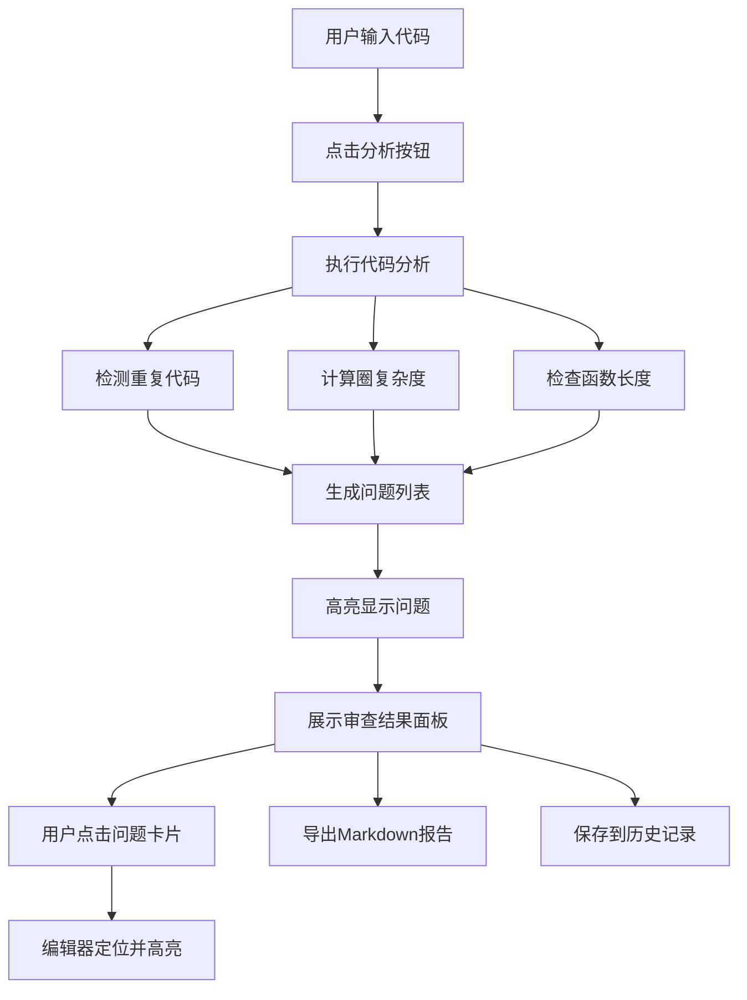
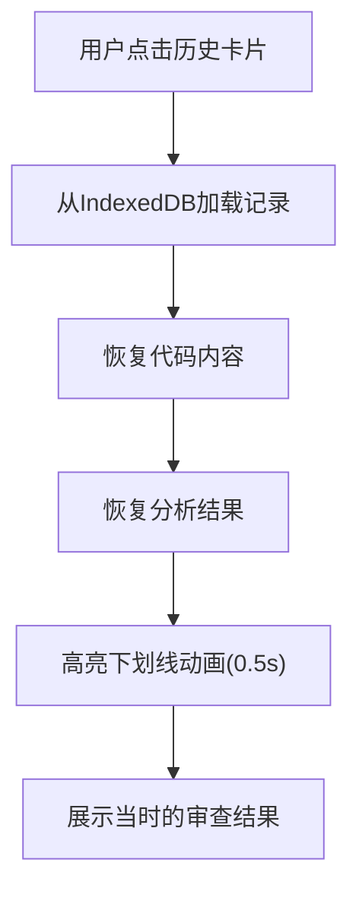
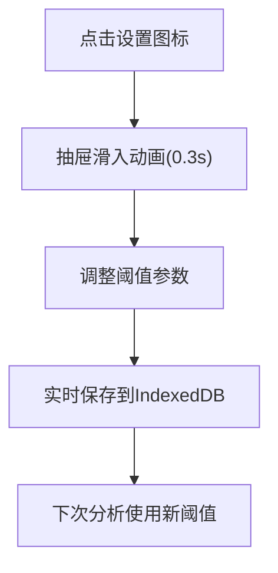

## 1. 产品概述
代码审查助手是一款面向研发团队的Web应用，在代码审查阶段自动识别代码中的重复片段、循环复杂度陷阱和过长函数，生成结构化审查报告，解决人工审查耗时久、遗漏多的问题。

### 1.1 产品目标
- 提升代码审查效率，将人工审查时间减少60%以上
- 自动化检测常见代码质量问题，降低人为遗漏风险
- 提供可追溯的审查历史，支持团队知识沉淀
- 通过可配置的审查阈值，适应不同团队的编码规范

### 1.2 目标用户
- 前端开发工程师（JavaScript/TypeScript）
- 代码审查人员（Tech Lead、Senior Developer）
- 技术团队负责人

---

## 2. 核心功能

### 2.1 功能模块清单

| 模块 | 功能描述 |
|------|---------|
| 代码分析模块 | JavaScript代码输入、语法解析、问题检测、高亮显示 |
| 报告管理模块 | 问题分类展示、Markdown导出、历史记录回看、设置管理 |

### 2.2 页面详情

| 页面名称 | 模块名称 | 功能描述 |
|---------|---------|----------|
| 主页面 | 代码编辑器 | 支持JavaScript代码输入，语法高亮，行号显示，一键分析 |
| 主页面 | 审查结果面板 | 问题分类列表，点击定位，统计数字，颜色高亮 |
| 主页面 | 报告预览 | 结构化报告展示，问题摘要，修复建议，Markdown导出 |
| 主页面 | 历史记录卡片 | 审查记录列表，时间排序，点击回看 |
| 主页面 | 设置抽屉 | 阈值配置，持久化存储，滑入动画 |

---

## 3. 核心流程

### 3.1 代码审查主流程

### 3.2 历史记录回看流程

### 3.3 设置流程

---

## 4. 用户界面设计

### 4.1 设计风格
- **整体风格**: 专业开发工具风格，借鉴VS Code编辑器美学
- **深色主题**: 代码编辑器使用深色背景(#1E1E1E)，结果面板使用白色背景
- **配色方案**:
  - 导航栏: 深色 #1E293B
  - 重复代码高亮: 浅红 #FFE0E0
  - 高复杂度高亮: 浅黄 #FFF0D0
  - 过长函数高亮: 浅蓝 #E0F0FF
  - 遮罩层: 半透明 #00000066

### 4.2 字体与排版
- **代码字体**: Cascadia Code, Consolas, 等宽字体
- **界面字体**: 系统无衬线字体
- **代码字号**: 14px，行高 1.6

### 4.3 布局规范
- **主布局**: 左右两栏，左栏70%（代码编辑器），右栏30%（结果面板）
- **导航栏**: 高度56px，顶部固定
- **卡片设计**: 
  - 问题卡片: 圆角10px，间距8px
  - 历史卡片: 宽度280px，圆角12px，阴影 #00000022 0 4px 12px

### 4.4 交互与动画
- **问题卡片点击**: 背景色平滑过渡(0.2s)
- **代码高亮下划线**: 0.5s ease-in-out
- **设置抽屉**: 0.3s cubic-bezier(0.4,0,0.2,1)
- **响应式切换**: 0.3s过渡
- **卡片悬停**: 阴影增强，轻微上浮

### 4.5 页面设计概览

| 区域 | 模块 | UI元素 |
|-----|------|--------|
| 顶部 | 导航栏 | Logo文字、设置图标、历史记录入口 |
| 左侧 | 代码编辑器 | 文本域、行号、高亮层、分析按钮 |
| 右侧 | 结果面板 | 问题分类标签、统计数字、问题卡片列表 |
| 右侧 | 报告区域 | 表格（表头固定）、横向滚动、导出按钮 |
| 右侧 | 历史记录 | 卡片网格、时间戳、文件名 |
| 右侧 | 设置抽屉 | 滑块控件、数值输入、保存提示 |

### 4.6 响应式设计
- **桌面端(≥1280px)**: 左右两栏布局，内容居中
- **平板端(768px-1279px)**: 保持两栏，比例自适应
- **移动端(<768px)**: 上下堆叠布局，先编辑器后结果面板
- **交互优化**: 触摸设备增加点击区域，支持手势滑动关闭抽屉

---

## 5. 性能指标

| 指标 | 目标值 |
|-----|-------|
| 代码分析响应时间 | ≤ 3秒（100行示例代码） |
| 首次加载时间 | ≤ 2秒 |
| 历史记录加载 | ≤ 500ms（100条记录） |
| 页面切换动画帧率 | ≥ 60fps |

---

## 6. 数据持久化

### 6.1 存储内容
- 审查历史记录（代码、结果、时间戳、文件名）
- 用户自定义阈值设置
- 最近使用的代码模板

### 6.2 存储策略
- 使用IndexedDB进行本地持久化
- 历史记录最多保存100条，超出自动删除最早记录
- 设置变更实时同步到存储
