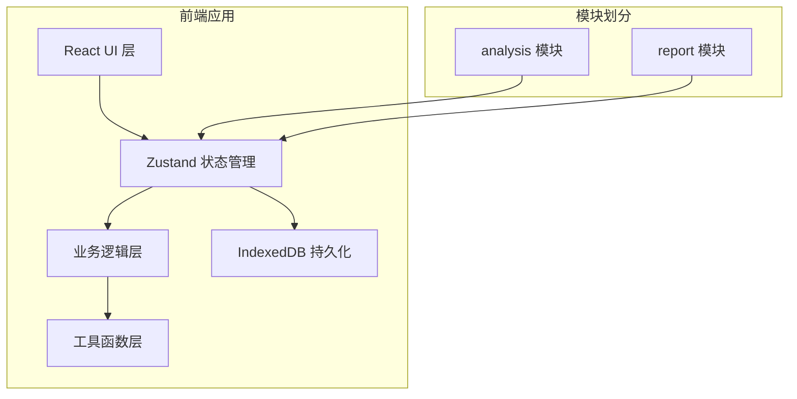
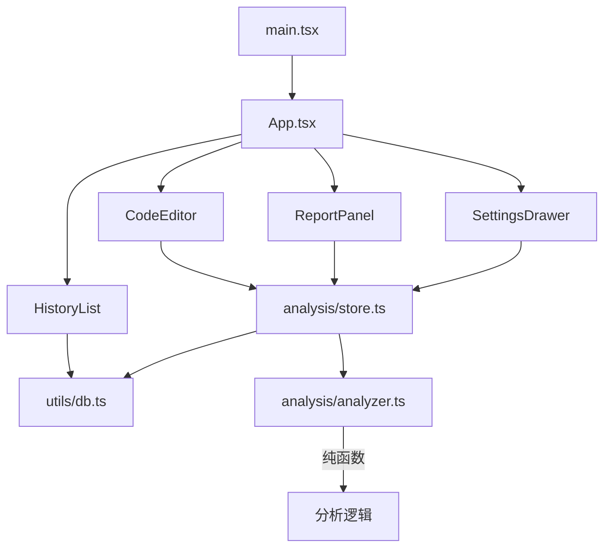

## 1. 架构设计

### 1.1 整体架构



### 1.2 模块依赖关系



---

## 2. 技术栈说明

| 层级 | 技术选型 | 版本 | 用途 |
|-----|---------|------|------|
| 构建工具 | Vite | 最新 | 构建与开发服务器 |
| 前端框架 | React | 18.x | UI组件库 |
| 语言 | TypeScript | 最新 | 类型安全 |
| 状态管理 | Zustand | 最新 | 全局状态管理 |
| 路由 | React Router DOM | 6.x | 前端路由 |
| 唯一ID | uuid | 最新 | 生成记录ID |
| 数据存储 | IndexedDB | - | 本地持久化 |
| 样式方案 | CSS Modules / 内联样式 | - | 组件样式 |

---

## 3. 目录结构

```
auto21/
├── index.html                 # 入口HTML
├── package.json              # 依赖配置
├── tsconfig.json             # TypeScript配置
├── vite.config.js            # Vite配置
└── src/
    ├── main.tsx              # 应用入口
    ├── App.tsx               # 根组件
    ├── analysis/             # 代码分析模块
    │   ├── store.ts          # Zustand store
    │   ├── CodeEditor.tsx    # 代码编辑器组件
    │   └── analyzer.ts       # 分析算法（纯函数）
    ├── report/               # 报告管理模块
    │   ├── ReportPanel.tsx   # 结果面板组件
    │   ├── HistoryList.tsx   # 历史记录组件
    │   └── SettingsDrawer.tsx# 设置抽屉组件
    └── utils/
        └── db.ts             # IndexedDB封装
```

---

## 4. 路由定义

| 路由路径 | 组件 | 用途 |
|---------|------|------|
| / | App | 主页面（代码分析+报告） |
| /history | App + HistoryList | 历史记录视图 |
| /history/:id | App + HistoryList | 查看指定历史记录 |

---

## 5. 数据模型

### 5.1 TypeScript 类型定义

```typescript
// 问题类型
export type IssueType = 'duplication' | 'complexity' | 'long-function';

// 严重程度
export type Severity = 'high' | 'medium' | 'low';

// 单个问题
export interface Issue {
  id: string;
  type: IssueType;
  severity: Severity;
  lineStart: number;
  lineEnd: number;
  message: string;
  suggestion: string;
  functionName?: string;
  complexity?: number;
}

// 分析结果
export interface AnalysisResult {
  issues: Issue[];
  stats: {
    total: number;
    duplication: number;
    complexity: number;
    longFunction: number;
  };
  timestamp: number;
}

// 审查阈值
export interface Thresholds {
  duplicationLines: number;    // 2-10, 默认3
  complexity: number;          // 5-20, 默认10
  maxFunctionLines: number;    // 30-100, 默认50
}

// 历史记录
export interface HistoryRecord {
  id: string;
  filename: string;
  code: string;
  result: AnalysisResult;
  thresholds: Thresholds;
  createdAt: number;
}

// Store状态
export interface AnalysisState {
  code: string;
  filename: string;
  thresholds: Thresholds;
  result: AnalysisResult | null;
  selectedIssueId: string | null;
  isAnalyzing: boolean;
  setCode: (code: string, filename?: string) => void;
  setThresholds: (thresholds: Partial<Thresholds>) => void;
  analyzeCode: () => Promise<void>;
  selectIssue: (id: string | null) => void;
  loadFromHistory: (record: HistoryRecord) => void;
}
```

### 5.2 IndexedDB Schema

```typescript
// 数据库名称: CodeReviewDB
// 版本: 1

// Object Store: settings
// - key: 'thresholds' (主键)
// - value: Thresholds

// Object Store: history
// - keyPath: 'id' (主键)
// - 索引: 'createdAt' (降序)
```

---

## 6. 核心算法

### 6.1 重复代码检测算法
1. 将代码按行分割，去除空白行和纯注释行
2. 使用滑动窗口，窗口大小为阈值N
3. 计算每个窗口的哈希值（简化版：字符串哈希）
4. 找出哈希值重复出现的窗口
5. 合并相邻的重复片段，去重后返回结果

### 6.2 圈复杂度计算（McCabe）
1. 识别函数边界（function声明、箭头函数）
2. 统计函数内的决策点:
   - if / else if → +1
   - for / while → +1
   - switch case → 每个case +1
   - && / || → +1
   - try / catch → catch +1
   - 三元运算符 ? : → +1
3. 圈复杂度 = 决策点数量 + 1

### 6.3 函数长度检测
1. 正则匹配函数声明（function、箭头函数、类方法）
2. 计算每个函数的起止行号
3. 行数 = endLine - startLine + 1
4. 超过阈值的标记为过长函数

---

## 7. 状态管理设计

### 7.1 Zustand Store 结构

```typescript
// src/analysis/store.ts
import { create } from 'zustand';
import { persist } from 'zustand/middleware';
import { analyze } from './analyzer';
import { saveToDB, loadFromDB } from '../utils/db';

export const useAnalysisStore = create<AnalysisState>()(
  persist(
    (set, get) => ({
      // 初始状态
      code: '',
      filename: 'untitled.js',
      thresholds: {
        duplicationLines: 3,
        complexity: 10,
        maxFunctionLines: 50,
      },
      result: null,
      selectedIssueId: null,
      isAnalyzing: false,
      
      // Actions
      setCode: (code, filename) => set({ code, filename: filename || get().filename }),
      
      setThresholds: (newThresholds) => {
        const updated = { ...get().thresholds, ...newThresholds };
        set({ thresholds: updated });
        saveToDB('settings', 'thresholds', updated);
      },
      
      analyzeCode: async () => {
        set({ isAnalyzing: true });
        const { code, thresholds, filename } = get();
        // 模拟3秒内完成
        await new Promise(r => setTimeout(r, 100));
        const result = analyze(code, thresholds);
        const record: HistoryRecord = {
          id: uuid(),
          filename,
          code,
          result,
          thresholds: { ...thresholds },
          createdAt: Date.now(),
        };
        await saveToDB('history', record.id, record);
        set({ result, isAnalyzing: false });
      },
      
      selectIssue: (id) => set({ selectedIssueId: id }),
      
      loadFromHistory: (record) => {
        set({
          code: record.code,
          filename: record.filename,
          thresholds: record.thresholds,
          result: record.result,
        });
      },
    }),
    {
      name: 'code-review-storage',
      partialize: (state) => ({ thresholds: state.thresholds }),
    }
  )
);
```

---

## 8. 组件通信方式

| 通信方式 | 适用场景 |
|---------|---------|
| Zustand Store | 跨模块共享状态（代码、结果、阈值） |
| Props传递 | 父子组件间数据传递 |
| Callbacks | 子组件触发父组件操作 |
| Custom Events | 同级组件间松耦合通信 |

---

## 9. 性能优化策略

1. **代码分析防抖**: 输入停止500ms后自动分析（可选）
2. **结果缓存**: 相同代码+相同阈值直接返回缓存结果
3. **懒加载**: 历史记录分页加载，按需渲染
4. **虚拟滚动**: 问题列表过长时使用虚拟滚动
5. **Web Worker**: 复杂分析算法移至Worker线程（进阶优化）
6. **动画优化**: 使用transform和opacity属性，避免触发重排

---

## 10. 开发规范

### 10.1 代码风格
- 使用TypeScript严格模式
- 组件使用函数式组件 + Hooks
- 纯函数与副作用分离（analyzer.ts为纯函数）
- 避免使用any类型，使用unknown替代
- 每个组件文件不超过300行

### 10.2 命名规范
- 组件: PascalCase (CodeEditor, ReportPanel)
- 函数/变量: camelCase (analyzeCode, selectedIssueId)
- 类型/接口: PascalCase (AnalysisState, Issue)
- 常量: UPPER_SNAKE_CASE (DEFAULT_THRESHOLDS)
- 纯函数文件: *.ts，组件文件: *.tsx

### 10.3 导入规范
```typescript
// 1. React及第三方库
import React from 'react';
import { useNavigate } from 'react-router-dom';

// 2. 状态管理
import { useAnalysisStore } from './store';

// 3. 工具函数
import { analyze } from './analyzer';

// 4. 类型定义
import type { Issue, Thresholds } from './types';

// 5. 样式
import './CodeEditor.css';
```
