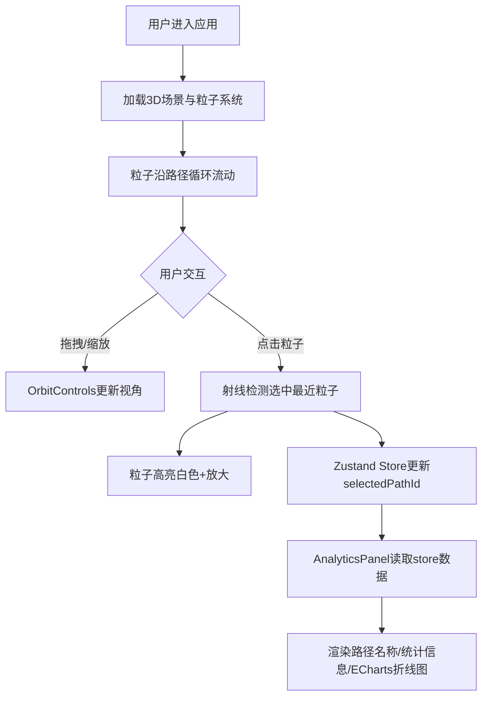

## 1. 产品概述

GeoFlow是一款交互式三维地理数据流可视化应用，通过动态粒子系统展示河流网络的流动过程。
- 核心用途：三维可视化展示河流粒子流动，支持数据分析与历史流量统计
- 目标用户：地理数据分析师、科研人员、数据可视化爱好者
- 产品价值：以直观的3D交互方式呈现复杂的河流网络数据流动态，辅助决策与研究

## 2. 核心功能

### 2.1 用户角色
| 角色 | 注册方式 | 核心权限 |
|------|----------|----------|
| 普通用户 | 无需注册，直接使用 | 浏览3D场景、交互控制、查看数据分析面板 |

### 2.2 功能模块
1. **三维河流可视化模块（river）**：3D场景渲染、粒子系统管理、路径流动动画、射线检测选中
2. **数据分析模块（analytics）**：流量统计、历史数据折线图、选定区域详情面板

### 2.3 页面详情
| 页面名称 | 模块名称 | 功能描述 |
|----------|----------|----------|
| 主页面 | 3D场景渲染 | 全屏Canvas展示河流粒子网络，支持鼠标拖拽旋转、滚轮缩放 |
| 主页面 | 分析面板 | 右下角半透明面板，展示选中路径的流量统计与历史折线图 |
| 主页面 | 交互控制 | 点击粒子高亮选中，联动更新分析面板数据 |

## 3. 核心流程

用户进入应用后，3D场景自动渲染并开始粒子流动动画。用户可通过鼠标拖拽旋转视角、滚轮缩放查看细节。点击任意粒子时，该粒子高亮白色并放大，同时右下角分析面板显示该粒子所属河流路径的名称、当前粒子数、平均流速及60秒历史流量折线图。

## 4. 用户界面设计

### 4.1 设计风格
- **主色调**：深空科技蓝主题，背景渐变从#0A0A2A到#000000
- **辅助色**：粒子颜色根据流量从#87CEEB（浅蓝）渐变至#00008B（深蓝），折线图使用#1E90FF
- **高亮色**：选中粒子白色（#FFFFFF）
- **字体**：系统无衬线字体（-apple-system, BlinkMacSystemFont, "Segoe UI", sans-serif）
- **布局风格**：单页沉浸式3D场景，分析面板悬浮于右下角
- **过渡动画**：所有交互元素过渡持续0.2秒

### 4.2 页面设计概览
| 页面名称 | 模块名称 | UI元素 |
|----------|----------|--------|
| 主页面 | 3D场景 | 全屏Canvas、10条贝塞尔曲线路径、500-800个流动粒子、20颗静态星星、半透明网格地面（y=-5）、相机初始(0,50,80)看向原点 |
| 主页面 | 分析面板 | 固定定位右下角，宽320px，背景rgba(20,20,30,0.85)，圆角12px，内边距16px；标题14px白色、标签12px浅灰色；ECharts折线图280x150px，半透明面积填充 |

### 4.3 响应式
- 桌面端优先设计，Canvas自适应窗口大小
- 分析面板固定定位，不随场景变化

### 4.4 3D场景指引
- **环境**：深空蓝到黑的渐变背景（顶部#0A0A2A到底部#000000）
- **地面**：半透明网格平面，网格间距10单位，网格线颜色rgba(255,255,255,0.1)，位于y=-5
- **点缀**：20颗随机静态星星粒子，大小1-2单位，白色透明度0.3
- **相机**：初始位置(0, 50, 80)，OrbitControls控制，缩放范围0.5-5倍
- **粒子**：圆形Sprite/Points，直径2-4单位，透明度0.6-0.9，沿路径每秒10-20单位流动
- **交互**：射线检测选中最近粒子，高亮白色放大至6单位
