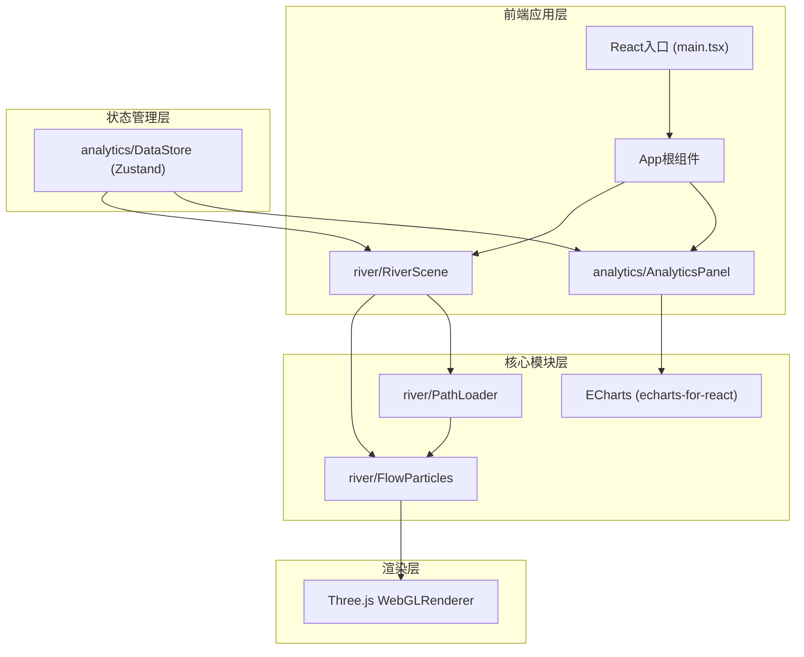

## 1. 架构设计



## 2. 技术描述
- **前端框架**：React@18 + ReactDOM@18 + TypeScript
- **构建工具**：Vite + @vitejs/plugin-react
- **3D渲染**：Three@0.160.0 + @types/three
- **状态管理**：Zustand
- **数据可视化**：ECharts + echarts-for-react
- **初始化方式**：手动搭建Vite项目结构

## 3. 模块职责定义

| 文件路径 | 职责 | 出口 |
|----------|------|------|
| `src/river/RiverScene.ts` | 创建Three.js场景、相机、轨道控制器，管理粒子系统，接收流量数据更新粒子颜色和速度 | 场景实例和update方法 |
| `src/river/FlowParticles.ts` | 生成和管理粒子对象数组，存储位置/速度/颜色/路径索引，提供更新循环方法使粒子沿路径移动 | 粒子数组和更新函数 |
| `src/river/PathLoader.ts` | 定义并解析10条三维贝塞尔曲线路径（每条4控制点），提供路径插值函数 | 路径数组和插值方法 |
| `src/analytics/DataStore.ts` | Zustand store，管理粒子位置、选定区域ID、流量统计信息，定义更新和查询方法 | useStore hook |
| `src/analytics/AnalyticsPanel.tsx` | React组件，渲染ECharts折线图展示选定区域流量历史，接收store中的选定区域数据 | JSX组件 |

## 4. 数据模型

### 4.1 核心数据结构

```typescript
// 路径控制点
interface PathPoint {
  x: number;
  y: number;
  z: number;
}

// 河流路径
interface RiverPath {
  id: string;
  name: string;
  controlPoints: [PathPoint, PathPoint, PathPoint, PathPoint];
  curve: THREE.CubicBezierCurve3;
  particles: number[]; // 该路径上的粒子索引
}

// 粒子数据
interface FlowParticle {
  index: number;
  pathId: string;
  t: number; // 路径参数 0-1
  speed: number; // 每秒沿路径前进的t增量
  color: THREE.Color;
  size: number;
  opacity: number;
}

// 流量统计记录
interface FlowRecord {
  timestamp: number;
  particleCount: number;
}

// 路径统计信息
interface PathStats {
  pathId: string;
  pathName: string;
  currentParticleCount: number;
  averageSpeed: number;
  history: FlowRecord[];
}

// Zustand Store状态
interface DataStoreState {
  particles: FlowParticle[];
  selectedPathId: string | null;
  pathStats: Map<string, PathStats>;
  selectPath: (pathId: string | null) => void;
  updatePathStats: (pathId: string, stats: Partial<PathStats>) => void;
  getSelectedPathStats: () => PathStats | null;
}
```

## 5. 关键技术实现点

### 5.1 粒子系统优化
- 使用`THREE.Points`（非单个Sprite）批量渲染，保证800粒子30FPS+
- 贝塞尔曲线插值在初始化时预计算足够密度的采样点，运行时直接查表
- 每5秒计算一次路径流量，通过lerp平滑更新粒子颜色

### 5.2 交互流程
- `OrbitControls`：`enableDamping=true`，`minDistance=40`（0.5×80），`maxDistance=400`（5×80）
- 射线检测：点击时从相机发射射线，遍历Points找到最近交点，映射到所属pathId
- 选中反馈：修改该粒子的color=white，size=6，保持其他粒子不变

### 5.3 数据流
- RiverScene每帧更新 → 调用FlowParticles.update() → 粒子t值推进并循环
- RiverScene每5秒计算各路径粒子数 → 调用DataStore.updatePathStats()
- 用户点击粒子 → DataStore.selectPath(pathId) → AnalyticsPanel重渲染ECharts
