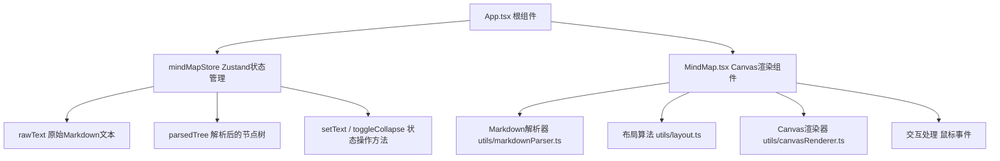
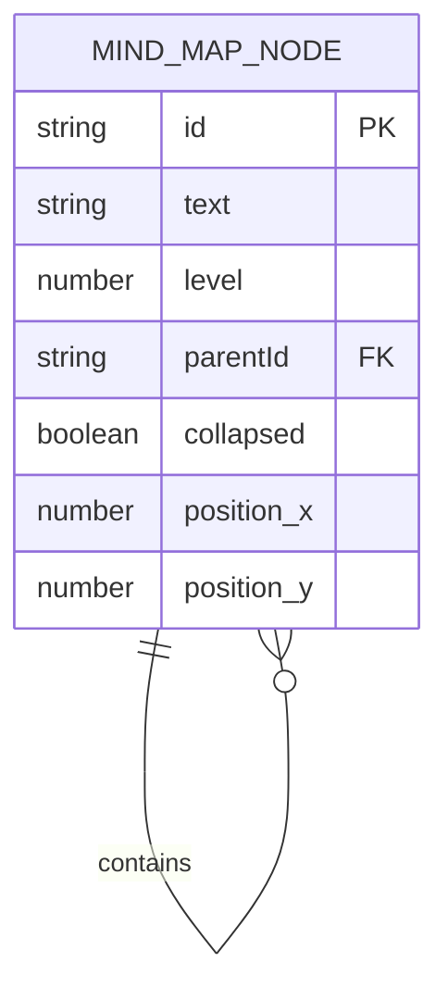

## 1. 架构设计



## 2. 技术描述
- **前端框架**：React@18 + TypeScript + Vite
- **状态管理**：Zustand
- **渲染方式**：HTML5 Canvas 2D API
- **项目初始化**：vite-init react-ts模板

## 3. 项目文件结构与数据流向

```
package.json                  # 项目依赖与脚本配置
vite.config.js                # Vite构建配置，集成React插件
tsconfig.json                 # TypeScript严格模式配置
index.html                    # 入口HTML，全屏flex布局
src/
├── App.tsx                   # 根组件，接收用户输入传递给Store和MindMap
├── store/
│   └── mindMapStore.ts       # Zustand状态：rawText / parsedTree / setText / toggleCollapse
├── components/
│   └── MindMap.tsx           # Canvas主组件：绑定事件、调度渲染、交互回写
├── types/
│   └── index.ts              # 类型定义：MindMapNode接口等
└── utils/
    ├── markdownParser.ts     # Markdown标题解析器，输出节点树
    ├── layout.ts             # 辐射式布局算法，计算position坐标
    └── canvasRenderer.ts     # Canvas绘制函数：节点、连线、动画过渡
```

**数据流向说明**：
1. `App.tsx` 左栏textarea接收用户文本 → 调用 `mindMapStore.setText()`
2. `setText()` 内部调用 `markdownParser.parse()` 生成 `parsedTree`
3. `MindMap.tsx` 订阅 `parsedTree`，调用 `layout.calculatePositions()` 计算坐标
4. `MindMap.tsx` 通过 `canvasRenderer` 绘制节点和连线
5. 用户交互（拖拽/点击/悬停）触发事件 → 更新store中的节点状态 → 触发重绘

## 4. 数据模型

### 4.1 核心类型定义

```typescript
interface Position {
  x: number;
  y: number;
}

interface MindMapNode {
  id: string;
  text: string;
  level: 1 | 2 | 3;
  children: MindMapNode[];
  collapsed: boolean;
  position: Position;
  parentId?: string;
}

interface MindMapState {
  rawText: string;
  parsedTree: MindMapNode | null;
  setText: (text: string) => void;
  toggleCollapse: (nodeId: string) => void;
  updateNodePosition: (nodeId: string, position: Position) => void;
}
```

### 4.2 Mermaid ER图



## 5. 性能优化策略

- **虚拟化渲染**：节点数超过30时，仅渲染视口范围内的节点
- **帧率控制**：使用requestAnimationFrame节流，保持60FPS
- **增量重绘**：拖拽时仅更新受影响节点和连线，不清除全画布
- **内存管理**：及时释放离屏Canvas和事件监听器
- **解析性能**：使用正则表达式一次性扫描标题，O(n)时间复杂度
