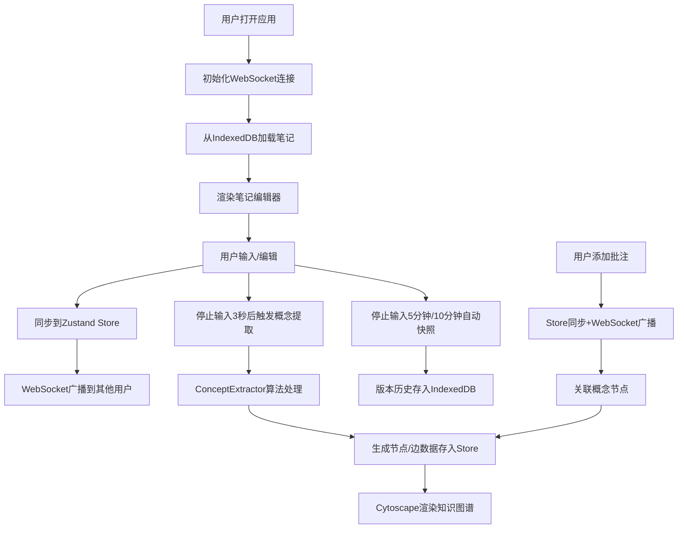

## 1. 产品概述

NoteSync是一款面向在线教育场景的协作式笔记与知识图谱生成应用，支持多学生实时协同编辑、批注讨论，并通过AI自动提取关键概念生成可视化知识图谱。

- 核心目标：解决学生学习笔记分散、协作效率低、知识关联难的痛点
- 目标用户：在线教育平台的学生群体
- 产品价值：通过实时协作和知识图谱技术，提升学习效率和知识理解深度

## 2. 核心功能

### 2.1 用户角色

| 角色 | 注册方式 | 核心权限 |
|------|----------|----------|
| 学生用户 | 自动分配（模拟2个用户） | 编辑笔记、添加批注、查看知识图谱、管理版本历史 |

### 2.2 功能模块

1. **笔记编辑模块**：富文本编辑、实时光标同步、多用户协作
2. **批注讨论模块**：段落批注、回复讨论、气泡浮动显示
3. **知识图谱模块**：自动概念提取、可视化图谱、交互跳转
4. **版本历史模块**：自动快照、历史列表、版本恢复

### 2.3 页面详情

| 页面名称 | 模块名称 | 功能描述 |
|---------|----------|----------|
| 主应用 | 导航栏 | 视图切换按钮（笔记/知识图谱）、用户状态显示 |
| 笔记视图 | 编辑器 | TipTap富文本编辑、实时光标、用户颜色区分 |
| 笔记视图 | 批注面板 | 批注列表、添加/编辑/删除批注、回复讨论 |
| 笔记视图 | 版本历史侧边栏 | 时间戳列表、版本恢复、快照描述 |
| 知识图谱视图 | 图谱渲染 | Cytoscape辐射布局、节点交互、高亮动画 |
| 知识图谱视图 | 概念详情 | 悬停提示、点击跳转、概念频率统计 |

## 3. 核心流程

## 4. 用户界面设计

### 4.1 设计风格

- **主题**：深色科技风
- **背景主色**：#1A1A2E
- **卡片/面板背景**：#16213E
- **文字主色**：#E0E0E0
- **强调色**：#0F3460（深蓝）、#E94560（亮红）
- **用户光标色**：用户1红色(#E74C3C)、用户2蓝色(#3498DB)
- **按钮样式**：圆角8px、悬停缩放1.05、过渡0.2s ease
- **字体**：正文使用系统字体，编辑器使用Fira Code等宽字体
- **布局**：Flexbox弹性布局，桌面端左右分栏（60%/40%），移动端上下布局

### 4.2 页面设计概览

| 页面名称 | 模块名称 | UI元素 |
|---------|----------|--------|
| 主应用 | 导航栏 | 深色背景、logo文字、两个切换按钮（笔记/知识图谱）、用户状态指示器 |
| 笔记视图 | 编辑器 | 60%宽度、Fira Code字体、行高1.6、段落间距12px、实时光标标记 |
| 笔记视图 | 批注气泡 | 背景#2C3E50、文字#ECF0F1、圆角10px、阴影4px、弹出动画scale(0.95→1.0 0.3s) |
| 笔记视图 | 版本历史 | 右侧抽屉式侧边栏、时间戳倒序、描述文字、恢复按钮 |
| 知识图谱视图 | 图谱画布 | 深蓝渐变背景(#0F2027→#203A43)、节点发光效果、辐射布局 |
| 知识图谱视图 | 节点样式 | 大小36-72px映射词频、颜色#3498DB→#E74C3C渐变、悬停放大1.2倍 |
| 知识图谱视图 | 连接线 | 曲线连接、线宽1-3px映射共现次数、发光效果 |
| 全局 | 加载状态 | 白点脉冲动画(2px→6px循环) |
| 全局 | 空状态 | 提示文字"开始协作编辑，知识图谱将自动生成" |

### 4.3 响应式设计

- **桌面端（≥768px）**：左右分栏布局，笔记编辑区60%宽度，右侧为知识图谱/批注面板
- **移动端（<768px）**：上下布局，笔记编辑区在上，知识图谱/批注面板在下
- **触摸优化**：按钮最小尺寸44px，节点可触摸区域扩大
- **断点**：768px为主要响应式断点

### 4.4 动画与交互

- **批注气泡弹出**：transform: scale(0.95) → 1.0，0.3s ease-out
- **按钮悬停**：背景色渐变、轻微上移、阴影加深，0.2s ease
- **节点悬停**：放大1.2倍、发光增强，0.2s ease
- **段落高亮**：点击节点跳转时，段落背景#F1C40F闪烁0.5秒
- **加载动画**：三个白点循环缩放(2px→6px)，错开延迟
- **视图切换**：淡入淡出过渡，0.3s ease
