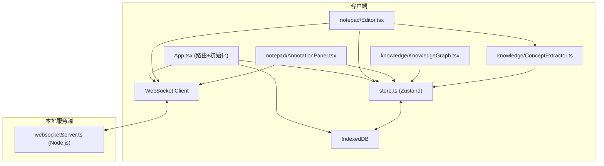
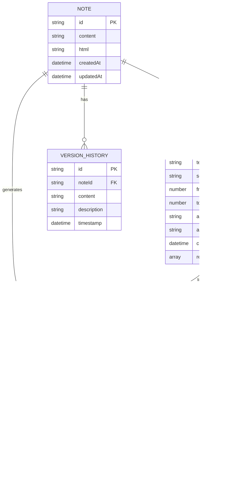
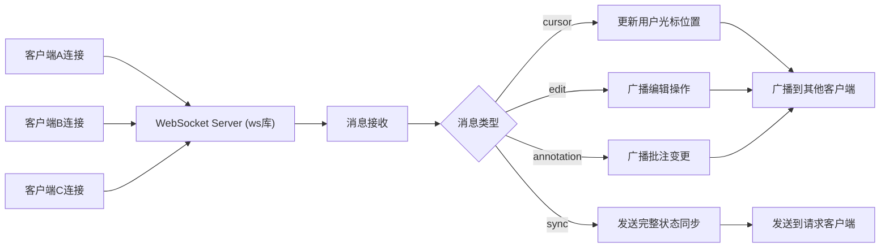

## 1. 架构设计



## 2. 技术描述

- **前端框架**：React@18 + TypeScript
- **构建工具**：Vite@5
- **状态管理**：Zustand
- **富文本编辑**：@tiptap/react + @tiptap/starter-kit（基于ProseMirror）
- **知识图谱渲染**：cytoscape + cytoscape-klay
- **路由**：react-router-dom@6
- **数据持久化**：IndexedDB（idb库）
- **实时通信**：ws（WebSocket）
- **工具库**：uuid
- **开发服务器端口**：3000
- **WebSocket端口**：8080
- **TypeScript配置**：严格模式、ES2020目标、bundler模块解析

## 3. 路由定义

| 路由 | 用途 |
|------|------|
| /notepad | 笔记编辑视图（默认路由） |
| /knowledge | 知识图谱视图 |

## 4. 数据模型

### 4.1 数据模型定义



### 4.2 TypeScript类型定义

```typescript
interface Note {
  id: string;
  content: string;
  html: string;
  createdAt: Date;
  updatedAt: Date;
}

interface Annotation {
  id: string;
  noteId: string;
  text: string;
  selectedText: string;
  from: number;
  to: number;
  author: string;
  authorColor: string;
  createdAt: Date;
  replies: AnnotationReply[];
}

interface AnnotationReply {
  id: string;
  text: string;
  author: string;
  authorColor: string;
  createdAt: Date;
}

interface Concept {
  id: string;
  name: string;
  frequency: number;
  noteId: string;
  firstOccurrence: number;
}

interface Edge {
  id: string;
  source: string;
  target: string;
  weight: number;
  noteId: string;
}

interface VersionHistory {
  id: string;
  noteId: string;
  content: string;
  description: string;
  timestamp: Date;
}

interface User {
  id: string;
  name: string;
  color: string;
  cursorPosition: number | null;
}

interface WsMessage {
  type: 'cursor' | 'edit' | 'annotation' | 'sync';
  payload: any;
  userId: string;
  timestamp: number;
}
```

## 5. WebSocket服务端架构



## 6. 文件结构与调用关系

```
d:\P\tasks\auto26\
├── package.json              # 依赖配置、启动脚本
├── vite.config.js            # Vite配置（端口3000）
├── tsconfig.json             # TypeScript配置（严格模式）
├── index.html                # 入口页面、全局样式
├── src/
│   ├── App.tsx               # 根组件、路由、初始化WS+DB
│   ├── store.ts              # Zustand状态管理
│   ├── websocketServer.ts    # 本地WebSocket服务端
│   ├── types/
│   │   └── index.ts          # 类型定义
│   ├── utils/
│   │   └── db.ts             # IndexedDB封装
│   ├── notepad/
│   │   ├── Editor.tsx        # TipTap编辑器组件
│   │   └── AnnotationPanel.tsx # 批注面板组件
│   └── knowledge/
│       ├── KnowledgeGraph.tsx # Cytoscape图谱组件
│       └── ConceptExtractor.ts # 概念提取算法
```

**调用关系与数据流向**：

1. **App.tsx** → 初始化 store、db、websocket连接 → 渲染路由
2. **Editor.tsx** → 监听用户输入 → 更新 store.content → 广播到 websocket → 触发 ConceptExtractor（防抖3秒）
3. **ConceptExtractor.ts** → 接收 content → 提取概念/关系 → 更新 store.concepts + store.edges
4. **KnowledgeGraph.tsx** → 订阅 store.concepts/edges → 渲染 Cytoscape 图谱 → 点击节点 → 触发 Editor 跳转高亮
5. **AnnotationPanel.tsx** → 用户操作 → 更新 store.annotations → 广播到 websocket → 关联 store.concepts
6. **store.ts** → 订阅状态变化 → 自动保存到 IndexedDB（防抖）
7. **websocketServer.ts** → 接收客户端消息 → 广播到其他客户端

## 7. 性能优化策略

| 优化点 | 策略 | 目标 |
|--------|------|------|
| 编辑器输入响应 | TipTap虚拟渲染+防抖更新Store | <50ms延迟 |
| 知识图谱渲染 | Cytoscape节点限制≤100、增量更新 | <1秒首屏 |
| WebSocket广播 | 操作合并+消息队列+二进制序列化 | <200ms延迟 |
| 概念提取 | 防抖3秒+增量计算（仅处理新增文本） | 不阻塞UI |
| 版本历史 | 差异化存储（只存变更）+ 懒加载 | 快速列表渲染 |
| 重绘优化 | React.memo、useMemo、useCallback | 减少不必要渲染 |
