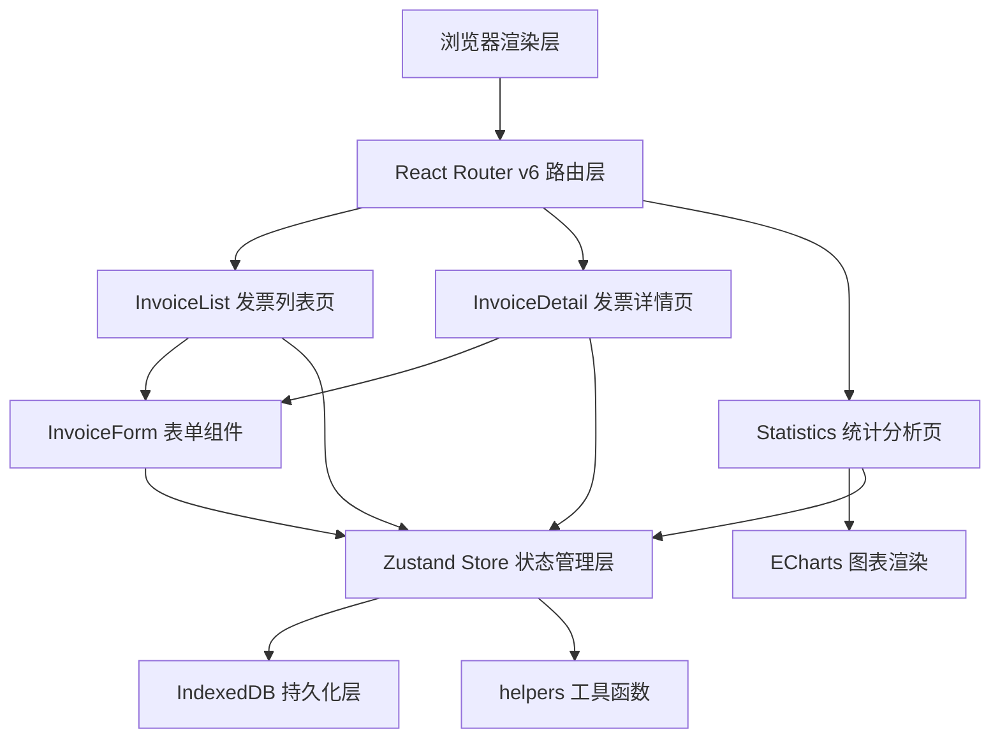
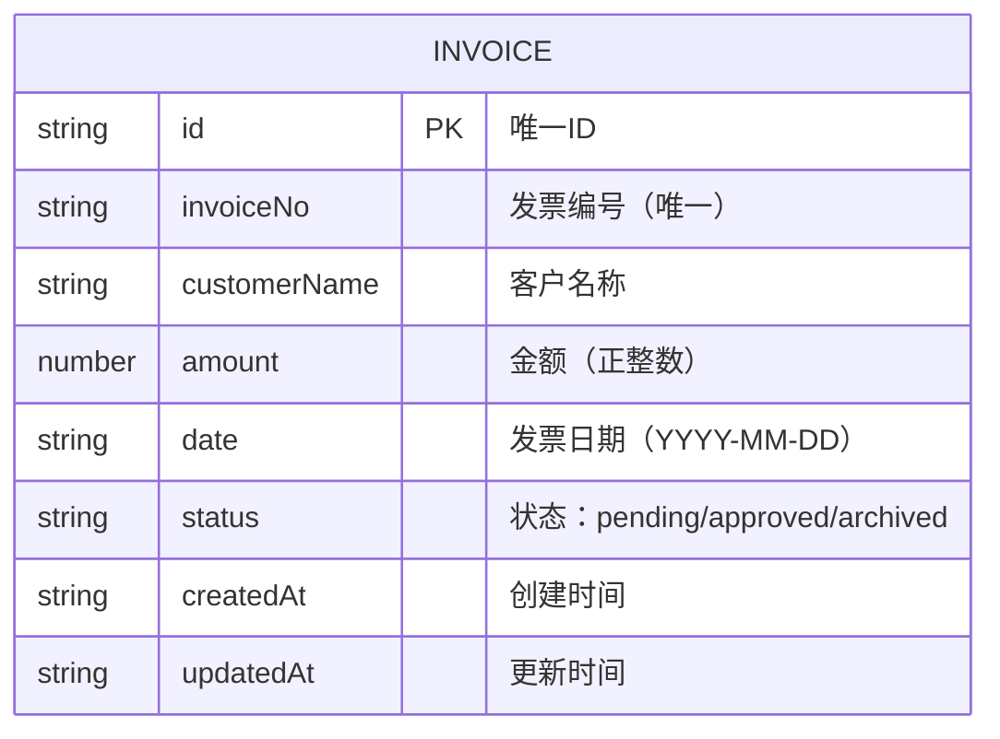

## 1. 架构设计



## 2. 技术选型说明

- **前端框架**：React@18 + TypeScript
- **构建工具**：Vite
- **状态管理**：Zustand（轻量级，API简洁）
- **路由管理**：React Router v6
- **图表库**：ECharts（功能完善，性能优秀）
- **数据持久化**：IndexedDB（浏览器本地大容量存储）
- **工具库**：uuid（生成唯一ID）

## 3. 路由定义

| 路由 | 用途 |
|------|------|
| / | 重定向到 /invoices |
| /invoices | 发票列表页（默认首页） |
| /invoices/:id | 发票详情页（编辑/审核/归档） |
| /invoices/new | 新建发票页 |
| /statistics | 统计分析页 |

## 4. 数据模型

### 4.1 数据模型定义



### 4.2 数据类型定义

```typescript
type InvoiceStatus = 'pending' | 'approved' | 'archived';

interface Invoice {
  id: string;
  invoiceNo: string;
  customerName: string;
  amount: number;
  date: string;
  status: InvoiceStatus;
  createdAt: string;
  updatedAt: string;
}

interface InvoiceFormData {
  invoiceNo: string;
  customerName: string;
  amount: number | '';
  date: string;
  status: InvoiceStatus;
}

interface FormErrors {
  invoiceNo?: string;
  customerName?: string;
  amount?: string;
  date?: string;
}
```

## 5. 项目文件结构

```
auto27/
├── .trae/documents/
│   ├── prd.md
│   └── tech-arch.md
├── package.json
├── index.html
├── vite.config.js
├── tsconfig.json
├── src/
│   ├── main.tsx              # 入口组件，挂载Router和Store
│   ├── App.tsx               # 路由配置，布局组件
│   ├── store/
│   │   └── invoiceStore.ts   # Zustand store，发票状态管理
│   ├── pages/
│   │   ├── InvoiceList.tsx   # 发票列表页
│   │   ├── InvoiceDetail.tsx # 发票详情页
│   │   └── Statistics.tsx    # 统计分析页
│   ├── components/
│   │   └── InvoiceForm.tsx   # 发票表单组件
│   └── utils/
│       └── helpers.ts        # 工具函数
```

## 6. Store 接口定义

```typescript
interface InvoiceStore {
  invoices: Invoice[];
  loading: boolean;
  storageError: boolean;
  loadInvoices: () => Promise<void>;
  addInvoice: (data: InvoiceFormData) => Promise<Invoice>;
  updateInvoice: (id: string, data: Partial<Invoice>) => Promise<Invoice | null>;
  deleteInvoice: (id: string) => Promise<void>;
  getInvoiceById: (id: string) => Invoice | undefined;
  approveInvoice: (id: string) => Promise<Invoice | null>;
  archiveInvoice: (id: string) => Promise<Invoice | null>;
  getStatistics: (startDate?: string, endDate?: string) => {
    monthlyData: { month: string; amount: number }[];
    customerData: { name: string; value: number }[];
  };
  setStorageError: (error: boolean) => void;
}
```

## 7. IndexedDB 操作封装

数据库名：InvoiceHubDB，版本：1
对象仓库：invoices，主键：id
索引：invoiceNo（唯一）、status、date、customerName
