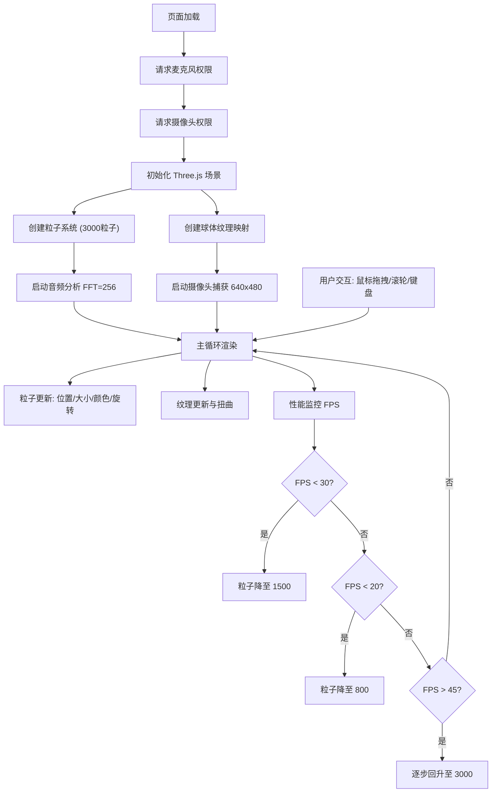

## 1. 产品概述

实时音视频三维粒子动画可视化应用，将用户的麦克风音频和摄像头画面转化为沉浸式的三维粒子艺术效果。通过 Web Audio API 进行音频频谱分析，驱动粒子系统的运动、颜色和大小变化，同时将摄像头画面映射到三维球体上，实现音视觉的动态融合。

- **核心目标**：在浏览器中实现高性能的音频驱动视觉粒子系统与摄像头纹理映射的动态融合
- **目标用户**：创意工作者、音乐可视化爱好者、VJ 表演者
- **产品价值**：提供零配置、即时可用的沉浸式音视觉体验

## 2. 核心功能

### 2.1 功能模块

1. **音频驱动粒子系统**：3000 个三维粒子，由音频频谱数据实时控制运动、大小、颜色和旋转
2. **摄像头纹理映射**：将摄像头画面实时渲染到三维球体内表面，支持透明度调节和音频驱动扭曲
3. **显示模式切换**：纯粒子模式、纯纹理模式、融合模式三种显示方式
4. **交互控制系统**：鼠标拖拽旋转、滚轮缩放、空格键暂停
5. **性能监控与自适应**：实时 FPS 显示，根据帧率自动调整粒子数量

### 2.2 页面详情

| 页面名称 | 模块名称 | 功能描述 |
|---------|---------|----------|
| 主页面 | 3D 渲染画布 | 全屏 Three.js 渲染场景，包含粒子系统和球体纹理 |
| 主页面 | 控制面板 | 纹理透明度滑块、模式切换按钮、帧率显示 |
| 主页面 | 交互系统 | OrbitControls 相机控制、键盘快捷键 |
| 主页面 | 音频分析 | Web Audio API 频谱分析（FFT size 256） |
| 主页面 | 性能监控 | FPS 监控、粒子数量自适应调整 |

## 3. 核心流程

用户打开页面 → 请求麦克风和摄像头权限 → 初始化 Three.js 场景、粒子系统、球体纹理 → 启动音频分析和摄像头捕获 → 主循环更新粒子和纹理 → 用户通过鼠标/键盘交互 → 性能监控自适应调整粒子数量

## 4. 用户界面设计

### 4.1 设计风格

- **整体风格**：暗色科技感，赛博朋克美学
- **主色调**：#0D0D1A（深紫黑背景）
- **辅助色**：#00D4FF（亮青色）
- **强调色**：#FF7F50（珊瑚橙，用于警告提示）
- **数字色**：#FFD700（金色，用于帧率显示）

**设计要点**：
- 半透明毛玻璃效果的控制面板
- 呼吸动画的边框效果
- 平滑的模式切换过渡动画
- 粒子的 HSV 颜色映射

### 4.2 页面设计概览

| 页面名称 | 模块名称 | UI 元素 |
|---------|---------|---------|
| 主页面 | 3D 画布 | 全屏无边框，#0D0D1A 背景，禁止滚动 |
| 主页面 | 控制面板 | 左上角悬浮，宽 220px，背景 rgba(20,20,30,0.7)，圆角 12px，内边距 16px |
| 主页面 | 透明度滑块 | 范围 -1 到 1，步长 0.01，轨道 #555，手柄 #00D4FF，悬停 #66E3FF |
| 主页面 | 模式按钮 | 三个按钮 60x32px，默认 #333，选中 #00D4FF，0.2s 过渡 |
| 主页面 | FPS 显示 | 右上角，金色数字 #FFD700，monospace 字体 |
| 主页面 | 控制面板动画 | 悬停透明度 0.7→0.9，背景模糊 blur(4px) |
| 主页面 | 边框呼吸动画 | 1px #00D4FF 边框，透明度 0.3-0.6 循环，周期 3s |

### 4.3 响应式设计

- **桌面端**：鼠标交互为主，OrbitControls 拖拽旋转和滚轮缩放
- **移动端**：触屏交互，OrbitControls 默认支持旋转和缩放手势
- **全屏设计**：所有设备均为全屏无边框体验

### 4.4 3D 场景设计

- **环境**：纯黑背景（#000000），营造沉浸式宇宙感
- **粒子系统**：
  - 3000 个 Point 粒子，使用 BufferGeometry
  - 大小范围 1-8 像素，由音频能量驱动
  - 颜色 HSV 映射：低频→红色，高频→蓝紫色
  - 整体旋转 0.5-2.0 rad/s，由低频段驱动
  - Z 轴波动由中频段驱动
- **球体纹理**：
  - 半径 5 单位的球体，内表面渲染
  - 摄像头画面作为纹理，透明度可调
  - 低频驱动纹理扭曲流动感
- **相机**：PerspectiveCamera，初始距离 10 单位，范围 2-20 单位
- **光照**：粒子自发光，球体使用基本材质不受光照影响
- **后处理**：无（保持高性能）

### 4.5 交互细节

| 交互方式 | 功能 | 效果 |
|---------|------|------|
| 鼠标左键拖拽 | 旋转场景 | OrbitControls，阻尼 0.1 |
| 鼠标滚轮 | 缩放场景 | 范围 2-20 单位 |
| 数字键 1 | 切换纯粒子模式 | 0.5s 过渡动画 |
| 数字键 2 | 切换纯纹理模式 | 0.5s 过渡动画 |
| 数字键 3 | 切换融合模式 | 0.5s 过渡动画 |
| 空格键 | 暂停/恢复粒子运动 | 粒子静止保留颜色位置，纹理继续更新 |
| 滑块拖拽 | 调节纹理透明度 | 0.0-1.0 范围 |

### 4.6 动画系统

- **模式切换**：0.5 秒淡入淡出过渡
- **按钮状态**：0.2 秒背景色过渡
- **边框呼吸**：3 秒周期 ease-in-out 透明度变化
- **控制面板悬停**：透明度 0.7→0.9 平滑过渡
- **粒子运动**：基于音频的连续动态变化
- **纹理扭曲**：低频驱动的流动扭曲效果
