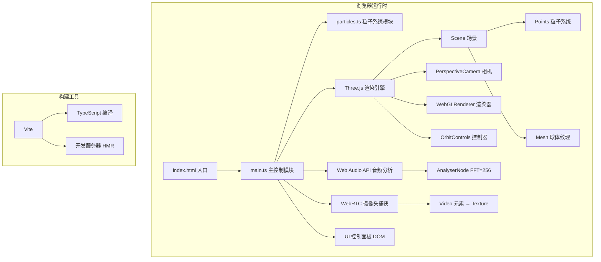

## 1. 架构设计

本项目为纯前端单页面应用，采用模块化架构设计。所有 3D 场景逻辑、音频处理、摄像头管理、UI 交互集成在同一模块内，通过 Vite 构建工具进行开发和打包。



## 2. 技术描述

### 2.1 核心技术栈

- **前端框架**：原生 TypeScript（无 React/Vue，直接操作 DOM 和 Three.js）
- **3D 引擎**：Three.js v0.160.0
- **构建工具**：Vite v5.x
- **类型定义**：@types/three
- **音频处理**：Web Audio API（AnalyserNode）
- **视频捕获**：WebRTC（getUserMedia）

### 2.2 技术选型理由

- **TypeScript**：类型安全，提升代码可维护性，target ES2020
- **Three.js**：成熟的 WebGL 封装，支持粒子系统、纹理映射、OrbitControls
- **Vite**：快速的开发体验，原生 ESM 支持，配置简单
- **原生 DOM**：UI 结构简单，无需引入 UI 框架，减少依赖和体积

## 3. 项目结构

```
auto28/
├── .trae/
│   └── documents/
│       ├── PRD.md
│       └── technical-architecture.md
├── src/
│   ├── main.ts          # 主入口：场景初始化、主循环、事件处理
│   └── particles.ts     # 粒子系统：创建、更新、暂停/恢复
├── index.html           # 入口 HTML
├── package.json         # 依赖配置
├── tsconfig.json        # TypeScript 配置
└── vite.config.js       # Vite 配置
```

### 3.1 模块职责

| 文件 | 职责 | 关键导出 |
|------|------|----------|
| `main.ts` | 场景初始化、相机/渲染器设置、音频捕获、摄像头捕获、主循环、键盘事件、性能监控、模式切换、UI 交互 | 无（入口文件） |
| `particles.ts` | 粒子系统创建与管理，包括位置/颜色/大小更新、暂停恢复逻辑 | `createParticles`, `updateParticles`, `setParticleCount`, `togglePause` |

### 3.2 数据流

```
音频输入 → Microphone → MediaStream → AudioContext → AnalyserNode
                                                    ↓
                                                frequencyBinCount (128)
                                                    ↓
                                            main.ts 主循环读取
                                                    ↓
                        ┌────────────────────┴────────────────────┐
                        ↓                                         ↓
                  particles.ts                             球体纹理扭曲
                  - 位置更新                                - UV 偏移
                  - 大小更新                                - 扭曲强度
                  - 颜色更新
                  - 整体旋转
                  - Z 轴波动

摄像头输入 → getUserMedia → <video> → VideoTexture → SphereGeometry → Mesh
```

## 4. 核心数据结构

### 4.1 粒子系统数据

```typescript
interface ParticleSystem {
  points: THREE.Points;
  geometry: THREE.BufferGeometry;
  material: THREE.PointsMaterial;
  count: number;           // 当前粒子数量
  baseCount: number;       // 基础粒子数量 (3000)
  isPaused: boolean;       // 是否暂停
  positions: Float32Array; // 位置数据
  colors: Float32Array;    // 颜色数据
  sizes: Float32Array;     // 大小数据
  basePositions: Float32Array; // 基础位置（用于波动计算）
  velocities: Float32Array;    // 速度数据
}
```

### 4.2 音频分析数据

```typescript
interface AudioData {
  analyser: AnalyserNode;
  frequencyData: Uint8Array;  // 频谱数据 (128 bins)
  lowFrequency: number;       // 低频段能量 (0-200Hz)
  midFrequency: number;       // 中频段能量 (200-2000Hz)
  highFrequency: number;      // 高频段能量 (2000-8000Hz)
}
```

### 4.3 模式与状态

```typescript
type DisplayMode = 'particles' | 'texture' | 'blend';

interface AppState {
  mode: DisplayMode;
  textureOpacity: number;     // 纹理透明度 (0-1)
  particleOpacity: number;    // 粒子透明度 (0.3-0.8 in blend mode)
  isPaused: boolean;          // 粒子运动暂停
  currentParticleCount: number;
  fps: number;
}
```

## 5. 核心算法

### 5.1 音频频段划分

- FFT size: 256 → frequencyBinCount: 128
- 采样率: 44100 Hz
- 每个 bin 宽度: 44100 / 256 ≈ 172 Hz
- **低频段 (0-200Hz)**: bin 0-1，驱动旋转速度 (0.5-2.0 rad/s)
- **中频段 (200-2000Hz)**: bin 1-12，驱动 Z 轴波动幅度
- **高频段 (2000-8000Hz)**: bin 12-47，驱动颜色饱和度

### 5.2 粒子位置生成

初始位置在半径 5 的球体内随机分布，使用球面坐标系：
```
r = 5 * sqrt(random)
theta = 2 * PI * random
phi = acos(2 * random - 1)
x = r * sin(phi) * cos(theta)
y = r * sin(phi) * sin(theta)
z = r * cos(phi)
```

### 5.3 颜色映射 (HSV → RGB)

- 色相 (Hue): 映射到频率索引，0→红(0°)，高频→紫(280°)
- 饱和度 (Saturation): 由高频能量驱动，0.5-1.0 范围
- 明度 (Value): 由对应频率能量驱动，0.3-1.0 范围

### 5.4 性能自适应算法

- FPS > 45 且粒子数 < 3000：每 5 秒增加 500 个粒子
- FPS < 30 且粒子数 > 1500：立即降至 1500
- FPS < 20 且粒子数 > 800：立即降至 800

### 5.5 球体纹理扭曲

使用 ShaderMaterial 或修改 UV，低频能量驱动纹理坐标偏移：
```
uv.x += sin(uv.y * 10 + time) * lowFreq * 0.1
uv.y += cos(uv.x * 10 + time) * lowFreq * 0.1
```

## 6. 性能优化

### 6.1 渲染优化

- 使用 BufferGeometry 而非 Geometry，减少内存开销
- 粒子使用 Points 渲染，每个粒子为单个点
- 纹理更新使用 VideoTexture，自动同步 video 元素
- 避免在渲染循环中创建新对象，使用对象池模式

### 6.2 粒子数量自适应

- 根据 FPS 动态调整粒子数量
- 调整时重建 BufferGeometry 属性
- 使用较低的粒子数下限 800 保证基本体验

### 6.3 帧率监控

- FPS 计算使用 1 秒滑动窗口
- 每秒更新一次显示值
- 避免频繁调整导致抖动

## 7. 构建配置

### 7.1 TypeScript 配置

- strict: true（严格模式）
- target: ES2020
- moduleResolution: bundler
- noImplicitAny: true
- strictNullChecks: true

### 7.2 Vite 配置

- 基础配置，无特殊插件
- 开发服务器端口默认 5173
- 支持 HMR 热更新
