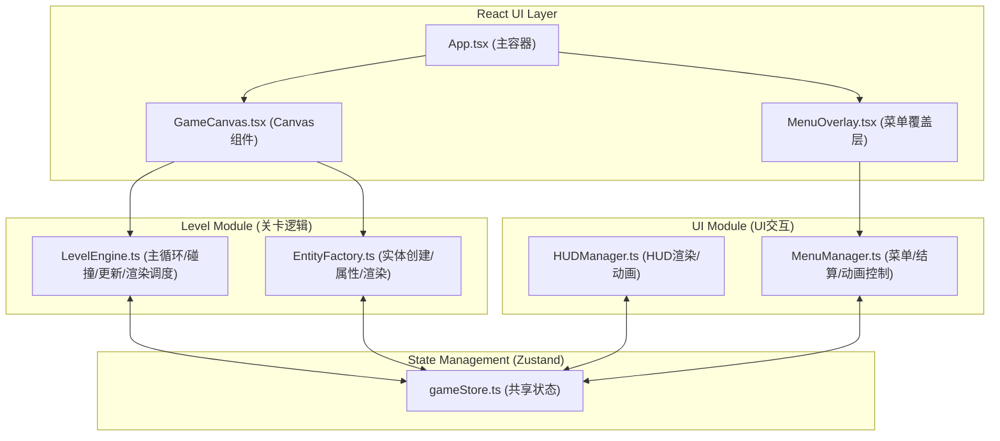

## 1. 架构设计


## 2. 技术描述
- **前端框架**：React@18 + React-DOM@18
- **构建工具**：Vite + @vitejs/plugin-react
- **状态管理**：Zustand
- **语言**：TypeScript（严格模式）
- **渲染方式**：HTML5 Canvas 2D API（所有游戏内容在Canvas上绘制）
- **项目初始化**：使用vite-init脚手架创建

## 3. 文件结构定义
```
/
├── package.json
├── index.html
├── tsconfig.json
├── vite.config.js
└── src/
    ├── main.tsx (入口)
    ├── App.tsx (主组件)
    ├── components/
    │   ├── GameCanvas.tsx (Canvas包装组件)
    │   └── MenuOverlay.tsx (菜单/结算覆盖层)
    ├── level/
    │   ├── LevelEngine.ts (关卡引擎)
    │   └── EntityFactory.ts (实体工厂)
    ├── ui/
    │   ├── HUDManager.ts (HUD管理器)
    │   └── MenuManager.ts (菜单管理器)
    └── store/
        └── gameStore.ts (Zustand状态)
```

## 4. 状态模型定义 (gameStore)

### 4.1 游戏状态切片
```typescript
type GameScreen = 'menu' | 'levelSelect' | 'playing' | 'paused' | 'result';

interface PlayerState {
  x: number;
  y: number;
  vx: number;
  vy: number;
  health: number;        // 0-5
  facing: 1 | -1;
  isJumping: boolean;
  animFrame: number;
}

interface ChronoFieldState {
  active: boolean;
  energy: number;        // 0-100
  cooldown: boolean;
  cooldownTimer: number;  // ms
  continuousTime: number; // ms (连续使用时间)
}

interface LevelState {
  currentLevel: number;
  collectedFragments: number;
  cameraX: number;
  entities: Entity[];
}

interface UIState {
  currentScreen: GameScreen;
  showResult: boolean;
  resultStars: number;
  healthFlash: number;    // ms
  healthShake: number;    // ms
  energyShake: number;    // ms
}
```

### 4.2 Actions
- `startGame(levelId: number)` → 初始化关卡实体，切换到playing
- `updatePlayerState(partial)` → 更新玩家位置/速度/血量
- `updateChronoField(partial)` → 力场激活/关闭/能量/冷却
- `collectFragment(id)` → 碎片计数+1
- `showResult(stars, fragments)` → 切换结算界面
- `goToMenu()` → 返回主菜单

## 5. 关键交互机制

### 5.1 主循环 (LevelEngine)
- requestAnimationFrame驱动
- 时间步长固定(dt)或插值
- 循环流程：输入处理 → 物理更新(重力/移动) → 力场判定 → 实体更新(分受影响/不受影响两类) → 碰撞检测 → 收集判定 → 相机跟随 → 渲染

### 5.2 时间力场判定
- 力场中心：玩家坐标
- 力场半径：200px（环形波纹视觉对应）
- 受影响实体类型：Drone（巡逻无人机）
- 不受影响：Turret（炮塔）、Bullet（弹丸）、CrumblingPlatform（破碎平台）、SpikeFloor（棘刺）

### 5.3 碰撞检测
- AABB矩形碰撞
- 玩家与平台：分轴检测，先Y后X，解决卡墙
- 玩家与敌人/弹丸：扣血+击退
- 玩家与碎片：收集+计数
- 玩家与出口：结算

### 5.4 渲染管线
1. 清空画布 → 紫色渐变背景
2. 时间力场激活时：离屏canvas渲染背景 → 像素中心扭曲操作 → 贴回
3. 渲染平台/机关（含噪点纹理）
4. 渲染碎片（闪烁脉冲动画）
5. 渲染敌人（无人机/炮塔/弹丸）
6. 渲染玩家（帧动画）
7. 力场激活时：玩家周围金色环形波纹
8. HUDManager渲染HUD（血条/能量/碎片）

### 5.5 UI动画
- 数值抖动：血条/能量值变化时，0.15s随机offset偏移
- 结算星星：每颗间隔0.3s，scale 0→1 + rotate 720°
- 按钮悬停：背景rgba(0,255,255,0.2)填充，transition 0.3s
- 受伤闪红：血条区域0.2s红色叠加
