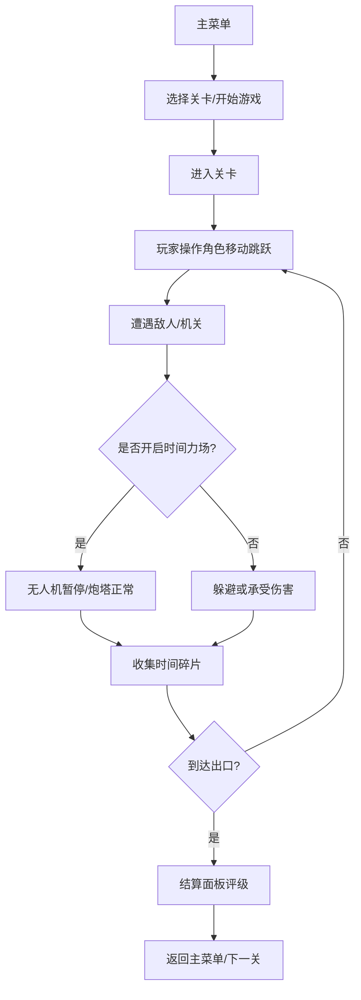

## 1. 产品概述
ChronoBreach 是一款以时间停止为核心机制的2D横版平台解谜游戏，玩家通过开启时间力场暂停特定敌人和机关，利用时间不连续性穿越障碍、收集时间碎片并到达出口。
- 面向喜欢解谜和平台跳跃类游戏的玩家，提供独特的时间操控体验
- 通过策略性使用时间力场，创造富有挑战性和满足感的关卡体验

## 2. 核心特性

### 2.1 功能模块
1. **主菜单界面**：游戏标题、开始游戏按钮、关卡选择按钮
2. **关卡游戏场景**：横向卷轴平台关卡、角色控制、碰撞检测、物理模拟
3. **时间力场系统**：暂停特定实体（巡逻无人机）、视觉特效、能量管理
4. **敌人系统**：巡逻无人机（可暂停）、锁定炮塔（不受影响）
5. **机关系统**：破碎平台、周期翻转棘刺（均不受时间力场影响）
6. **收集系统**：时间碎片收集、评分计算
7. **HUD系统**：血条、碎片计数、能量条显示与动画
8. **结算面板**：通关评级、星星动画、碎片统计

### 2.2 页面详情
| 页面名称 | 模块名称 | 功能描述 |
|---------|---------|---------|
| 主菜单 | 按钮组 | 开始游戏、关卡选择，霓虹蓝描边，悬停背景填充 |
| 关卡场景 | 背景渲染 | 复古科幻渐变紫色背景，暗金属纹理地面/平台 |
| 关卡场景 | 玩家角色 | 宇航员角色，8方向行走动画，跳跃帧 |
| 关卡场景 | 时间力场 | 金色环形波纹、背景扭曲失真、能量消耗冷却 |
| 关卡场景 | 敌人 | 巡逻无人机（暂停）、锁定炮塔（弹丸发射） |
| 关卡场景 | 机关 | 破碎平台（踩踏延迟消失）、棘刺地面（周期翻转） |
| HUD界面 | 状态显示 | 血条（5格渐变）、碎片计数、能量条（冷却遮罩） |
| 结算面板 | 评级显示 | 半透明遮罩、星级动画（旋转飞出）、关闭按钮 |

## 3. 核心流程

## 4. 用户界面设计

### 4.1 设计风格
- **主色调**：渐变紫色系（#2B0F3A → #1A0F2E），霓虹蓝#00FFFF，金色#FFD700，暗红警示色
- **按钮样式**：霓虹蓝描边，圆角矩形，悬停背景半透明填充，0.3s ease过渡
- **字体**：像素风/科幻等宽字体，强化复古科幻氛围
- **布局风格**：固定960x640窗口居中，#0F0A1A背景边框
- **视觉特效**：Canvas噪点纹理、环形波纹、像素扭曲、数值抖动动画

### 4.2 页面设计概述
| 页面名称 | 模块名称 | UI元素 |
|---------|---------|--------|
| 主菜单 | 标题区 | 大字号ChronoBreach标题，霓虹发光效果 |
| 主菜单 | 按钮组 | 垂直排列，开始游戏/关卡选择，悬停动画 |
| 关卡场景 | 背景 | 紫色渐变+星点，远景视差滚动 |
| 关卡场景 | 平台 | 暗金属噪点纹理，边缘高光线条 |
| 关卡场景 | 玩家 | 圆头盔宇航员，蓝白配色，像素画风格 |
| 关卡场景 | 力场效果 | 金色半透明环形波纹，背景中心扭曲 |
| HUD | 血条 | 左上角5格，绿→红渐变，受伤闪红 |
| HUD | 能量条 | 右下角，消耗/回复动画，冷却红色遮罩 |
| 结算 | 面板 | 居中圆角12px，紫色渐变背景，半透明遮罩 |
| 结算 | 星星 | 依次旋转飞出，scale 0→1，旋转720° |

### 4.3 响应式
- 固定窗口尺寸960x640，屏幕上绝对居中
- 小于该尺寸的屏幕显示缩放提示信息
- Canvas内部坐标系固定960x640，通过CSS缩放适配
