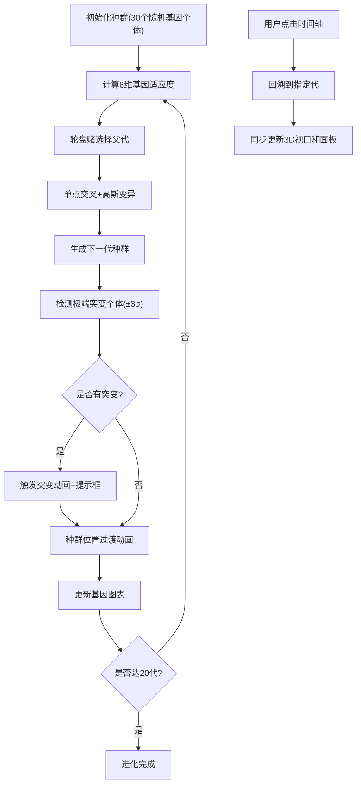

## 1. 产品概述
MorphMuseum是一个在线3D交互式生物形态进化可视化应用，让用户通过操作滑块和拖拽，动态观察虚拟生物从远古形态到未来形态的多代进化过程，并查看不同基因特征在种群中的分布变化。
- 主要用途：教育展示、科学可视化、基因进化模拟演示
- 目标用户：生物爱好者、学生、科研人员、对进化算法感兴趣的开发者
- 产品价值：将抽象的进化算法和基因遗传概念转化为直观的3D可视化体验

## 2. 核心特性

### 2.1 用户角色
| 角色 | 注册方式 | 核心权限 |
|------|----------|----------|
| 普通用户 | 无需注册 | 浏览进化过程、调节参数、回溯历史代、查看基因分布 |

### 2.2 功能模块
1. **进化模拟模块**：种群管理、适应度计算、选择交叉变异、代际演化
2. **3D交互展示模块**：生物模型渲染、视角控制、个体选择高亮、动画效果
3. **基因可视化模块**：条形图、小提琴图、雷达图展示基因分布
4. **时间轴回溯模块**：20代历史记录、状态回滚、跳转连线指示

### 2.3 页面详情
| 页面名称 | 模块名称 | 功能描述 |
|----------|----------|----------|
| 主界面 | 3D视口 | 显示当前代种群，支持OrbitControls旋转视角，点击个体高亮 |
| 主界面 | 右侧控制面板 | 基因分布图（条形图+小提琴图）、个体详情雷达图、参数滑块（选择压力、变异率、代际速度） |
| 主界面 | 底部时间轴 | 显示1-20代标记，点击回溯，高亮当前代，跳转指示连线 |

## 3. 核心流程
用户进入应用后，系统自动初始化30个随机基因的初代种群，开始自动进化。用户可通过滑块调节选择压力和变异率，观察种群基因分布变化；点击任意个体查看其基因雷达图；点击底部时间轴任意代可回溯该代状态；当出现极端突变个体时，系统触发动画和提示。

## 4. 用户界面设计

### 4.1 设计风格
- **主色调**：深蓝紫渐变背景（#0F0C29 → #302B63），深色面板（#1E1E2E）
- **强调色**：紫色滑块（#7C4DFF）、蓝色到红色渐变条形（#3498DB → #E74C3C）、绿色小提琴图（#2ECC71半透明）
- **字体**：无衬线字体，现代科技感
- **布局**：左侧70% 3D视口，右侧30%控制面板，底部时间轴
- **动画**：所有状态变化使用0.3-1.5s平滑过渡，缓动函数cubic-bezier(0.25, 0.46, 0.45, 0.94)

### 4.2 页面设计概览
| 页面名称 | 模块名称 | UI元素 |
|----------|----------|--------|
| 主界面 | 3D视口 | 深蓝紫渐变背景、半透明网格地面、30个生物个体按圆形排列、环境光+定向光、OrbitControls |
| 主界面 | 右侧面板 | 卡片式布局（圆角12px）、基因分布图（条形图+小提琴图）、8边形雷达图、三个滑块控件、分割线 |
| 主界面 | 底部时间轴 | 半透明背景（#1E1E2E，0.9不透明度）、20个代标记、高亮当前代、半透明跳转连线 |

### 4.3 响应式设计
- 桌面端优先，最小宽度1024px
- 3D视口最小宽度600px
- 面板内容自适应，小屏幕下可滚动

### 4.4 3D场景指引
- **环境**：深蓝紫色渐变背景，营造科技感和深邃感
- **光照**：环境光（强度0.6）+ 定向光（强度1.0，位置(10, 20, 10)），突出生物立体感
- **相机**：透视相机，位置(0, 15, 25)，看向原点，未选中时自动环绕旋转
- **交互**：OrbitControls支持缩放、旋转、平移，点击个体触发高亮发光动画
- **动画**：代际切换位置过渡（0.5s）、突变动画（1.5s旋转缩放）、选中高亮（0.3s边框动画）
- **性能**：帧率≥30fps，使用BufferGeometry，合理控制几何体面数
