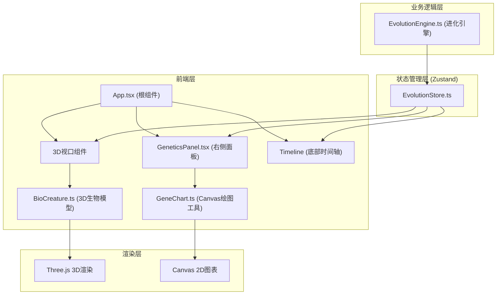

## 1. 架构设计



## 2. 技术描述

- **前端框架**：React@18 + TypeScript
- **构建工具**：Vite
- **3D渲染**：Three.js@0.160 + @types/three
- **状态管理**：Zustand
- **工具库**：uuid
- **无后端**：纯前端应用，所有计算在浏览器端完成

## 3. 文件结构

```
d:\P\tasks\auto3\
├── package.json
├── index.html
├── tsconfig.json
├── vite.config.js
└── src\
    ├── App.tsx
    ├── evolution\
    │   ├── EvolutionEngine.ts
    │   ├── BioCreature.ts
    │   └── EvolutionStore.ts
    └── genetics\
        ├── GeneticsPanel.tsx
        └── GeneChart.ts
```

## 4. 数据模型

### 4.1 基因维度定义
| 基因名称 | 类型 | 取值范围 | 权重 |
|----------|------|----------|------|
| bodySize (体型) | number | [0, 1] | 0.15 |
| skinColor (肤色) | number | [0, 1] | 0.10 |
| hornLength (角长) | number | [0, 1] | 0.15 |
| tailType (尾型) | number | [0, 1] | 0.10 |
| limbLength (肢长) | number | [0, 1] | 0.12 |
| headSize (头型) | number | [0, 1] | 0.12 |
| eyeSize (眼型) | number | [0, 1] | 0.13 |
| spineCurve (脊柱曲度) | number | [0, 1] | 0.13 |

### 4.2 数据结构定义

```typescript
interface Genotype {
  id: string;
  bodySize: number;
  skinColor: number;
  hornLength: number;
  tailType: number;
  limbLength: number;
  headSize: number;
  eyeSize: number;
  spineCurve: number;
  fitness: number;
}

interface PopulationStats {
  mean: number[];
  std: number[];
  max: number[];
  min: number[];
}

interface GenerationSnapshot {
  generation: number;
  population: Genotype[];
  stats: PopulationStats;
  positions: { x: number; z: number }[];
  mutationEvents: string[];
}

interface EvolutionState {
  currentGeneration: number;
  maxGenerations: number;
  population: Genotype[];
  history: GenerationSnapshot[];
  selectedIndividualId: string | null;
  selectionPressure: number;
  mutationRate: number;
  generationSpeed: number;
  isEvolving: boolean;
  viewedGeneration: number;
  jumpLine: { from: number; to: number } | null;
  mutationAlert: { id: string; visible: boolean } | null;
  transitionProgress: number;
}
```

## 5. 核心模块设计

### 5.1 EvolutionEngine.ts
- **适应度计算**：8个基因维度加权求和，每个维度与最优值(0.5)的距离计算
- **选择算法**：轮盘赌选择（Roulette Wheel Selection）
- **交叉算子**：单点交叉（Single-point Crossover）
- **变异算子**：高斯变异（Gaussian Mutation）
- **极端突变检测**：计算种群均值±3σ，检测超出范围的个体

### 5.2 BioCreature.ts
- **几何体构成**：
  - 躯干：SphereGeometry（球体）
  - 四肢：ConeGeometry（圆锥）×4
  - 头部：SphereGeometry（球体）
  - 角：自定义BufferGeometry（锥体+弯曲顶点偏移实现曲线）
  - 尾巴：自定义BufferGeometry（从粗到细的锥形渐细结构）
- **材质**：MeshStandardMaterial，支持emissive高亮
- **方法**：update(genotype)、animate(delta)、highlight()、playMutationAnimation()

### 5.3 GeneChart.ts
- **条形图**：8个基因平均值，颜色从#3498DB到#E74C3C线性渐变
- **小提琴图**：核密度估计，半透明#2ECC71填充
- **雷达图**：8边形，显示选定个体的8个基因值
- **性能**：单次绘制≤16ms

### 5.4 动画系统
- **代际过渡**：cubic-bezier(0.25, 0.46, 0.45, 0.94) 缓动函数
- **位置插值**：四元数旋转 + 位置平移，0.5秒完成
- **突变动画**：1.5秒快速旋转 + 缩放至1.5倍后恢复
- **选中高亮**：0.3秒emissive颜色过渡

### 5.5 性能优化
- Three.js使用BufferGeometry而非Geometry
- 材质复用，避免重复创建
- Canvas图表使用requestAnimationFrame节流
- 种群数量固定为30，控制渲染负载
