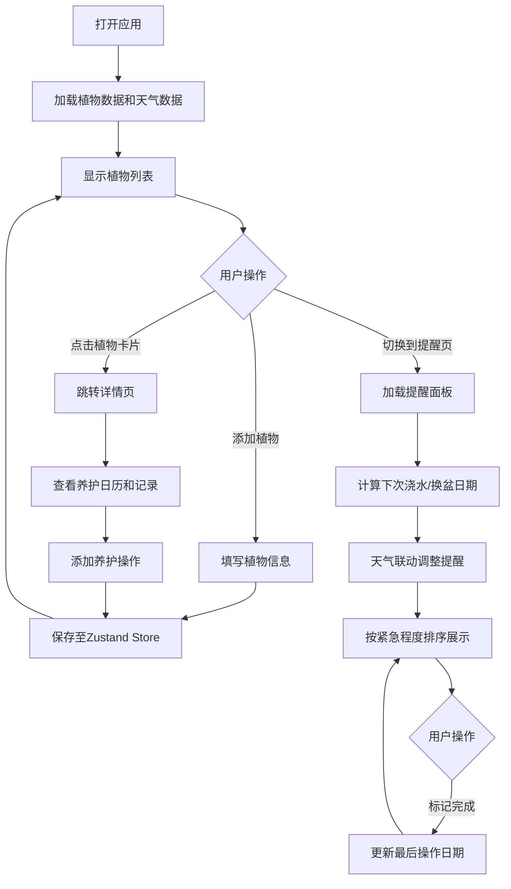

## 1. 产品概述

SuccuCare是一款面向园艺爱好者的在线多肉植物养护管理与智能提醒应用，帮助用户系统化管理数百种多肉植物的养护计划。通过模拟天气数据智能调整养护建议，提升植物存活率，简化日常养护工作。

- 目标用户：多肉植物收藏爱好者、家庭园艺爱好者
- 核心价值：智能养护提醒、系统化管理、天气联动调整

## 2. 核心功能

### 2.1 功能模块

1. **我的植物（植物管理）**：植物列表展示、添加/编辑植物信息、植物详情查看、收藏标记、模糊搜索
2. **养护提醒（智能提醒）**：智能提醒列表、天气联动调整、紧急程度排序、一键标记完成
3. **品种百科**：多肉品种预设信息展示

### 2.2 页面详情

| 页面名称 | 模块名称 | 功能描述 |
|----------|----------|----------|
| 植物列表页 | PlantList | 网格卡片展示植物、响应式布局、收藏星标、搜索过滤、路由跳转详情 |
| 植物详情页 | PlantDetail | 植物照片展示、养护记录日历、浇水/光照/施肥信息、编辑保存 |
| 智能提醒页 | ReminderPanel | 提醒卡片列表、紧急程度色标、进度条倒计时、天气推迟标签、完成操作 |
| 品种百科页 | SpeciesEncyclopedia | 预设品种列表、品种信息展示（浇水间隔、光照偏好） |

## 3. 核心流程

## 4. 用户界面设计

### 4.1 设计风格

- **主色调**：#D5E8D4（浅草绿）、#FFFFFF（白色）、#6B8E23（橄榄绿）、#4A6741（深绿）
- **强调色**：#FFD700（金色收藏星标）、#8FBC8F（导航高亮）
- **紧急程度色**：红色（超期）、黄色（今日到期）、绿色（未来3天）
- **操作类型色**：蓝色（浇水）、绿色（施肥）、橙色（换盆）、灰色（翻土）
- **字体**：font-family: -apple-system, sans-serif
- **布局风格**：左侧固定导航侧栏 + 右侧自适应主内容区，卡片式布局
- **图标风格**：Emoji图标
- **动效**：卡片悬停上移阴影加深、收藏星标缩放、完成操作淡出、按钮过渡

### 4.2 页面设计概览

| 页面名称 | 模块名称 | UI元素 |
|----------|----------|--------|
| 植物列表页 | PlantList | 搜索框（300ms防抖）、Grid卡片布局（响应式4/2/1列）、卡片（240x320px圆角12px阴影）、照片区、名称品种、下次浇水倒计时、收藏星标 |
| 植物详情页 | PlantDetail | 大图展示、基本信息、养护操作记录、日历视图（react-calendar）、操作色点标注、编辑保存按钮（加载状态） |
| 智能提醒页 | ReminderPanel | 提醒卡片列表、圆形类型图标、文字描述、倒计时进度条、天气推迟标签、完成按钮（圆角20px）、淡出动画 |
| 品种百科页 | SpeciesEncyclopedia | 品种卡片列表、品种名称、浇水间隔、光照偏好说明 |

### 4.3 响应式设计

- Desktop-first，桌面端优先设计
- 植物列表：max-width: 1200px时4列，<768px时2列，<480px时1列
- 侧栏在移动端可折叠（汉堡菜单）

### 4.4 性能要求

- 植物列表初始加载（100株模拟数据）≤ 1.5秒
- 搜索过滤响应时间 ≤ 100ms
- 日历视图渲染 ≤ 500ms
