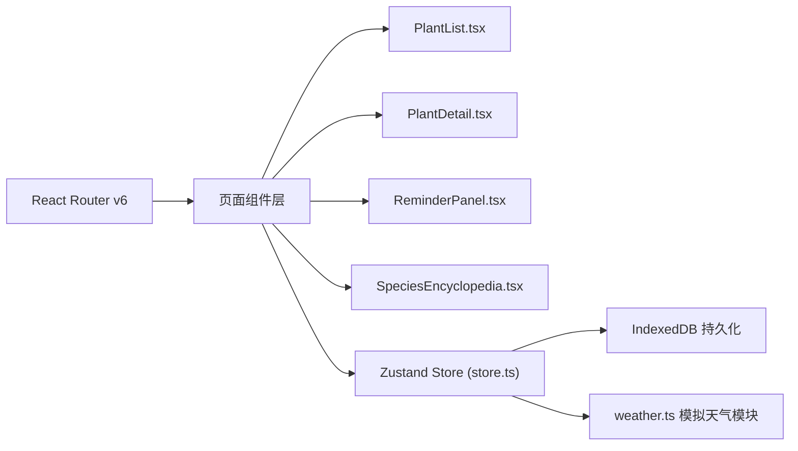
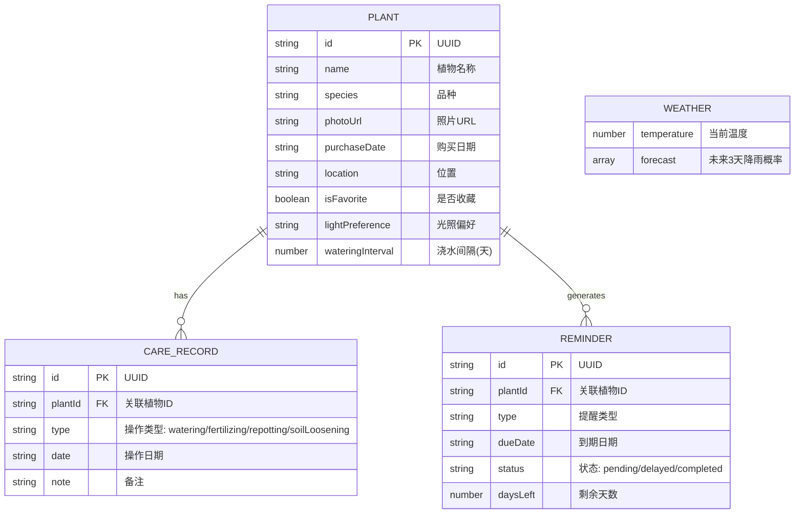

## 1. 架构设计



## 2. 技术说明

- **前端框架**：React@18 + TypeScript
- **构建工具**：Vite + @vitejs/plugin-react
- **状态管理**：Zustand
- **路由**：React Router v6
- **数据持久化**：IndexedDB
- **UI组件库**：react-calendar（日历视图）
- **工具库**：uuid（ID生成）

## 3. 路由定义

| 路由 | 页面组件 | 用途 |
|------|----------|------|
| / | PlantList | 植物列表页（默认首页） |
| /plants | PlantList | 我的植物列表 |
| /plants/:id | PlantDetail | 单株植物详情页 |
| /reminders | ReminderPanel | 智能提醒面板 |
| /species | SpeciesEncyclopedia | 品种百科 |

## 4. 数据模型

### 4.1 实体关系图



### 4.2 品种预设数据

| 品种名称 | 浇水间隔(天) | 光照偏好 |
|----------|-------------|----------|
| 熊童子 | 10 | 喜阳 |
| 玉露 | 14 | 半阴 |
| 生石花 | 30 | 喜阳 |
| 黑法师 | 12 | 喜阳 |
| 静夜 | 10 | 喜阳 |
| 雪莲 | 15 | 半阴 |
| 姬玉露 | 14 | 半阴 |
| 火祭 | 7 | 喜阳 |
| 蓝石莲 | 12 | 喜阳 |
| 吉娃娃 | 10 | 喜阳 |

## 5. 核心数据流向

### 5.1 Store数据流

```
plants模块写入植物数据 → Zustand Store (plants, reminders, weather)
                                      ↓
                              reminder模块读取数据
                                      ↓
                        结合天气数据计算提醒 → 更新Store
```

### 5.2 页面数据流

**PlantList.tsx**:
```
store.plants → 过滤（搜索/收藏）→ Grid渲染卡片 → 用户点击 → 路由跳转 /plants/:id
```

**PlantDetail.tsx**:
```
store.plants[id] → 渲染详情 + 日历视图 → 编辑保存 → store.updatePlant()
store.careRecords → 过滤当前plantId → 日历色点标注
```

**ReminderPanel.tsx**:
```
store.plants + store.weather → 计算下次浇水日期 → 天气判断推迟 → 紧急排序 → 渲染列表
用户点击完成 → store.markReminderComplete() → 更新plant最后操作日期
```

## 6. 文件结构

```
src/
├── main.tsx                    # 应用入口，路由配置
├── App.tsx                     # 根组件（布局容器）
├── store.ts                    # Zustand全局Store
├── weather.ts                  # 模拟天气数据模块
├── types.ts                    # TypeScript类型定义
├── plants/
│   ├── PlantList.tsx           # 植物列表页
│   ├── PlantDetail.tsx         # 植物详情页
│   ├── PlantCard.tsx           # 植物卡片组件
│   └── PlantForm.tsx           # 植物表单组件
├── reminder/
│   ├── ReminderPanel.tsx       # 智能提醒面板
│   └── ReminderCard.tsx        # 提醒卡片组件
├── species/
│   └── SpeciesEncyclopedia.tsx # 品种百科页
├── components/
│   ├── Sidebar.tsx             # 导航侧栏
│   ├── Layout.tsx              # 页面布局
│   └── SearchInput.tsx         # 搜索输入框
└── utils/
    ├── idb.ts                  # IndexedDB工具
    └── dateUtils.ts            # 日期工具函数
```
