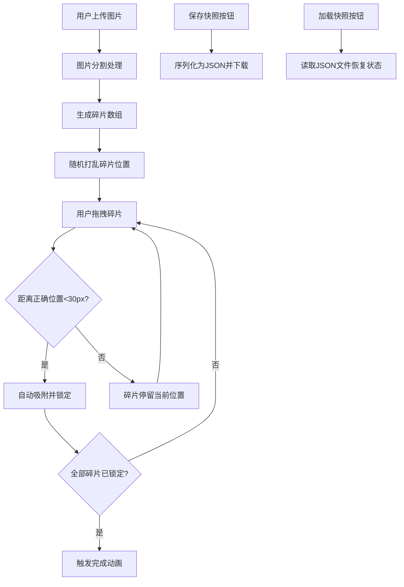

## 1. 产品概述

图片碎片拼贴画板应用，允许用户上传图片并将其自动分割为可拖拽的碎片，通过手动拼图完成创意重组或解谜体验。
- 主要解决浏览器中碎片化图像编辑、创意拼贴和拼图游戏的需求，面向设计师、创意工作者和普通娱乐用户
- 提供流畅的拖拽体验、视觉反馈和状态持久化功能

## 2. 核心功能

### 2.1 功能模块

1. **主画布区域**：碎片渲染、拖拽交互、对齐验证、完成特效
2. **工具栏区域**：图片上传、随机打乱、保存快照、加载快照、重置、分割数调整
3. **状态管理模块**：碎片位置、锁定状态、z-index层级、分割参数
4. **文件管理模块**：快照序列化/反序列化、图片处理

### 2.2 页面详情

| 页面名称 | 模块名称 | 功能描述 |
|-----------|-------------|---------------------|
| 主页面 | 画布区域 | 80vmin正方形画布，容纳所有可拖拽碎片，支持网格背景、虚线占位框、完成发光边框 |
| 主页面 | 工具栏 | 上传按钮、滑块(2x2~6x6)、操作按钮(随机打乱/保存快照/加载快照/重置) |
| 主页面 | 状态指示器 | 右上角显示当前分割模式（如"4 x 4"） |
| 主页面 | 完成提示 | 拼图完成时居中显示"拼图完成！"文字，带淡入动画 |

## 3. 核心流程

用户上传图片 → 图片自动分割为N×N碎片 → 碎片随机散落在画布上 → 用户拖拽碎片至正确位置 → 碎片靠近时自动吸附锁定 → 全部碎片对齐后触发完成动画 → 用户可保存/加载快照

## 4. 用户界面设计

### 4.1 设计风格
- 主色调：白色背景 #FAFAFA，浅灰 #E0E0E0 #F5F5F5 #CCC #EEE
- 强调色：金色 #FFD700（完成发光），淡蓝 #F0F8FF（锁定背景），绿色 #90EE90（对齐闪烁），灰色 #888 #555（描边）
- 按钮样式：圆角6px，边框1px #CCC，背景#FFF，悬浮#EEE，点击#DDD
- 字体：'Segoe UI', system-ui，无衬线
- 布局：极简风格，居中画布+底部工具栏

### 4.2 页面设计概述

| 页面名称 | 模块名称 | UI元素 |
|-----------|-------------|-------------|
| 主页面 | 画布 | 80vmin×80vmin，1px #E0E0E0边框，网格背景，碎片渲染层 |
| 主页面 | 碎片 | 1px #888描边，悬停2px #555+阴影，拖拽时放大1.1倍+随机旋转-5°~5°，锁定后淡蓝背景 |
| 主页面 | 工具栏 | 高60px，背景#F5F5F5，按钮水平居中排列，滑块控件 |
| 主页面 | 状态指示器 | 右上角12px灰色文字，显示"N x N" |
| 主页面 | 完成提示 | 24px居中文字，淡入效果，金色发光边框 |

### 4.3 响应式
- 桌面端优先设计
- 移动端（<768px）：画布调整为95vmin，工具栏按钮缩小为80%

### 4.4 动效设计
- 随机打乱：0.5s ease-out动画
- 对齐锁定：背景色#F0F8FF 0.3s渐显
- 完成动画：0.8s pulse金色发光边框，0.6s ease-in-out碎片边缘融合
- 拖拽旋转恢复：0.15s过渡
- 对齐闪烁：0.2s绿色背景
