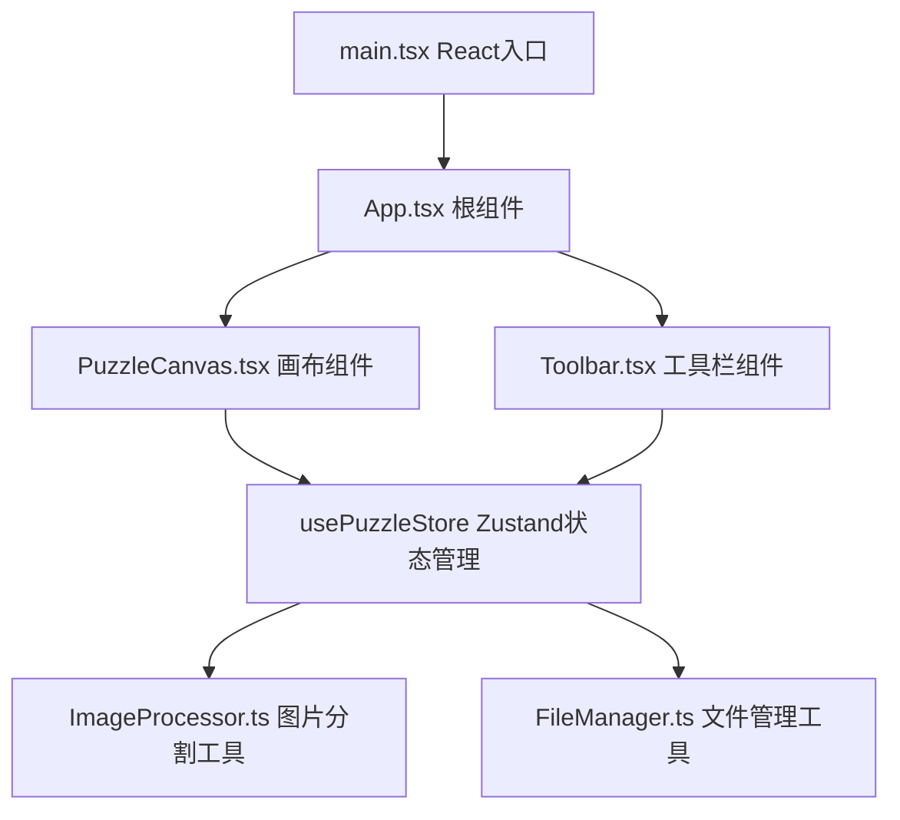

## 1. 架构设计



## 2. 技术描述

- 前端：React@18 + TypeScript + Vite
- 状态管理：Zustand
- 图片处理：Canvas API
- 构建工具：Vite
- 依赖包：react@18, react-dom@18, zustand, uuid, vite, @vitejs/plugin-react

## 3. 核心数据模型

### 3.1 碎片数据结构

```typescript
interface Piece {
  id: string;
  imgData: ImageData;
  correctX: number;
  correctY: number;
  curX: number;
  curY: number;
  locked: boolean;
  zIndex: number;
}
```

### 3.2 快照数据结构

```typescript
interface PuzzleSnapshot {
  version: string;
  gridSize: number;
  pieces: {
    id: string;
    correctX: number;
    correctY: number;
    curX: number;
    curY: number;
    locked: boolean;
    zIndex: number;
  }[];
  imageDataBase64: string;
  canvasWidth: number;
  canvasHeight: number;
  savedAt: string;
}
```

## 4. 模块划分

### 4.1 状态管理模块 (puzzleStore.ts)
- pieces: 碎片数组状态
- gridSize: 分割数量(2~6)
- isCompleted: 是否完成
- maxZIndex: 当前最大z-index
- Actions:
  - setImageAndSplit: 设置图片并分割
  - updatePiecePosition: 更新碎片位置
  - lockPiece: 锁定碎片
  - shufflePieces: 随机打乱
  - resetPuzzle: 重置拼图
  - checkCompletion: 检查是否全部完成
  - setGridSize: 设置分割数量
  - saveSnapshot: 保存快照
  - loadSnapshot: 加载快照

### 4.2 画布组件 (PuzzleCanvas.tsx)
- 渲染所有碎片
- 处理鼠标/触摸拖拽事件
- 渲染虚线占位框
- 处理吸附对齐逻辑
- 完成特效渲染

### 4.3 工具栏组件 (Toolbar.tsx)
- 图片上传控件
- 分割数量滑块
- 随机打乱按钮
- 保存快照按钮
- 加载快照按钮
- 重置按钮

### 4.4 工具函数

**ImageProcessor.ts**
- splitImage: 接收图片文件和分割数，返回碎片ImageData数组

**FileManager.ts**
- saveSnapshot: 创建Blob并下载JSON文件
- loadSnapshot: 读取JSON文件恢复状态

## 5. 文件结构

```
.
├── package.json
├── index.html
├── tsconfig.json
├── vite.config.js
└── src/
    ├── main.tsx
    ├── App.tsx
    ├── store/
    │   └── puzzleStore.ts
    ├── components/
    │   ├── PuzzleCanvas.tsx
    │   └── Toolbar.tsx
    └── utils/
        ├── ImageProcessor.ts
        └── FileManager.ts
```
