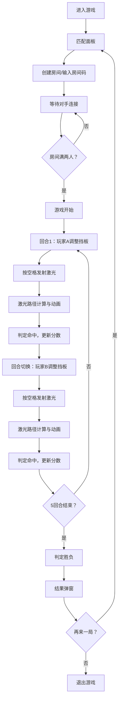

## 1. 产品概述
LaserMaze是一款在线多人激光迷阵对战游戏，两位玩家在由反射镜、棱镜和可移动挡板组成的8x8迷宫中，通过调整光学元件引导激光路径击中对方基地得分。

- 核心玩法：回合制策略对战，玩家在限定时间内调整己方半场挡板位置，发射激光通过光学反射击中对方基地
- 目标用户：休闲竞技游戏爱好者，喜欢策略和物理益智类游戏的玩家
- 市场价值：融合物理模拟与策略对战的创新玩法，具有高度的可重玩性和竞技性

## 2. 核心功能

### 2.1 用户角色
| 角色 | 注册方式 | 核心权限 |
|------|----------|----------|
| 玩家 | 无需注册，通过房间码匹配 | 创建/加入房间、调整挡板、发射激光、查看对战结果 |

### 2.2 功能模块
1. **匹配面板**：房间创建与加入，4位房间码管理，等待对手连接
2. **游戏棋盘**：8x8网格Canvas渲染，光学元件显示与交互
3. **激光系统**：激光路径追踪，反射、分裂、碰撞物理模拟
4. **回合系统**：回合计时，玩家轮流操作，胜负判定
5. **HUD界面**：玩家信息、生命值、得分、剩余时间显示
6. **网络同步**：Socket.IO实时同步双方操作与游戏状态

### 2.3 页面详情
| 页面名称 | 模块名称 | 功能描述 |
|----------|----------|----------|
| 匹配页面 | 匹配面板 | 输入/创建4位房间码，显示等待状态，自动复制房间码 |
| 游戏页面 | 游戏棋盘 | Canvas渲染8x8网格，显示反射镜、棱镜、挡板、基地 |
| 游戏页面 | 拖拽交互 | 玩家拖拽己方半场挡板，释放后网格吸附 |
| 游戏页面 | 激光发射 | 空格键触发激光，实时动画绘制路径，粒子效果 |
| 游戏页面 | 信息面板 | 左右两侧显示双方玩家头像、生命条、得分、剩余时间 |
| 游戏页面 | 结果弹窗 | 游戏结束显示胜负，提供"再来一局"按钮 |

## 3. 核心流程

### 玩家匹配与游戏流程
1. 玩家进入游戏，显示匹配面板
2. 玩家输入房间码加入或点击创建新房间（生成4位随机码）
3. 等待第二位玩家加入，房间满两人自动开始游戏
4. 每回合15秒调整时间，玩家拖拽己方半场挡板
5. 按下空格键发射激光，激光路径实时计算与动画
6. 判定命中结果，更新生命值和得分
7. 回合切换，共5回合后判定胜负
8. 显示结果弹窗，可选择再来一局重新匹配

## 4. 用户界面设计

### 4.1 设计风格
- **整体风格**：深色科技风，赛博朋克质感
- **主色调**：背景渐变 #1A1A2E → #16213E，棋盘深灰 #2C2C2C
- **强调色**：玩家A红色 #FF4444，玩家B蓝色 #4444FF，金色反射镜 #FFD700，棱镜银白 #C0C0C0，挡板蓝色 #00BFFF
- **辅助色**：网格线浅灰 #4A4A4A，边框发光 #00FF7F / #FF007F
- **按钮样式**：圆角卡片，半透明背景 #FFFFFF10，边框 #00FF7F40，悬停发光效果
- **字体**：显示字体使用 Orbitron（科技感数字字体），正文字体使用 Rajdhani
- **布局**：棋盘居中，左右两侧对称信息面板，匹配模态框居中

### 4.2 页面设计概述
| 页面名称 | 模块名称 | UI元素 |
|----------|----------|--------|
| 匹配页面 | 匹配面板 | 居中模态框、发光输入框、创建/加入按钮、房间码显示与复制 |
| 游戏页面 | 背景层 | 深色渐变背景、科技感网格纹理 |
| 游戏页面 | 信息面板 | 圆角卡片、头像轮廓、渐变生命条、数字得分、倒计时 |
| 游戏页面 | 游戏棋盘 | 8x8 Canvas网格、光学元件（反射镜/棱镜/挡板）、基地标记、激光发射器 |
| 游戏页面 | 激光效果 | 红色激光线、流动光点、爆散粒子、命中闪光 |
| 游戏页面 | 回合提示 | 棋盘边缘彩色光晕、回合切换动画 |
| 游戏页面 | 结果弹窗 | 胜负文字、基地动画效果、再来一局按钮 |

### 4.3 动画效果
- **拖拽反馈**：拖拽时元件阴影（距离6px，透明度0.3），释放时0.2秒弹性吸附动画
- **激光发射**：屏幕轻微抖动（位移4px，持续0.15秒），激光路径流动光点
- **碰撞效果**：挡板阻挡时浅蓝色爆散粒子（持续0.5秒）
- **回合切换**：棋盘边缘闪烁对应玩家颜色光晕（0.5秒过渡）
- **输入框动画**：边框颜色在 #00FF7F 和 #FF007F 之间循环发光
- **胜利动画**：胜者基地闪烁金色光晕，败者基地变灰（持续3秒）

### 4.4 响应式设计
- 桌面端优先设计，棋盘固定640x640像素
- 信息面板自适应宽度，最小支持1280px屏幕宽度
- 触控设备支持触摸拖拽操作
