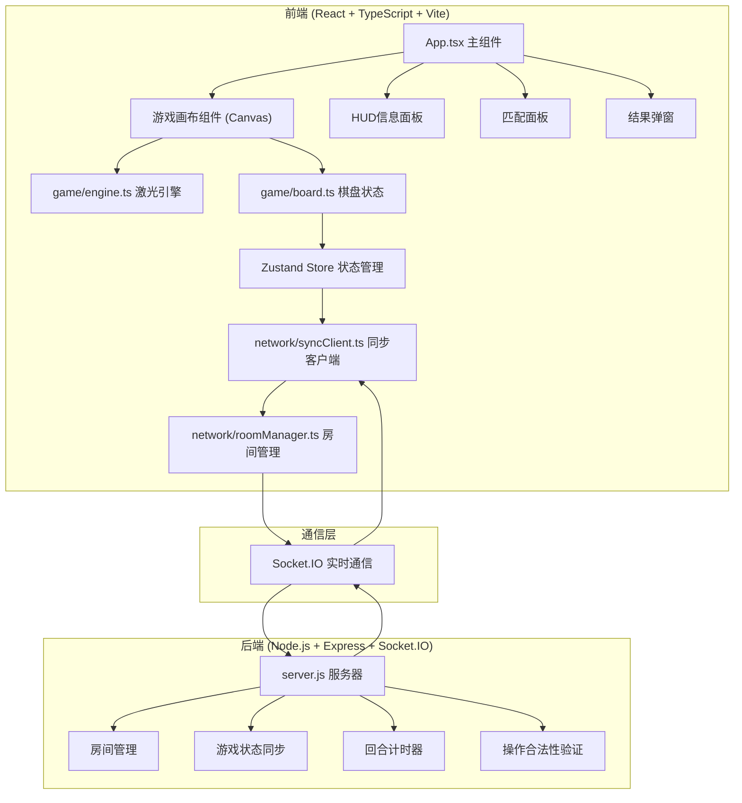
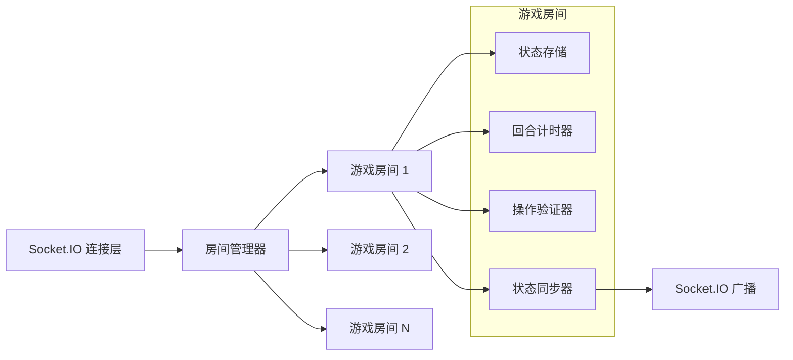

## 1. 架构设计



## 2. 技术描述

- **前端框架**: React@18 + TypeScript + Vite@5
- **状态管理**: Zustand@4
- **实时通信**: Socket.IO-client@4
- **渲染引擎**: HTML5 Canvas 2D
- **后端服务**: Node.js + Express@4 + Socket.IO@4
- **构建工具**: Vite（同时启动前端开发服务器和后端Socket.IO服务器）
- **开发脚本**: `npm run dev` 同时启动Vite和Node服务器

## 3. 项目文件结构

| 文件路径 | 描述 |
|----------|------|
| `package.json` | 项目依赖配置，包含react、zustand、socket.io等 |
| `index.html` | 入口HTML文件，加载主应用和样式 |
| `tsconfig.json` | TypeScript配置，严格模式，ES2020目标 |
| `vite.config.js` | Vite配置，/socket.io代理到本地服务器 |
| `server.js` | Node.js服务器，Express+Socket.IO游戏服务 |
| `src/game/types.ts` | 游戏核心类型定义 |
| `src/game/engine.ts` | 激光路径追踪引擎，物理模拟 |
| `src/game/board.ts` | 迷宫棋盘状态管理，Zustand store |
| `src/network/roomManager.ts` | 房间匹配管理，Socket.IO事件处理 |
| `src/network/syncClient.ts` | 网络同步客户端，状态序列化 |
| `src/App.tsx` | React主组件，集成所有模块 |
| `src/components/GameCanvas.tsx` | 游戏画布组件，Canvas渲染 |
| `src/components/PlayerPanel.tsx` | 玩家信息面板组件 |
| `src/components/MatchModal.tsx` | 匹配面板模态框 |
| `src/components/ResultModal.tsx` | 结果弹窗组件 |

## 4. 核心数据类型定义

```typescript
// 网格坐标
interface GridCoord {
  x: number;  // 0-7
  y: number;  // 0-7
}

// 像素坐标
interface PixelCoord {
  x: number;
  y: number;
}

// 光学元件类型
type ElementType = 'mirror' | 'prism' | 'blocker';

// 反射镜朝向
type MirrorOrientation = 'nw-se' | 'ne-sw';  // 两种45度朝向

// 光学元件
interface OpticalElement {
  id: string;
  type: ElementType;
  position: GridCoord;
  orientation?: MirrorOrientation;  // 仅反射镜需要
  movable: boolean;  // 是否可移动
  owner: 'playerA' | 'playerB' | 'neutral';  // 所属玩家半场
}

// 激光线段
interface LaserSegment {
  start: PixelCoord;
  end: PixelCoord;
  intensity: number;  // 0-1，用于分裂后衰减
}

// 激光路径结果
interface LaserResult {
  segments: LaserSegment[];
  hitBase: 'playerA' | 'playerB' | null;
  hitPosition: PixelCoord | null;
  particles: ParticleEffect[];
}

// 粒子效果
interface ParticleEffect {
  id: string;
  position: PixelCoord;
  color: string;
  createdAt: number;
  duration: number;
}

// 玩家状态
interface PlayerState {
  id: string;
  name: 'playerA' | 'playerB';
  lives: number;  // 初始3
  score: number;  // 初始0
  connected: boolean;
}

// 游戏状态
type GamePhase = 'matching' | 'playing' | 'ended';
type TurnPhase = 'adjust' | 'fire' | 'resolve';

interface GameState {
  phase: GamePhase;
  currentTurn: 'playerA' | 'playerB';
  turnPhase: TurnPhase;
  round: number;  // 1-5
  timeRemaining: number;  // 秒
  players: Record<'playerA' | 'playerB', PlayerState>;
  elements: OpticalElement[];
  laserResult: LaserResult | null;
  isFiring: boolean;
  winner: 'playerA' | 'playerB' | 'draw' | null;
}

// Socket.IO事件
interface ServerToClientEvents {
  'room:joined': (data: { roomCode: string; player: 'playerA' | 'playerB' }) => void;
  'room:full': () => void;
  'game:start': (state: GameState) => void;
  'game:state': (state: Partial<GameState>) => void;
  'game:turn': (data: { turn: 'playerA' | 'playerB'; phase: TurnPhase; time: number }) => void;
  'element:moved': (data: { elementId: string; position: GridCoord }) => void;
  'laser:fired': (result: LaserResult) => void;
  'game:end': (data: { winner: 'playerA' | 'playerB' | 'draw' }) => void;
  'error': (message: string) => void;
}

interface ClientToServerEvents {
  'room:create': () => void;
  'room:join': (roomCode: string) => void;
  'element:move': (data: { elementId: string; position: GridCoord }) => void;
  'laser:fire': () => void;
  'game:restart': () => void;
}
```

## 5. 核心模块说明

### 5.1 游戏逻辑模块 (game/)

**engine.ts - 激光路径追踪引擎**
- 输入：起始位置、方向、棋盘元件布局
- 输出：激光线段数组、命中结果、粒子效果
- 物理规则：
  - 反射镜：入射角等于反射角，45度转向
  - 棱镜：分裂为两束，各以60度夹角射出
  - 挡板：阻挡激光，生成爆散粒子
- 性能要求：单次计算耗时 < 5ms

**board.ts - 棋盘状态管理（Zustand Store）**
- 8x8网格状态管理
- 元件位置追踪
- 拖拽操作处理
- 碰撞检测与网格吸附
- 向UI层暴露状态和操作方法

### 5.2 网络通信模块 (network/)

**roomManager.ts - 房间与匹配管理**
- 创建/加入房间（4位数字房间码）
- 监听对手连接状态
- 转发玩家操作指令
- 处理Socket.IO连接事件

**syncClient.ts - 网络同步客户端**
- 监听本地Zustand store变化
- 序列化为Socket.IO事件发送
- 接收远程事件更新本地store
- 处理状态冲突和延迟补偿

### 5.3 服务器端 (server.js)

- Express提供静态文件服务
- Socket.IO管理WebSocket连接
- 房间状态存储和管理
- 回合计时器（每回合15秒）
- 操作合法性验证（禁止修改对方半场元件）
- 游戏状态增量广播

## 6. 性能优化策略

1. **Canvas渲染优化**
   - 使用requestAnimationFrame确保60FPS
   - 离屏Canvas缓存静态元素（网格、固定元件）
   - 激光路径使用增量绘制，避免全量重绘

2. **激光计算优化**
   - 网格空间划分，快速碰撞检测
   - 递归深度限制，防止无限循环
   - 结果缓存，相同布局重复利用

3. **网络优化**
   - 状态增量同步，仅发送变化部分
   - 操作防抖，避免高频消息
   - 本地预测，减少延迟感知

## 7. API 事件定义

| 事件名称 | 方向 | 数据结构 | 描述 |
|----------|------|----------|------|
| `room:create` | C→S | 无 | 创建新房间 |
| `room:join` | C→S | `{ roomCode: string }` | 加入指定房间 |
| `room:joined` | S→C | `{ roomCode: string; player: 'playerA' \| 'playerB' }` | 成功加入房间 |
| `room:full` | S→C | 无 | 房间已满，游戏即将开始 |
| `game:start` | S→C | `GameState` | 游戏开始，同步初始状态 |
| `element:move` | C→S | `{ elementId: string; position: GridCoord }` | 移动挡板请求 |
| `element:moved` | S→C | `{ elementId: string; position: GridCoord }` | 广播挡板移动 |
| `laser:fire` | C→S | 无 | 发射激光请求 |
| `laser:fired` | S→C | `LaserResult` | 广播激光发射结果 |
| `game:turn` | S→C | `{ turn: 'playerA' \| 'playerB'; phase: TurnPhase; time: number }` | 回合切换通知 |
| `game:state` | S→C | `Partial<GameState>` | 状态增量更新 |
| `game:end` | S→C | `{ winner: 'playerA' \| 'playerB' \| 'draw' }` | 游戏结束通知 |
| `game:restart` | C→S | 无 | 请求重新开始 |
| `error` | S→C | `{ message: string }` | 错误通知 |

## 8. 服务器架构



**服务器职责：**
1. 维护所有活跃房间的游戏状态
2. 验证客户端操作的合法性
3. 管理回合计时和切换
4. 向房间内所有玩家广播状态更新
5. 处理玩家连接/断开事件
