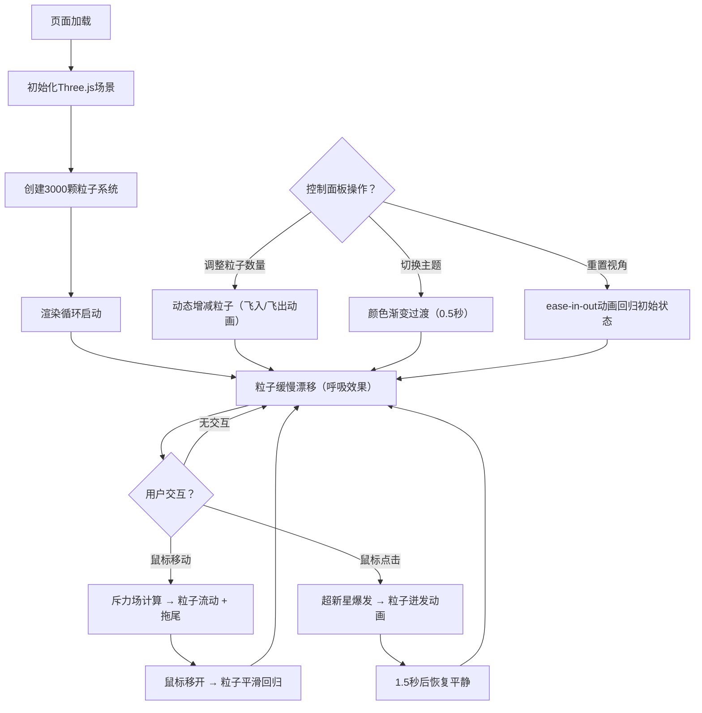

## 1. 产品概述

AstroDust是一个基于Three.js的交互式星云粒子可视化Web应用，通过数千颗动态星尘粒子构建沉浸式太空场景，支持用户与粒子系统进行实时交互。

- 主要用途：提供沉浸式的太空星云可视化体验，用户可通过鼠标与粒子系统互动，创造独特的视觉效果
- 目标用户：对视觉艺术、WebGL/Three.js技术感兴趣的用户，以及需要动态背景或视觉展示的场景
- 产品价值：展示WebGL高性能粒子系统的技术能力，提供具有艺术美感的交互式视觉体验

## 2. 核心功能

### 2.1 Feature Module

1. **星云主场景**：3000颗粒子构成的动态星云，支持三维空间分布、颜色分组、呼吸式漂移效果
2. **鼠标交互**：鼠标移动产生斥力场，粒子受斥力流动并产生拖尾效果，鼠标移开后平滑回归
3. **超新星爆发**：点击触发粒子爆发动画，粒子高速迸发、颜色闪烁、尺寸变化
4. **控制面板**：粒子数量调节、颜色主题切换、重置视角功能

### 2.3 Page Details

| 页面名称 | 模块名称 | 功能描述 |
|---------|---------|---------|
| 主页面 | 星云画布 | 全屏Three.js画布，渲染动态粒子星云，支持鼠标移动和点击交互 |
| 主页面 | 控制面板 | 右下角浮动面板，包含粒子数量滑块、颜色主题切换按钮、重置视角按钮 |

## 3. 核心流程

用户打开页面后，自动加载并渲染星云粒子系统。粒子在三维空间中缓慢漂移，形成呼吸般的起伏效果。当用户移动鼠标时，粒子受到斥力场影响向外流动并产生拖尾；用户点击画布时，触发超新星爆发动画，粒子从点击处向外迸发。用户可通过右下角控制面板调整粒子数量、切换颜色主题或重置视角。

## 4. User Interface Design

### 4.1 Design Style

- **主色调**：深邃太空蓝紫渐变（#0A0E27 → #1A1B41）
- **粒子颜色群**：
  - 蓝色群：#4B6CB7, #7393D1
  - 紫色群：#6C5B7B, #9B59B6
  - 金色群：#F39C12, #F1C40F
- **按钮风格**：半透明圆角卡片，背景#1A1B41，透明度0.85
- **字体**：现代无衬线字体，轻量级字重，营造科技感
- **布局风格**：全屏沉浸式画布，右下角浮动控制面板，极简主义
- **动效风格**：平滑过渡、自然缓动、物理仿真

### 4.2 Page Design Overview

| 页面名称 | 模块名称 | UI Elements |
|---------|---------|-------------|
| 主页面 | 星云画布 | 全屏Canvas，渐变背景，3000颗动态粒子，鼠标斥力场，点击爆发效果 |
| 主页面 | 控制面板 | 圆角12px半透明面板，滑块控件，主题切换按钮组，重置按钮 |

### 4.3 Responsiveness

- Desktop-first设计，全屏自适应
- Canvas自动适应窗口尺寸变化
- 控制面板固定在右下角，支持移动端触摸交互
- 触摸设备上支持触摸移动和点击交互

### 4.4 3D Scene Guidance

- **环境**：深空背景，从#0A0E27到#1A1B41的径向渐变
- **光照**：粒子自发光，无需额外光源
- **相机设置**：PerspectiveCamera，视场角75度，Z轴位置1000
- **粒子系统**：使用Three.js Points + BufferGeometry + ShaderMaterial实现高性能渲染
- **交互**：鼠标位置映射到3D空间，计算斥力场影响粒子运动
- **后处理**：粒子拖尾通过Shader实现，超新星爆发通过顶点动画实现
- **性能预算**：3000粒子稳定60FPS，5000粒子不低于45FPS
