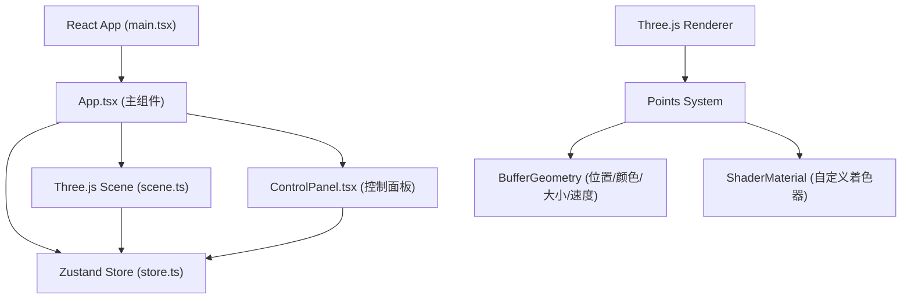

## 1. Architecture Design



## 2. Technology Description

- **Frontend**: React@18 + TypeScript@5 + Vite@5
- **3D Engine**: Three.js@0.160 (使用原生Three.js，非React Three Fiber)
- **State Management**: Zustand@4
- **Build Tool**: Vite@5 + @vitejs/plugin-react@4
- **粒子系统**: Three.js Points + BufferGeometry + ShaderMaterial
- **无后端**：纯前端应用，无需服务器

## 3. Directory Structure

```
src/
├── main.tsx          # React入口，挂载App组件
├── App.tsx           # 主组件，初始化场景，绑定事件
├── store.ts          # Zustand状态管理
├── scene.ts          # Three.js场景核心类
└── ControlPanel.tsx  # 控制面板组件
```

## 4. File Responsibilities

### 4.1 package.json
- 依赖：three@0.160, @types/three, zustand, vite, @vitejs/plugin-react, typescript, react, react-dom, @types/react, @types/react-dom
- 脚本：`npm run dev` 启动开发服务器

### 4.2 index.html
- 全屏无滚动，body背景#0A0E27
- 挂载点#root

### 4.3 tsconfig.json
- 严格模式：strict: true
- 目标：ES2020
- 模块：ESNext
- JSX：react-jsx

### 4.4 vite.config.js
- 配置React插件
- 开发服务器端口：默认5173

### 4.5 src/main.tsx
- 创建React根节点
- 渲染App组件

### 4.6 src/store.ts (Zustand Store)
- **State**:
  - `particleCount: number` (1000-5000, 默认3000)
  - `colorTheme: 'nebula' | 'aurora' | 'lava'` (默认'nebula')
  - `isResetting: boolean`
- **Actions**:
  - `setParticleCount(count: number)`: 设置粒子数量
  - `setColorTheme(theme: string)`: 切换颜色主题
  - `resetView()`: 重置视角

### 4.7 src/scene.ts (Three.js Scene Class)
- **Properties**:
  - `scene: THREE.Scene`
  - `camera: THREE.PerspectiveCamera`
  - `renderer: THREE.WebGLRenderer`
  - `particles: THREE.Points`
  - `geometry: THREE.BufferGeometry`
  - `material: THREE.ShaderMaterial`
  - `mouse: THREE.Vector2` (归一化鼠标坐标)
  - `mouseWorld: THREE.Vector3` (世界坐标鼠标位置)
  - `isMouseOver: boolean`
  - `novaData: { active: boolean, position: THREE.Vector3, time: number }`
  - `unsubscribe: () => void` (Zustand订阅取消函数)
  
- **BufferGeometry Attributes**:
  - `position`: Float32Array (x, y, z) × count
  - `originalPosition`: Float32Array (x, y, z) × count (初始位置，用于回归)
  - `color`: Float32Array (r, g, b) × count
  - `originalColor`: Float32Array (r, g, b) × count (初始颜色)
  - `targetColor`: Float32Array (r, g, b) × count (目标颜色，用于渐变)
  - `size`: Float32Array × count (粒子大小)
  - `originalSize`: Float32Array × count
  - `velocity`: Float32Array (vx, vy, vz) × count
  - `driftSpeed`: Float32Array × count (Z轴漂移速度)
  - `colorGroup`: Uint8Array × count (0=蓝色, 1=紫色, 2=金色)
  - `novaPhase`: Float32Array × count (超新星爆发相位)

- **ShaderMaterial**:
  - **Vertex Shader**: 处理粒子位置、大小、超新星动画
  - **Fragment Shader**: 处理粒子颜色、圆形渲染、透明度

- **Methods**:
  - `init(container: HTMLElement)`: 初始化场景、相机、渲染器、粒子系统
  - `update(deltaTime: number)`: 每帧更新，处理粒子运动、斥力场、超新星动画
  - `handleMouseMove(clientX: number, clientY: number)`: 处理鼠标移动
  - `handleMouseLeave()`: 处理鼠标离开
  - `handleClick(clientX: number, clientY: number)`: 处理点击，触发超新星
  - `setParticleCount(count: number)`: 动态调整粒子数量（飞入/飞出动画）
  - `setColorTheme(theme: string)`: 切换颜色主题（0.5秒渐变）
  - `resetView()`: 重置视角（0.8秒ease-in-out动画）
  - `destroy()`: 清理资源，取消Zustand订阅
  - `private initParticles(count: number)`: 初始化粒子数据
  - `private updateRepulsion(deltaTime: number)`: 更新斥力场影响
  - `private updateNova(deltaTime: number)`: 更新超新星动画
  - `private updateDrift(deltaTime: number)`: 更新呼吸式漂移
  - `private easeInOut(t: number)`: 缓动函数

### 4.8 src/App.tsx
- 使用useRef存储scene实例
- useEffect中初始化scene，绑定鼠标事件
- 监听窗口resize事件
- 渲染canvas容器和ControlPanel

### 4.9 src/ControlPanel.tsx
- 使用Zustand的useStore获取state和actions
- 粒子数量滑块：range 1000-5000，显示当前值
- 颜色主题切换：三个按钮（星云蓝紫、极光绿蓝、熔岩红橙）
- 重置视角按钮
- 样式：圆角12px，背景#1A1B41，透明度0.85，固定右下角

## 5. Color Themes

| 主题名称 | 颜色群1 | 颜色群2 | 颜色群3 |
|---------|---------|---------|---------|
| 星云蓝紫 | #4B6CB7, #7393D1 | #6C5B7B, #9B59B6 | #F39C12, #F1C40F |
| 极光绿蓝 | #1ABC9C, #16A085 | #3498DB, #2980B9 | #00D4AA, #00B894 |
| 熔岩红橙 | #E74C3C, #C0392B | #E67E22, #D35400 | #F39C12, #E67E22 |

## 6. Performance Optimizations

1. **BufferGeometry + ShaderMaterial**: 单次draw call渲染所有粒子
2. **GPU计算**: 顶点着色器中处理粒子动画，减少CPU负载
3. **对象池复用**: 动态调整粒子数量时复用BufferGeometry，避免频繁创建销毁
4. **高效更新**: 仅更新必要的attribute，使用setDrawRange控制可见粒子数
5. **帧率控制**: requestAnimationFrame自动适配刷新率
6. **内存管理**: destroy方法中正确dispose所有Three.js资源

## 7. Animation Details

### 7.1 斥力场模型
- 斥力半径：200像素
- 强度衰减：1/r²模型
- 最大斥力强度：500像素/秒²
- 回归时间：1-2秒平滑插值

### 7.2 超新星爆发
- 影响半径：150像素
- 加速时间：0.3秒
- 速度倍率：10倍初始速度
- 方向偏转：±15度随机
- 颜色变化：#FFFFFF → 原色（0.8秒渐变）
- 尺寸变化：原尺寸 → 5px → 原尺寸
- 总持续时间：1.5秒

### 7.3 粒子增删动画
- 新增粒子：从画面边缘飞入（0.5秒）
- 减少粒子：向边缘飞出并消散（0.5秒）

### 7.4 颜色主题切换
- 过渡时间：0.5秒
- 插值方式：线性RGB插值
