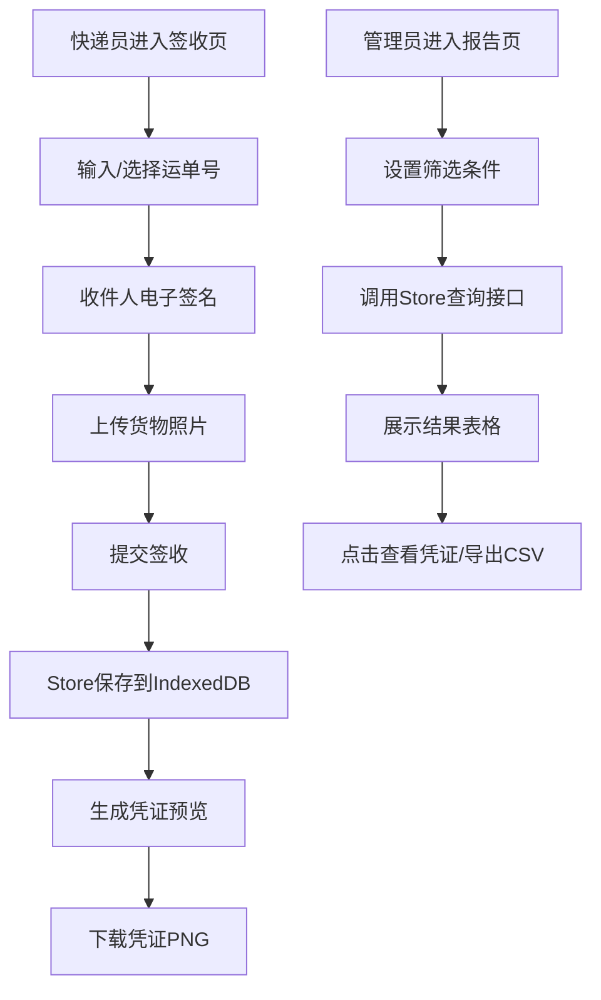

## 1. 产品概述

SignFlow是一款面向中小型物流公司的在线快递电子签收与凭证管理应用，替代传统纸质签收流程，为快递员和收件人提供数字化的签收方案。

- 核心价值：提升物流末端配送效率，确保签收凭证安全可追溯，降低纸质凭证管理成本
- 目标用户：快递员（移动端签收）、运营管理人员（后台查询管理）

## 2. 核心功能

### 2.1 用户角色

| 角色 | 使用场景 | 核心权限 |
|------|----------|----------|
| 快递员 | 送达时引导收件人签名拍照 | 创建签收记录、生成凭证 |
| 运营管理员 | 查询统计签收记录 | 查询记录、导出报表、下载凭证 |

### 2.2 功能模块

1. **签收管理模块（/signing）**：运单信息展示、电子签名捕获、货物照片上传、签收提交、凭证预览下载
2. **报告查询模块（/reports）**：多条件筛选查询、记录表格展示、凭证详情弹窗、CSV数据导出

### 2.3 页面详情

| 页面名称 | 模块名称 | 功能描述 |
|---------|---------|---------|
| 签收页面 | 运单信息展示 | 显示运单号、收件人、快递员信息 |
| 签收页面 | 签名画布 | 320x160px画布，支持手写签名，可清除确认 |
| 签收页面 | 照片上传 | 调用摄像头/相册，限制5MB内JPEG/PNG，120px圆角缩略图预览 |
| 签收页面 | 凭证预览 | 350x500px A5比例凭证卡片，支持PNG下载 |
| 报告页面 | 筛选面板 | 单号模糊搜索、日期范围选择（默认最近7天）、快递员下拉筛选 |
| 报告页面 | 结果表格 | 交替行背景、按时间降序、表头固定、行悬停高亮 |
| 报告页面 | 凭证弹窗 | 点击运单号或查看按钮弹出完整凭证卡片 |
| 报告页面 | CSV导出 | 导出查询结果为sign-records-{日期}.csv |

## 3. 核心流程

## 4. 用户界面设计

### 4.1 设计风格
- **主色调**：#1565C0（品牌蓝），用于按钮、表头、导航
- **辅色调**：#E3F2FD（浅蓝背景），用于面板背景、行悬停
- **强调色**：#FF6F00（橙色），用于关键操作按钮
- **签名区背景**：#FAF5F0（米白色）
- **签名字迹**：#1A237E（深蓝色）
- **按钮样式**：圆角8px，填充色#1565C0，白色字体，悬停加深至#0D47A1，过渡0.3s ease
- **卡片样式**：box-shadow: 0 4px 12px rgba(0,0,0,0.1)，圆角12px
- **字体**：使用系统无衬线字体栈，标题加粗，正文常规
- **布局**：签收页垂直布局，报告页左右两栏（桌面）/上下布局（移动端）

### 4.2 页面设计概览

| 页面名称 | 模块名称 | UI元素 |
|---------|---------|--------|
| 签收页面 | 整体布局 | 垂直居中，最大宽度480px，各区块gap 16px，移动端占满屏宽 |
| 签收页面 | 运单标题 | 20px加粗居中，品牌蓝颜色 |
| 签收页面 | 签名区域 | 米白背景画布，3px深蓝线条，下方清除/确认按钮并排 |
| 签收页面 | 照片区域 | 虚线边框上传区，点击唤起选择，预览图120px圆角4px |
| 签收页面 | 提交按钮 | 全宽，强调色，大号按钮，底部固定间距 |
| 签收页面 | 凭证卡片 | 350x500px阴影卡片，元素间距12px均匀分布 |
| 报告页面 | 筛选面板 | 280px宽左侧面板，浅蓝背景，各筛选控件垂直排列 |
| 报告页面 | 结果表格 | 表头品牌蓝白字，交替行背景#FFFFFF/#F5F9FF，悬停#E3F2FD |
| 报告页面 | 弹窗 | 居中模态框，背景半透明遮罩，关闭按钮右上角 |

### 4.3 响应式设计
- **桌面端（≥768px）**：报告页左右两栏（筛选280px + 表格自适应）
- **移动端（<768px）**：签收页签名区占满屏宽；报告页上下布局（筛选面板在上，表格在下）
- **触摸优化**：所有按钮最小高度44px，可点击区域充足
- **过渡动画**：所有动画时长0.3s，使用ease-out缓动

### 4.4 性能指标
- 签名捕获→凭证预览：≤1秒（不含用户操作）
- 1000条记录查询：≤300ms
- 凭证图片生成下载：≤500ms
