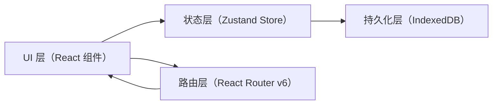

## 1. 架构设计



### 架构说明
- **UI层**：签收模块组件（SignaturePad、ReceiptDisplay）、报告模块组件（ReportDashboard）
- **状态层**：Zustand全局Store管理签收记录状态，提供addRecord/queryRecords方法
- **持久化层**：IndexedDB本地存储，通过Store自动同步读写
- **路由层**：React Router v6管理/signing和/reports两个路由

## 2. 技术选型说明

| 类别 | 技术栈 | 版本 | 用途 |
|------|--------|------|------|
| 前端框架 | React | 18.x | 组件化UI构建 |
| 构建工具 | Vite | 最新 | 快速开发构建 |
| 语言 | TypeScript | 最新 | 类型安全 |
| 状态管理 | Zustand | 最新 | 轻量级全局状态 |
| 数据持久化 | IndexedDB（原生） | - | 本地大容量存储 |
| 路由 | React Router DOM | 6.x | 前端路由 |
| 签名捕获 | react-signature-canvas | 最新 | Canvas签名组件 |
| 文件下载 | file-saver | 最新 | 文件保存到本地 |
| 样式方案 | CSS Modules / 原生CSS | - | 组件化样式 |

## 3. 路由定义

| 路由路径 | 页面组件 | 说明 |
|---------|---------|------|
| /signing | SignaturePad + ReceiptDisplay | 签收管理模块，默认重定向到此 |
| /reports | ReportDashboard | 报告查询模块 |
| * | 重定向至/signing | 未匹配路由 |

## 4. Store定义

### 4.1 状态接口

```typescript
interface SignRecord {
  id: string;
  trackingNumber: string;
  recipient: string;
  courier: string;
  signatureBase64: string;
  photoBase64: string;
  timestamp: string; // ISO格式
}

interface SignStore {
  records: SignRecord[];
  addRecord: (record: Omit<SignRecord, 'id' | 'timestamp'>) => SignRecord;
  queryRecords: (filters: QueryFilters) => SignRecord[];
  getCouriers: () => string[];
}

interface QueryFilters {
  trackingNumber?: string;
  startDate?: string;
  endDate?: string;
  courier?: string;
}
```

## 5. 文件结构与调用关系

```
src/
├── App.tsx                         # 根组件，路由配置，接收Store
├── stores/
│   └── signStore.ts               # Zustand Store + IndexedDB持久化
├── modules/
│   ├── signing/
│   │   ├── SignaturePad.tsx      # 签收界面（调用store.addRecord）
│   │   └── ReceiptDisplay.tsx    # 凭证预览（读取store最新记录）
│   └── reports/
│       └── ReportDashboard.tsx   # 查询界面（调用store.queryRecords/getCouriers）
├── types/
│   └── index.ts                   # 类型定义
└── utils/
    ├── csv.ts                     # CSV导出工具
    └── receipt.ts                  # 凭证Canvas渲染工具
    └── db.ts                     # IndexedDB封装
```

### 调用关系与数据流向

| 数据流方向 | 涉及文件 | 说明 |
|-----------|---------|------|
| 签名→存储 | SignaturePad.tsx → signStore.ts | 签名/照片→Base64→调用addRecord→写入IndexedDB |
| 存储→渲染 | signStore.ts → ReceiptDisplay.tsx | Store最新记录→渲染凭证卡片→Canvas转PNG下载 |
| 查询→渲染 | ReportDashboard.tsx → signStore.ts | 筛选条件→调用queryRecords→返回记录→渲染表格 |
| 详情查询 | ReportDashboard.tsx → signStore.ts | 点击运单号→读取单条记录→弹窗渲染凭证 |
| 导出 | ReportDashboard.tsx → utils/csv.ts | 查询结果→生成CSV→file-saver下载 |

## 6. 核心工具说明

### 6.1 IndexedDB封装（utils/db.ts）
- 数据库名：SignFlowDB，版本1
- 对象仓库：sign_records，主键id，索引trackingNumber、timestamp、courier

### 6.2 凭证渲染工具（utils/receipt.ts）
- 输入：SignRecord
- 输出：Blob（PNG）
- 流程：创建350x500 Canvas → 绘制卡片元素→ 调用toBlob → file-saver保存

### 6.3 CSV导出工具（utils/csv.ts）
- 输入：SignRecord[]
- 输出：Blob（CSV/UTF-8 BOM）
- 字段：运单号、收件人、快递员、签收时间
