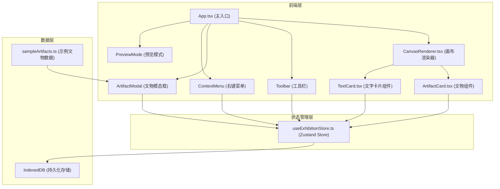

## 1. 架构设计



## 2. 技术描述

- **前端框架**：React@18 + TypeScript
- **状态管理**：Zustand
- **构建工具**：Vite + @vitejs/plugin-react
- **数据持久化**：IndexedDB（原生 API）
- **UI 渲染**：Canvas 2D（连线绘制）+ DOM（元素交互）
- **唯一 ID**：uuid
- **开发服务器端口**：3000

## 3. 核心数据模型

### 3.1 文物 (Artifact)
```typescript
interface Artifact {
  id: string;
  name: string;
  description: string;
  imageUrl: string;
  x: number;
  y: number;
  width: number;
  height: number;
  color?: string;
}
```

### 3.2 文字卡片 (TextCard)
```typescript
interface TextCard {
  id: string;
  title: string;
  description: string;
  x: number;
  y: number;
  width: number;
  color?: string;
}
```

### 3.3 绑定关系 (Binding)
```typescript
interface Binding {
  id: string;
  artifactId: string;
  cardId: string;
  color: string;
}
```

### 3.4 连线 (Connection)
```typescript
interface Connection {
  id: string;
  fromId: string;
  toId: string;
  fromType: 'artifact' | 'card';
  toType: 'artifact' | 'card';
}
```

### 3.5 画布状态 (CanvasState)
```typescript
interface CanvasState {
  artifacts: Artifact[];
  cards: TextCard[];
  bindings: Binding[];
  connections: Connection[];
  scrollY: number;
  isPreviewMode: boolean;
  narrativeStartId: string | null;
  isBindingMode: boolean;
  bindingCardId: string | null;
  isConnectingMode: boolean;
  connectingFromId: string | null;
  connectingFromType: 'artifact' | 'card' | null;
}
```

## 4. Store 方法定义

| 方法名 | 参数 | 功能描述 |
|--------|------|----------|
| addArtifact | artifact: Artifact | 添加文物到画布 |
| addCard | card: TextCard | 添加文字卡片到画布 |
| moveEntity | id: string, type: 'artifact'\|'card', x: number, y: number | 移动实体，联动绑定对象 |
| removeArtifact | id: string | 删除文物 |
| removeCard | id: string | 删除卡片 |
| createBinding | cardId: string, artifactId: string | 创建绑定关系 |
| removeBinding | id: string | 移除绑定 |
| createConnection | fromId, toId, fromType, toType | 创建叙事连线 |
| removeConnection | id: string | 删除连线 |
| setNarrativeStart | id: string \| null | 设置叙事起点 |
| setPreviewMode | isPreview: boolean | 切换预览模式 |
| setBindingMode | isBinding: boolean, cardId?: string | 设置绑定模式 |
| setConnectingMode | isConnecting: boolean, fromId?: string, fromType?: string | 设置连接模式 |
| updateCardContent | id: string, title?: string, description?: string | 更新卡片内容 |
| saveToStorage | 无 | 保存到 IndexedDB |
| loadFromStorage | 无 | 从 IndexedDB 加载 |

## 5. 文件结构

```
src/
├── App.tsx              # 主组件，渲染工具栏和画布
├── store/
│   └── useExhibitionStore.ts  # Zustand 状态管理
├── components/
│   ├── ArtifactCard.tsx      # 文物图像组件
│   ├── TextCard.tsx          # 文字卡片组件
│   └── CanvasRenderer.tsx    # 画布渲染器
├── data/
│   └── sampleArtifacts.ts    # 内置示例文物数据
└── styles/
    └── global.css            # 全局样式
```

## 6. 关键技术实现点

### 6.1 拖拽系统
- 使用 React 事件处理（onMouseDown/onMouseMove/onMouseUp）
- 拖拽时计算偏移量，支持画布自动滚动
- 弹簧回弹效果：使用 requestAnimationFrame 实现弹性动画
- 帧率不低于 50fps

### 6.2 绑定联动
- 移动文物时，根据绑定关系计算卡片偏移量并同步移动
- 移动卡片时，同理同步移动绑定的文物
- 使用颜色标记区分不同绑定关系

### 6.3 连线绘制
- 使用 Canvas 2D 绘制贝塞尔曲线
- 计算控制点实现平滑曲线
- 路径避让：检测连线与其他元素的碰撞，调整控制点
- 箭头绘制：在终点绘制三角形箭头

### 6.4 预览模式
- 使用全屏覆盖层（Z-index: 9999）
- 隐藏所有编辑控件
- 文物点击放大：CSS transform + transition
- 卡片点击高亮：边框 + 文字样式变化

### 6.5 数据持久化
- IndexedDB 存储完整画布状态
- 应用启动时自动加载
- 使用 JSON 序列化/反序列化

## 7. 性能优化

- 拖拽使用 transform 而非 top/left，触发 GPU 加速
- Canvas 连线使用 requestAnimationFrame 批量重绘
- 减少不必要的重渲染（memo 优化）
- 弹簧动画使用 requestAnimationFrame 保证流畅度
