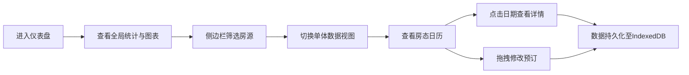

## 1. 产品概述

民宿房东多房源管理仪表盘，帮助房东统一管理多平台房源信息、房态日历和收益数据，解决数据分散、难以全局把控的痛点。目标用户为在 Airbnb、Booking 等多平台运营的民宿房东。

## 2. 核心功能

### 2.1 功能模块

1. **仪表盘主页**：统计卡片、双轴收益图表、侧边栏房源筛选
2. **房态日历视图**：月视图日历、预订状态标记、拖拽修改、详情弹窗
3. **房源详情页**：单体房源详细数据视图

### 2.2 页面详情

| 页面名称 | 模块名称 | 功能描述 |
|-----------|-------------|---------------------|
| 仪表盘主页 | 统计卡片 | 展示总房源数、本月总收入、本月平均入住率、待处理预订数四张卡片（240px宽，白色圆角，阴影0 2px 8px rgba(0,0,0,0.08)） |
| 仪表盘主页 | 侧边栏筛选 | 260px宽浅灰背景（#F5F5F5），房源卡片列表（50px高），名称搜索，收入排序，状态圆点指示 |
| 仪表盘主页 | 双轴图表 | ECharts渲染，横轴月份，左轴柱状图收入，右轴折线图入住率，切换延迟<200ms |
| 房态日历 | 月视图日历 | 默认当前月，彩色方块标记状态（已预订#E74C3C、空闲#2ECC71、待确认#F39C12），翻月60fps动画 |
| 房态日历 | 详情弹窗 | 点击日期弹出200px宽卡片（圆角8px，阴影0 4px 12px rgba(0,0,0,0.15)），展示客户姓名、入住天数、总价 |
| 房态日历 | 拖拽功能 | 拖拽方块修改日期，过渡0.3s ease，抬高阴影+半透明视觉反馈 |

## 3. 核心流程

房东进入仪表盘 → 查看全局统计数据和趋势图表 → 通过侧边栏筛选特定房源 → 切换日历视图查看房态 → 点击日期查看预订详情 → 拖拽调整预订日期 → 数据自动保存至 IndexedDB。

## 4. 用户界面设计

### 4.1 设计风格

- 主色调：深蓝 #2C3E50，白色 #FFFFFF
- 高亮色：#3498DB（按钮与链接）
- 状态色：已预订 #E74C3C、空闲 #2ECC71、待确认 #F39C12
- 卡片风格：圆角8px，柔和阴影
- 字体：专业无衬线字体，清晰层次
- 布局：左侧边栏 + 右侧主内容区两栏结构

### 4.2 页面设计概览

| 页面名称 | 模块名称 | UI元素 |
|-----------|-------------|-------------|
| 仪表盘主页 | 统计卡片 | 白色圆角卡片、图标+数值+趋势、淡入0.4s动画 |
| 仪表盘主页 | 侧边栏 | 浅灰背景、搜索框、房源卡片列表、状态圆点、hover高亮 |
| 仪表盘主页 | 图表区 | ECharts容器、双轴配置、响应式宽度 |
| 房态日历 | 月视图 | 网格布局、彩色状态方块、周标题、翻月箭头、60fps切换动画 |
| 房态日历 | 详情弹窗 | 固定定位、圆角8px、阴影、客户信息列表 |

### 4.3 响应式

- 桌面端：左侧260px边栏 + 右侧主内容区
- 小屏（<768px）：侧边栏折叠为顶部下拉菜单
- 图表容器自适应宽度
