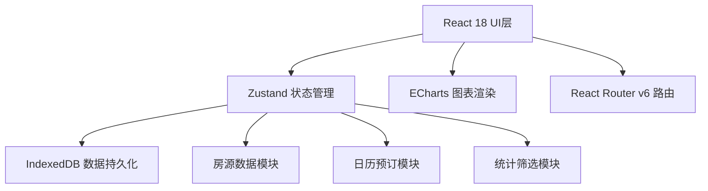
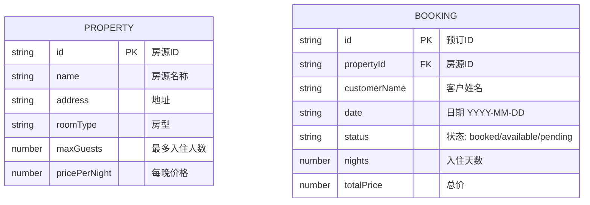

## 1. 架构设计



## 2. 技术描述

- 前端：React@18 + TypeScript + Vite
- 状态管理：zustand
- 数据持久化：IndexedDB（查询响应<100ms）
- 图表：echarts + echarts-for-react
- 路由：react-router-dom@6
- 工具库：uuid
- 样式：原生CSS + CSS变量

## 3. 路由定义

| 路由 | 用途 |
|-------|---------|
| /dashboard | 仪表盘主页，全局数据视图 |
| /detail/:propertyId | 单体房源详情数据视图 |
| / | 重定向至 /dashboard |

## 4. 数据模型

### 4.1 数据模型定义



### 4.2 TypeScript 类型定义

```typescript
interface Property {
  id: string;
  name: string;
  address: string;
  roomType: string;
  maxGuests: number;
  pricePerNight: number;
}

type BookingStatus = 'booked' | 'available' | 'pending';

interface Booking {
  id: string;
  propertyId: string;
  customerName: string;
  date: string;
  status: BookingStatus;
  nights: number;
  totalPrice: number;
}

interface MonthlyStats {
  month: string;
  revenue: number;
  occupancyRate: number;
}
```

## 5. 文件结构

```
src/
├── App.tsx              # 根组件，路由与Provider
├── components/
│   ├── Dashboard.tsx    # 仪表盘主组件
│   ├── CalendarView.tsx # 房态日历组件
│   └── ChartPanel.tsx   # 双轴图表组件
├── store/
│   └── propertyStore.ts # Zustand状态管理
├── types/
│   └── index.ts         # 类型定义
└── utils/
    └── db.ts            # IndexedDB工具
```
