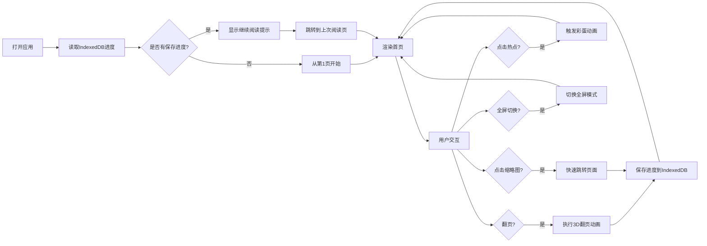

## 1. 产品概述

PageFlick 是一款数字漫画翻页阅读器，将手绘连环画稿转化为带有真实3D翻页动画效果的网页数字漫画，支持隐藏交互彩蛋和阅读进度记忆。

- **目标用户**：独立插画师、漫画创作者、数字漫画读者
- **核心价值**：提供沉浸式的纸质书阅读体验，结合数字交互增强阅读乐趣

## 2. 核心功能

### 2.1 功能模块

1. **翻页阅读器主界面**：3D翻页动画、页面渲染、热点交互
2. **缩略图导航栏**：页面缩略图展示、快速跳转、当前页高亮
3. **阅读进度系统**：IndexedDB持久化、继续阅读提示
4. **全屏模式**：全屏切换、导航栏自动隐藏/显示
5. **响应式适配**：桌面/平板/手机多端适配

### 2.2 功能详情

| 页面名称 | 模块名称 | 功能描述 |
|-----------|-------------|---------------------|
| 阅读器页面 | 翻页动画 | 左右点击/拖拽翻页，3D卷曲动画，0.5秒ease-out缓动，翻页期间禁止重复操作 |
| 阅读器页面 | 热点交互 | 每页2-3个隐藏热点，悬停显示淡黄色光晕，点击触发彩蛋动画（眨眼/发光） |
| 阅读器页面 | 页码显示 | 左上角显示当前页码/总页码 |
| 阅读器页面 | 全屏按钮 | 右上角SVG全屏图标，悬停变金色 |
| 底部导航栏 | 缩略图列表 | 所有页缩略图，宽40px等比缩放，间距8px |
| 底部导航栏 | 当前页高亮 | 金色#D4A017边框2px |
| 底部导航栏 | 快速跳转 | 点击缩略图直接跳转，0.2秒渐入效果 |
| 进度系统 | 持久化存储 | 每翻一页保存到IndexedDB |
| 进度系统 | 继续阅读提示 | 页面中央显示，白色半透明背景，0.3秒渐入，2秒后消失 |
| 全屏模式 | 全屏切换 | 进入/退出全屏 |
| 全屏模式 | 导航栏控制 | 全屏时默认隐藏，鼠标移到底部0.3秒上滑显示 |

## 3. 核心流程

用户打开应用 → 从IndexedDB读取上次阅读进度 → 显示"继续阅读"提示 → 跳转到上次阅读页 → 用户翻页/点击热点/切换全屏 → 操作触发对应动画/效果 → 翻页时自动保存进度

## 4. 用户界面设计

### 4.1 设计风格

- **主色调**：深灰色背景 #2C2C2C（略带纹理），白色纸张页面，金色高亮 #D4A017
- **辅助色**：淡黄色光晕 #FFF9C4（透明度0.4）
- **字体**：无衬线字体，页码14px（移动端12px）
- **按钮风格**：SVG图标，悬停变金色，圆角设计
- **布局风格**：居中阅读区域，4:3固定宽高比，最大宽度80%
- **动效**：CSS过渡 + requestAnimationFrame实现60fps动画

### 4.2 页面设计概览

| 页面名称 | 模块名称 | UI元素 |
|-----------|-------------|-------------|
| 阅读器页面 | 阅读区域 | 居中4:3白色纸张，深灰纹理背景，动态页面阴影 |
| 阅读器页面 | 页码显示 | 左上角白色文字，"当前页/总页数"格式 |
| 阅读器页面 | 全屏按钮 | 右上角SVG图标，悬停金色 |
| 阅读器页面 | 继续阅读提示 | 页面中央，白色半透明背景，0.3秒渐入，2秒淡出 |
| 底部导航栏 | 缩略图栏 | 半透明黑色背景rgba(0,0,0,0.6)，高60px，居中对齐 |
| 底部导航栏 | 缩略图 | 宽40px等比缩放，间距8px，当前页金色边框 |
| 热点区域 | 悬停效果 | 淡黄色半透明圆角矩形光晕 |
| 热点区域 | 彩蛋动画 | 角色眨眼（0.3秒）/物品发光（0.6秒外扩光晕） |
| 移动端 | 翻页按钮 | 左右半透明三角形圆形按钮，直径40px，悬停金色 |

### 4.3 响应式设计

- **桌面端（≥768px）**：阅读区域最大宽度80%，缩略图栏高60px，缩略图宽40px，页码14px
- **平板端（<768px）**：阅读区域占满宽度，缩略图栏高45px，缩略图宽30px，页码12px
- **手机端（<480px）**：隐藏缩略图栏，显示左右翻页按钮

### 4.4 性能优化

- 翻页动画帧率≥50fps
- 缩略图懒加载，可见视窗内加载真实图片，其余使用20x30灰色占位符
- 使用CSS硬件加速（transform）实现流畅动画
