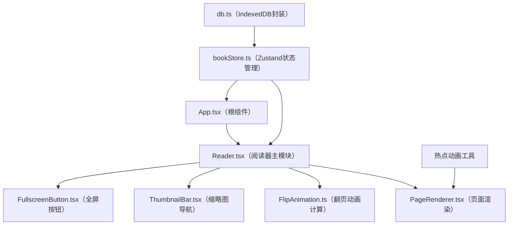

## 1. 架构设计



## 2. 技术说明

- **前端框架**：React@18 + TypeScript
- **构建工具**：Vite（支持路径别名@）
- **状态管理**：Zustand
- **数据持久化**：IndexedDB（自定义封装）
- **图形渲染**：Canvas 2D（页面渲染、热点绘制、动画效果）
- **动画实现**：CSS Transition + requestAnimationFrame（无第三方动画库）
- **工具库**：uuid

## 3. 文件结构说明

```
src/
├── main.tsx              # React应用入口，挂载App组件
├── App.tsx               # 根组件，加载书籍数据，传递进度
├── reader/
│   ├── Reader.tsx        # 阅读器主模块：翻页逻辑、状态管理、事件处理
│   ├── PageRenderer.tsx  # 单页Canvas渲染：图片绘制、热点、彩蛋动画
│   └── FlipAnimation.ts  # 纯函数模块：3D翻页变换矩阵计算
├── store/
│   ├── bookStore.ts      # Zustand store：书籍数据、当前页、进度持久化
│   └── db.ts             # IndexedDB封装：阅读进度读写
├── components/
│   ├── ThumbnailBar.tsx  # 底部缩略图导航栏
│   ├── FullscreenButton.tsx  # 全屏切换按钮
│   └── ContinueReading.tsx   # 继续阅读提示组件
└── types/
    └── index.ts          # 类型定义：Page、Hotspot、Book等
```

## 4. 数据流向

```
IndexedDB (db.ts)
    ↑↓ readProgress/saveProgress
Zustand Store (bookStore.ts)
    ↑↓ pages/currentPage/actions
Reader.tsx
    ├──→ PageRenderer.tsx (page数据, hotspot事件)
    ├──→ FlipAnimation.ts (direction, progress → transform样式)
    └──→ ThumbnailBar/FullscreenButton (状态与回调)
```

## 5. 数据模型

### 5.1 核心类型定义

```typescript
// 热点区域类型
type HotspotType = 'blink' | 'glow';

interface Hotspot {
  id: string;
  x: number;           // 左上角X坐标（相对页面宽度的百分比 0-100）
  y: number;           // 左上角Y坐标（相对页面高度的百分比 0-100）
  width: number;       // 宽度（百分比）
  height: number;      // 高度（百分比）
  type: HotspotType;   // 动画类型
}

// 漫画页
interface ComicPage {
  id: string;
  imageUrl: string;
  hotspots: Hotspot[];
}

// 漫画书
interface Book {
  id: string;
  title: string;
  totalPages: number;
  pages: ComicPage[];
}

// Store状态
interface BookState {
  book: Book | null;
  currentPage: number;
  isFlipping: boolean;
  flipDirection: 'next' | 'prev' | null;
  flipProgress: number;
  activeHotspot: string | null;
  isFullscreen: boolean;
  showContinueReading: boolean;
  // actions
  setCurrentPage: (page: number) => void;
  startFlip: (direction: 'next' | 'prev') => void;
  endFlip: () => void;
  setFlipProgress: (progress: number) => void;
  triggerHotspot: (id: string) => void;
  toggleFullscreen: () => void;
  hideContinueReading: () => void;
  loadBook: (book: Book) => void;
}
```

## 6. 关键模块实现说明

### 6.1 FlipAnimation.ts（纯函数）
- 输入：翻页方向('next'|'prev')、进度(0-1)
- 输出：CSS transform样式对象（perspective、rotateY、translateZ等）+ box-shadow样式
- 使用ease-out缓动函数：progress => 1 - Math.pow(1 - progress, 3)
- 计算页面卷曲效果：中间拱起、边缘阴影偏移

### 6.2 PageRenderer.tsx
- Canvas绘制页面图片（保持比例居中）
- 绘制热点：悬停时半透明圆角矩形光晕
- 彩蛋动画：
  - blink类型：在热点区域绘制闭眼→睁眼动画（0.3秒）
  - glow类型：外扩圆形光晕从内向外淡出（0.6秒）

### 6.3 bookStore.ts
- 创建时从IndexedDB读取savedPage
- currentPage变化时自动保存到IndexedDB（节流）
- 内置示例漫画数据（6-8页，每页2-3个热点）

### 6.4 db.ts
- 封装IndexedDB操作：openDB、getProgress、saveProgress
- 使用Promise封装异步操作
- 数据库名：pageflick_db，store名：reading_progress
