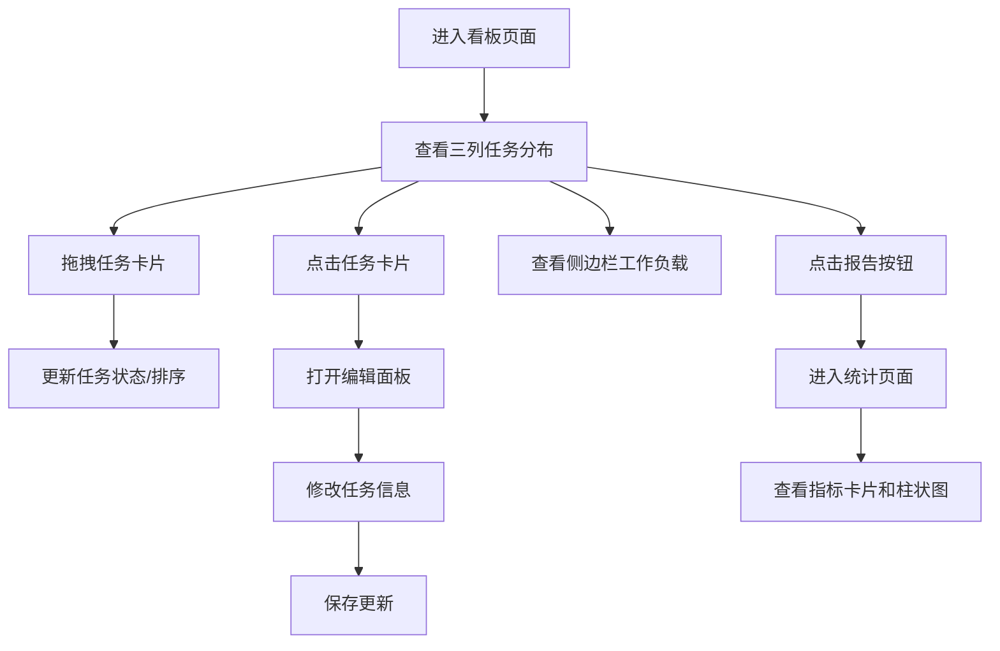

## 1. 产品概述
轻量级团队任务看板应用，专为小型团队设计，解决多项目并行时任务状态不透明、成员工作负载不清晰的问题。
- 提供直观的看板任务管理、成员工作负载可视化和项目统计报告功能
- 提升团队协作效率，让任务进度和成员贡献一目了然

## 2. 核心特性

### 2.1 功能模块

1. **看板页面**：三列看板管理、任务拖拽、任务编辑面板、成员工作负载侧边栏
2. **报告页面**：核心指标卡片、按项目分组的任务状态柱状图

### 2.2 页面详情

| 页面名称 | 模块名称 | 功能描述 |
|-----------|-------------|---------------------|
| 看板页面 | 三列看板 | 待办/进行中/已完成三列，支持任务卡片拖拽排序和跨列移动 |
| 看板页面 | 任务卡片 | 显示标题、成员头像、截止日期，拖拽时有旋转放大动画，点击打开编辑面板 |
| 看板页面 | 编辑面板 | 从右侧滑入，修改标题、描述、指派成员、截止日期，保存后更新任务 |
| 看板页面 | 工作负载侧边栏 | 显示成员任务数进度条（颜色随数量变化）、完成率百分比 |
| 报告页面 | 指标卡片 | 总任务数、已完成数、平均完成时长三个指标展示 |
| 报告页面 | 柱状图 | 按项目分组展示三色柱：待办、进行中、已完成 |

## 3. 核心流程

用户主要操作流程：
1. 用户进入看板页面，查看三列任务分布
2. 拖拽任务卡片改变状态或排序，拖拽时有视觉反馈
3. 点击任务卡片打开右侧编辑面板，修改任务信息
4. 通过侧边栏实时查看各成员工作负载
5. 点击顶部导航的"报告"按钮，进入统计页面
6. 在报告页面查看整体任务指标和项目分布图表

## 4. 用户界面设计

### 4.1 设计风格
- **主题风格**：浅色专业商务风，简洁清爽
- **主色调**：
  - 主背景色：#F0F3F5
  - 看板区域：#FFFFFF
  - 导航栏：#2C3E50（深灰蓝）
  - 侧边栏：#F8F9FA
- **强调色**：
  - 待办：#95A5A6
  - 进行中：#3498DB
  - 已完成：#2ECC71
  - 工作负载正常：#27AE60（≤3）
  - 工作负载中等：#E67E22（4-6）
  - 工作负载过高：#E74C3C（>6）
- **按钮风格**：悬停时背景色加深15%，轻微上移2px（0.2s ease）
- **字体**：'Inter', sans-serif，清晰专业
- **布局**：顶部导航+主体区域（侧边栏+看板内容），卡片式布局
- **圆角与阴影**：圆角8px，卡片阴影0 1px 3px rgba(0,0,0,0.08)
- **动画效果**：面板滑入（0.3s ease-out），拖拽过渡（0.2s）

### 4.2 页面设计概览

| 页面名称 | 模块名称 | UI 元素 |
|-----------|-------------|-------------|
| 看板页面 | 顶部导航 | 64px高度，深灰蓝背景，白色文字，左侧Logo，右侧"报告"按钮 |
| 看板页面 | 侧边栏 | 320px宽度，#F8F9FA背景，成员列表，头像+进度条+完成率 |
| 看板页面 | 看板区域 | 三列等宽布局，列标题+任务卡片列表，卡片280px宽，间距12px |
| 看板页面 | 任务卡片 | 白色背景，圆角8px，标题、成员头像圆圈、截止日期，拖拽时旋转5度+放大1.05倍 |
| 看板页面 | 编辑面板 | 400px宽，右侧滑入，表单输入（标题、描述、成员下拉、日期选择），保存/取消按钮 |
| 报告页面 | 指标卡片区 | 三个160px宽卡片，图标+数值，居中布局 |
| 报告页面 | 柱状图区 | ECharts渲染，X轴项目名，Y轴任务数，三色分组柱 |

### 4.3 响应式设计
- Desktop优先，主要适配1280px以上宽度
- 侧边栏固定宽度，看板区域自适应剩余空间
- 看板列使用flex布局，小屏可横向滚动
