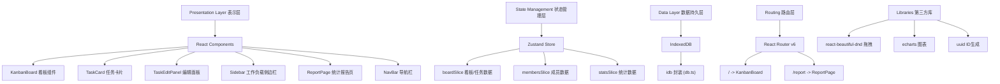
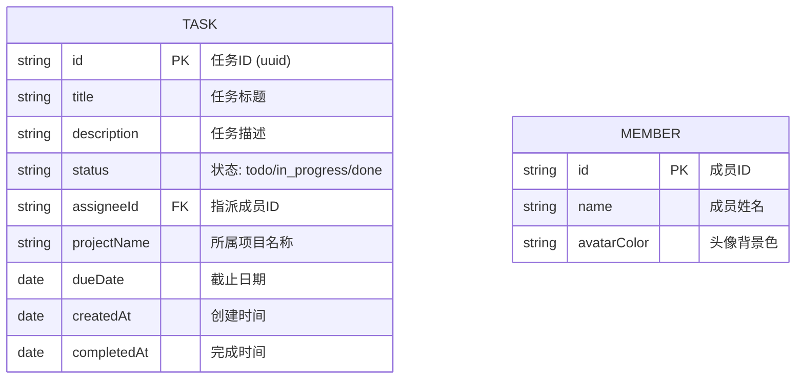

## 1. 架构设计



## 2. 技术说明

- **前端框架**: React@18 + TypeScript
- **构建工具**: Vite + @vitejs/plugin-react
- **路由管理**: React Router DOM v6
- **状态管理**: Zustand（slice模式：boardSlice/membersSlice/statsSlice）
- **本地持久化**: IndexedDB（idb库封装）
- **拖拽库**: react-beautiful-dnd
- **图表库**: ECharts
- **ID生成**: uuid
- **后端**: 无（纯前端应用，数据本地存储）
- **数据库**: IndexedDB 浏览器本地存储

## 3. 路由定义

| 路由 | 用途 |
|-------|---------|
| / | 看板主页：三列任务看板 + 工作负载侧边栏 |
| /report | 统计报告页：指标卡片 + 柱状图 |

## 4. 数据模型

### 4.1 数据模型定义



### 4.2 数据结构说明

```typescript
// 任务状态枚举
type TaskStatus = 'todo' | 'in_progress' | 'done';

// 成员接口
interface Member {
  id: string;
  name: string;
  avatarColor: string;
}

// 任务接口
interface Task {
  id: string;
  title: string;
  description: string;
  status: TaskStatus;
  assigneeId: string;
  projectName: string;
  dueDate: string;
  createdAt: string;
  completedAt: string | null;
}

// 看板列接口
interface BoardColumn {
  id: TaskStatus;
  title: string;
  taskIds: string[];
}

// 成员工作负载
interface MemberWorkload {
  member: Member;
  totalTasks: number;
  completedTasks: number;
  completionRate: number;
}

// 统计指标
interface Stats {
  totalTasks: number;
  completedTasks: number;
  avgCompletionTime: number; // 小时
  projectStats: ProjectStat[];
}

// 项目统计
interface ProjectStat {
  projectName: string;
  todo: number;
  inProgress: number;
  done: number;
}
```

## 5. 文件结构

```
d:\P\tasks\auto41/
├── .trae/documents/
│   ├── PRD.md
│   └── TECHNICAL_ARCHITECTURE.md
├── package.json
├── index.html
├── vite.config.js
├── tsconfig.json
└── src/
    ├── main.tsx              # 应用入口
    ├── App.tsx               # 路由配置+全局布局
    ├── index.css             # 全局样式
    ├── components/
    │   ├── KanbanBoard.tsx   # 看板三列组件
    │   ├── TaskCard.tsx      # 任务卡片
    │   ├── TaskEditPanel.tsx # 右侧编辑面板
    │   ├── Sidebar.tsx       # 成员工作负载侧边栏
    │   ├── NavBar.tsx        # 顶部导航栏
    │   └── ReportPage.tsx    # 统计报告页面
    ├── stores/
    │   └── useStore.ts       # Zustand Store
    └── utils/
        └── db.ts             # IndexedDB 封装
```

## 6. Store Slice 设计

### 6.1 boardSlice
- **State**: `tasks` (Record<string, Task>), `columns` (Record<TaskStatus, BoardColumn>)
- **Actions**: 
  - `addTask(task: Omit<Task, 'id' | 'createdAt'>)` - 新增任务
  - `moveTask(source: {col, idx}, dest: {col, idx})` - 拖拽移动任务
  - `updateTask(id, patch: Partial<Task>)` - 更新任务
  - `deleteTask(id)` - 删除任务

### 6.2 membersSlice
- **State**: `members` (Member[])
- **Actions**: 
  - `getMemberWorkload(): MemberWorkload[]` - 计算成员工作负载（派生数据）
  - 成员数据默认内置，不提供增删改

### 6.3 statsSlice
- **State**: 无独立状态，全部从 boardSlice 派生计算
- **Actions**:
  - `getStats(): Stats` - 计算统计指标
  - `getProjectStats(): ProjectStat[]` - 按项目分组统计
