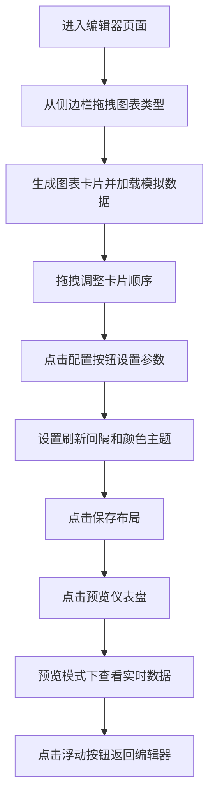

## 1. 产品概述

在线交互式数据仪表盘应用，允许用户以卡片拖拽方式自定义仪表盘布局，绑定动态更新的数据图表，实时反映业务指标变化。

- 主要用途：为业务用户提供灵活可定制的数据可视化仪表盘，支持拖拽式布局编辑、多类型图表、实时数据刷新
- 目标用户：业务分析师、数据运营人员、企业管理者
- 产品价值：零代码快速搭建个性化数据看板，实时监控核心业务指标

## 2. 核心功能

### 2.1 功能模块

1. **仪表盘编辑器模块**：图表选择侧边栏、拖拽式布局区域、图表卡片管理、配置面板、保存/预览功能
2. **图表数据模块**：多类型图表渲染（折线图、柱状图、饼图、面积图）、数据源配置、定时数据刷新、数据模拟生成
3. **仪表盘预览模块**：全屏预览模式、实时更新时间显示、悬停交互效果

### 2.2 页面详情

| 页面名称 | 模块名称 | 功能描述 |
|-----------|-------------|---------------------|
| 仪表盘编辑器 | 侧边栏图表选择 | 展示4种图表类型（折线图、柱状图、饼图、面积图），支持拖拽到布局区域 |
| 仪表盘编辑器 | 布局区域 | 基于react-beautiful-dnd的Droppable区域，支持卡片拖拽排序，两列自适应布局 |
| 仪表盘编辑器 | 图表卡片 | 展示ECharts预览图，包含删除按钮和配置按钮 |
| 仪表盘编辑器 | 配置面板 | 从右侧滑出，设置刷新间隔、颜色主题、删除图表 |
| 仪表盘编辑器 | 顶部操作栏 | 保存布局按钮、预览仪表盘切换按钮 |
| 仪表盘预览 | 顶部导航条 | 显示仪表盘名称和最后更新时间（每秒更新） |
| 仪表盘预览 | 图表展示区 | 展示所有图表卡片，隐藏操作按钮，支持悬停交互 |
| 仪表盘预览 | 返回编辑器按钮 | 右下角浮动按钮，点击返回编辑模式 |

## 3. 核心流程

用户从侧边栏拖拽图表类型到布局区域 → 自动生成图表卡片并加载模拟数据 → 拖拽调整卡片顺序 → 点击配置按钮设置刷新间隔和颜色主题 → 点击保存按钮持久化布局配置 → 点击预览按钮切换到预览模式 → 图表按配置间隔自动刷新数据 → 点击浮动按钮返回编辑器

## 4. 用户界面设计

### 4.1 设计风格

- **主色调**：#3498DB（经典蓝）
- **背景色**：#F5F7FA（浅灰蓝）
- **侧边栏**：#2C3E50（深蓝灰），白色文字
- **卡片背景**：#FFFFFF（纯白）
- **强调色**：#E74C3C（危险红）、#27AE60（成功绿）
- **配色方案**：经典蓝#2980B9、森林绿#27AE60、日落橙#E67E22、薰衣草#8E44AD
- **按钮样式**：圆角6px，主色调背景，白色文字，点击时0.1s缩小到0.95倍再恢复
- **字体**：Inter（Google Fonts），数值使用monospace
- **布局风格**：卡片式布局，侧边栏+主区域双栏结构
- **阴影层级**：卡片阴影0 2px 8px rgba(0,0,0,0.1)，面板阴影0 2px 12px rgba(0,0,0,0.2)

### 4.2 页面设计概述

| 页面名称 | 模块名称 | UI元素 |
|-----------|-------------|-------------|
| 仪表盘编辑器 | 侧边栏 | 固定宽度240px，背景#2C3E50，白色文字，4种图表类型卡片带图标和描述 |
| 仪表盘编辑器 | 布局区域 | 背景#F5F7FA，padding 24px，flex-wrap自适应，两列布局（min-width:280px, max-width:420px，间距16px） |
| 仪表盘编辑器 | 图表卡片 | 宽度280px，高度160px，圆角8px，白色背景，阴影，拖拽时旋转2度放大1.05倍，0.2s过渡 |
| 仪表盘编辑器 | 配置面板 | 宽度320px，白色背景，阴影-4px 0 16px rgba(0,0,0,0.15)，0.3s ease-out从右侧滑入 |
| 仪表盘编辑器 | 顶部按钮 | #3498DB背景，白色文字，圆角6px，悬停反馈 |
| 仪表盘预览 | 导航条 | 宽度80%居中，高度48px，白色背景，底部圆角8px，阴影 |
| 仪表盘预览 | 图表卡片 | 隐藏操作按钮，悬停上移4px放大1.02倍，0.2s ease-out |
| 仪表盘预览 | 浮动按钮 | 圆形直径48px，#3498DB背景，白色编辑图标，阴影，悬停放大1.1倍 |

### 4.3 响应式

- 桌面端优先设计
- 窗口宽度小于768px时切换为单列布局
- 移动端卡片高度变为200px
- 确保平板和手机屏幕可用

### 4.4 图表交互

- 折线图/面积图：hover显示tooltip（白色背景，圆角4px，阴影）
- 柱状图：点击柱子弹出数据点详情（数值、时间戳）
- 饼图：hover扇区向外偏移8px，显示占比百分比
- 数据刷新动画：ECharts动画时长300ms，平滑过渡
