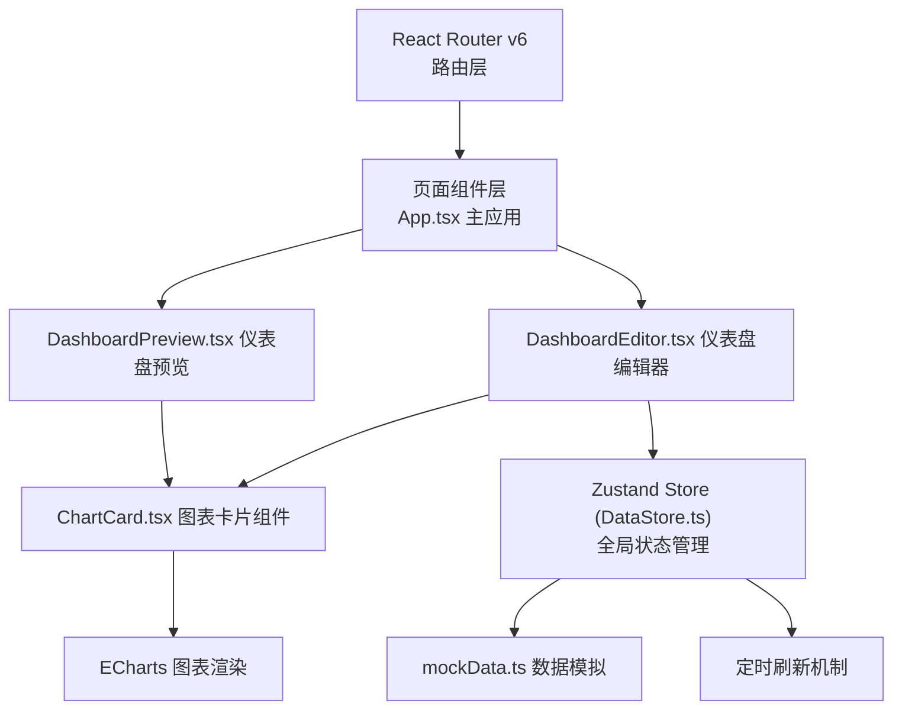

## 1. 架构设计



## 2. 技术描述

- 前端：React 18 + TypeScript + Vite
- 状态管理：Zustand
- 路由：React Router v6
- 图表：ECharts
- 拖拽：react-beautiful-dnd
- 唯一ID：uuid
- 样式：原生CSS（global.css, editor.css）
- 数据：内部模拟数据生成工具
- 开发服务器：Vite（端口3000，HMR热更新）

## 3. 路由定义

| 路由 | 组件 | 用途 |
|-------|---------|---------|
| / | DashboardEditor | 仪表盘编辑器（默认首页） |
| /editor | DashboardEditor | 仪表盘编辑器 |
| /preview | DashboardPreview | 仪表盘预览模式 |

## 4. 数据模型

### 4.1 Zustand Store 结构

```typescript
// 图表类型
type ChartType = 'line' | 'bar' | 'pie' | 'area'
type ColorTheme = 'blue' | 'green' | 'orange' | 'purple'
type RefreshInterval = 5 | 15 | 30 | 60

// 图表配置
interface ChartConfig {
  id: string
  type: ChartType
  dataSourceId: string
  colorTheme: ColorTheme
  refreshInterval: RefreshInterval
}

// 数据源
interface DataSource {
  id: string
  name: string
  type: 'mock' | 'api'
}

// Store State
interface DashboardState {
  chartConfigs: ChartConfig[]
  dataSources: Record<string, DataSource>
  chartData: Record<string, any>
  refreshIntervals: Record<string, number>
  isPreviewMode: boolean
  
  // Actions
  addChart: (type: ChartType) => void
  removeChart: (id: string) => void
  updateChart: (id: string, config: Partial<ChartConfig>) => void
  reorderCharts: (fromIndex: number, toIndex: number) => void
  setDataSource: (chartId: string, dataSourceId: string) => void
  setRefreshInterval: (chartId: string, interval: RefreshInterval) => void
  setColorTheme: (chartId: string, theme: ColorTheme) => void
  togglePreviewMode: () => void
  refreshChartData: (chartId: string) => void
  startDataRefresh: () => void
  stopDataRefresh: () => void
}
```

### 4.2 模拟数据结构

```typescript
// 折线图/面积图数据
interface LineChartData {
  timestamps: string[]
  values: number[]  // 范围: 20-80
}

// 柱状图数据
interface BarChartData {
  categories: string[]
  values: number[]  // 范围: 10-100
}

// 饼图数据
interface PieChartData {
  items: Array<{ name: string; value: number }>  // 各区域占比之和为100%
}
```

## 5. 项目文件结构

```
d:\P\tasks\auto45/
├── .trae/
│   └── documents/
│       ├── prd.md
│       └── technical-architecture.md
├── src/
│   ├── editor/
│   │   ├── DashboardEditor.tsx    # 仪表盘编辑器主组件
│   │   └── ChartCard.tsx          # 图表卡片组件
│   ├── data/
│   │   └── DataStore.ts          # Zustand状态管理与数据刷新
│   ├── utils/
│   │   └── mockData.ts         # 模拟数据生成工具
│   ├── styles/
│   │   ├── global.css         # 全局样式
│   │   └── editor.css        # 编辑器样式
│   ├── App.tsx              # 主应用组件（路由）
│   └── main.tsx             # 入口文件
├── index.html               # HTML入口
├── vite.config.js          # Vite配置
├── tsconfig.json         # TypeScript配置
└── package.json          # 项目依赖
```

## 6. 性能优化策略

- ECharts实例按需创建与销毁，避免内存泄漏
- 图表数据更新使用setOption({notMerge: false})实现平滑过渡动画
- 定时刷新使用独立定时器，按图表配置间隔分别管理
- 拖拽操作使用react-beautiful-dnd原生性能优化
- CSS过渡动画使用transform和opacity属性，触发GPU加速
- 最多16个图表同时渲染时保持45fps以上
- 配置面板滑入滑出动画帧率55fps以上
