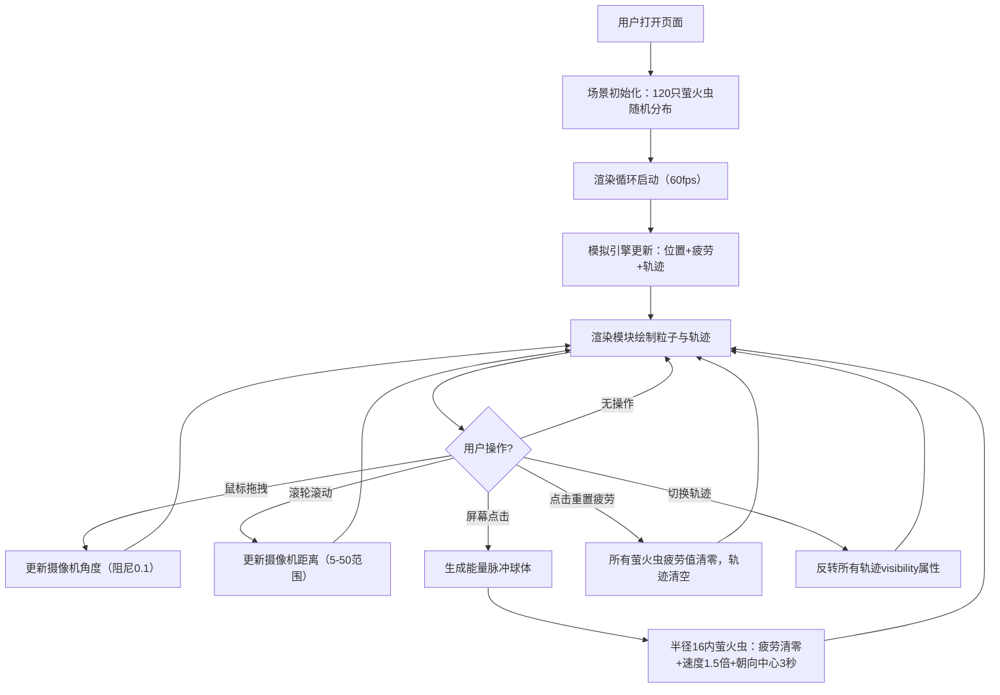
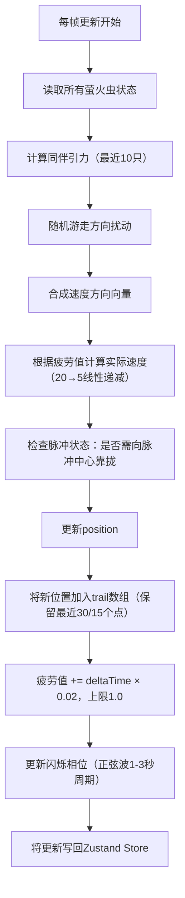

## 1. 产品概述

QuantumFirefly 是一个沉浸式的3D萤火虫夜空模拟可视化项目，通过随机游走算法与同伴引力模型模拟萤火虫群的自然飞行行为，用户可通过交互释放能量脉冲来影响萤火虫群体的运动状态，打造富有诗意的视觉体验。

- 核心价值：提供一个具有艺术美感的交互式3D粒子系统演示，展现群体行为（Boids算法变体）的视觉魅力
- 目标用户：视觉艺术爱好者、前端开发者、3D图形学习者

---

## 2. 核心特性

### 2.1 功能模块

1. **3D萤火虫场景渲染**：120只萤火虫粒子 + 流光轨迹 + 夜空渐变背景
2. **群体行为模拟引擎**：随机游走 + 同伴引力（最近10只加权方向偏移）
3. **疲劳值动态系统**：影响颜色、轨迹长度、飞行速度的负反馈循环
4. **能量脉冲交互**：点击屏幕释放脉冲，吸引萤火虫聚集并重置疲劳
5. **视角控制系统**：鼠标拖拽旋转 + 滚轮缩放 + 阻尼平滑
6. **性能监控面板**：实时FPS计数器 + 萤火虫总数显示
7. **控制面板**：重置疲劳按钮 + 轨迹显示切换开关

### 2.2 页面详情

| 页面名称 | 模块名称 | 功能描述 |
|---------|---------|---------|
| 主场景页面 | 3D场景渲染 | 深蓝色夜空渐变背景、萤火虫粒子系统、流光轨迹线 |
| 主场景页面 | 视角交互 | 鼠标拖拽旋转视角（上下45°限制）、滚轮缩放（5-50范围） |
| 主场景页面 | 脉冲交互 | 点击屏幕生成半透明扩散球体，影响半径16范围内的萤火虫 |
| 主场景页面 | 控制面板 | 显示萤火虫总数、重置疲劳按钮、切换轨迹显示开关 |
| 主场景页面 | FPS监控 | 界面角落显示帧率，≥50绿色#00FF00，<50红色#FF0000 |

---

## 3. 核心流程

### 用户交互主流程

### 萤火虫状态更新流程

---

## 4. 用户界面设计

### 4.1 设计风格

- **主色调**：深蓝夜空 `#0B1026 → #1A2A47` 垂直渐变
- **粒子冷色** `#74B9FF` → **粒子暖色** `#E17055`（根据疲劳值0→1渐变）
- **轨迹渐变**：起点蓝紫 `#6C5CE7` → 终点橙黄 `#FDCB6E`
- **脉冲色** `#00FFAA`（青绿色半透明球体）
- **文字主色** `#FFFFFF`，禁用态 `#95A5A6`
- **按钮样式**：1px白色实线边框、圆角8px、内边距8px 16px、点击时背景 `rgba(255,255,255,0.2)`、过渡0.2s
- **面板样式**：顶部居中、宽500px、背景 `rgba(15,23,42,0.8)`、圆角12px、背光模糊10px

### 4.2 页面设计概述

| 页面名称 | 模块名称 | UI元素 |
|---------|---------|--------|
| 主场景 | 背景 | 深蓝色垂直渐变（#0B1026→#1A2A47），无额外纹理保持纯净 |
| 主场景 | 萤火虫粒子 | Points材质，圆形渐变纹理（Canvas生成），6-12px随机大小，sizeAttenuation开启，Additive混合，闪烁亮度0.3→1.0正弦波 |
| 主场景 | 流光轨迹 | LineSegments材质，顶点颜色渐变，透明度随距离衰减，半透明Additive混合 |
| 主场景 | 脉冲球体 | SphereGeometry，MeshBasicMaterial透明，透明度0.6→0.0扩散，半径2→16（8单位/秒） |
| 主场景 | 控制面板 | 顶部固定居中，flex布局，左中右分布：数量标签 / 重置按钮 / 开关按钮 |
| 主场景 | FPS计数器 | 右上角/左下角绝对定位，等宽字体monospace，14px，每15帧刷新 |

### 4.3 响应式

- **Desktop-first** 设计，全屏Canvas铺满viewport
- 控制面板使用固定像素宽度500px，在小屏幕上可缩小至90vw
- 所有3D交互在移动设备上降级为touch事件：单指拖拽旋转、双指捏合缩放
- 触控点击同样触发能量脉冲

### 4.4 3D场景指南

- **环境氛围**：深夜星空，低环境光，依赖粒子自发光营造氛围，无HDRI
- **光照设置**：AmbientLight强度0.1，主要依赖PointsMaterial的自发光（Additive Blending）
- **摄像机设置**：PerspectiveCamera fov=60，初始位置(0,0,30)，OrbitControls目标原点，minDistance=5 maxDistance=50，maxPolarAngle=π*3/4（上下45°限制），enableDamping=true dampingFactor=0.1
- **构图焦点**：萤火虫主要分布在半径15的球体内，摄像机目标点始终为场景中心
- **交互动画**：脉冲球体使用scale线性放大 + opacity线性衰减，萤火虫速度变化使用线性插值避免抖动
- **后处理**：可考虑添加UnrealBloomPass增强辉光效果（如性能允许）
- **性能预算**：Draw call控制在10以内（1个Points + 1个LineSegments + 脉冲球），顶点数<5000，三角形<10000
