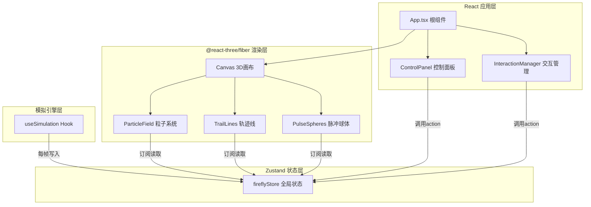

## 1. 架构设计



---

## 2. 技术描述

- **前端框架**：React@18 + TypeScript@5 + Vite@5
- **3D渲染**：three@0.160 + @react-three/fiber@8 + @react-three/drei@9
- **状态管理**：zustand@4
- **构建工具**：Vite + @vitejs/plugin-react
- **模块划分**：
  - `src/store/` — Zustand全局状态定义（单向数据流：simulation写，rendering读）
  - `src/simulation/` — 物理/行为模拟引擎（useSimulation自定义Hook）
  - `src/rendering/` — Three.js可视化渲染组件（粒子+轨迹）
  - `src/components/` — React UI组件（控制面板、交互管理）

---

## 3. 项目文件结构

| 文件路径 | 职责描述 |
|---------|---------|
| `package.json` | 依赖定义 + 脚本（dev: vite, build: vite build, preview: vite preview） |
| `vite.config.js` | Vite配置，引入@vitejs/plugin-react |
| `tsconfig.json` | TypeScript严格模式，jsx: react-jsx，moduleResolution: bundler |
| `index.html` | HTML入口，root div，引入main.tsx |
| `src/main.tsx` | ReactDOM.createRoot挂载App |
| `src/App.tsx` | 组合Canvas+控制面板+FPS，调用store初始化，设置OrbitControls |
| `src/store/fireflyStore.ts` | Zustand store：120只萤火虫数组 + 脉冲数组 + actions |
| `src/simulation/engine.ts` | useSimulation Hook：useFrame中更新位置/疲劳/轨迹/脉冲 |
| `src/rendering/ParticleField.tsx` | Points组件：批量渲染120粒子，颜色/大小由疲劳值驱动 |
| `src/rendering/TrailLines.tsx` | LineSegments组件：批量渲染轨迹，顶点颜色+透明度衰减 |
| `src/components/ControlPanel.tsx` | 顶部控制面板：数量标签 + 重置按钮 + 轨迹开关 |
| `src/components/InteractionManager.tsx` | 点击事件→Raycaster→3D坐标→添加脉冲到store |

---

## 4. 数据模型（Zustand Store）

### 4.1 Store 类型定义

```typescript
import { Vector3 } from 'three'

interface Firefly {
  id: number
  position: Vector3      // 当前位置
  velocity: Vector3      // 当前速度方向（单位向量）
  trail: Vector3[]       // 历史轨迹，最多30/15个点
  fatigue: number        // 0-1 疲劳值
  baseSpeed: number      // 基础飞行速度（20）
  phase: number          // 闪烁相位 0-2π
  blinkPeriod: number    // 闪烁周期 1-3秒
  size: number           // 粒子大小 6-12px
  pulseBoostTimer: number // 脉冲加速剩余时间（秒）
  pulseTarget: Vector3 | null // 脉冲吸引目标点
}

interface Pulse {
  id: number
  center: Vector3        // 脉冲中心
  radius: number         // 当前半径（2→16）
  opacity: number        // 当前透明度（0.6→0）
  life: number           // 剩余生命（秒）
}

interface FireflyState {
  fireflies: Firefly[]
  pulses: Pulse[]
  trailsVisible: boolean
  initFireflies: () => void
  updateFireflies: (updates: Partial<Firefly>[]) => void
  resetFatigue: () => void
  toggleTrails: () => void
  addPulse: (center: Vector3) => void
  updatePulses: (dt: number) => void
}
```

### 4.2 数据流约束

- **模拟引擎（writer）**：`useSimulation` 在 `useFrame` 中每帧读取 `store.getState()`，更新后通过 `updateFireflies` / `updatePulses` 批量写回
- **渲染组件（reader）**：`ParticleField` / `TrailLines` 使用 `useStore(selector)` 订阅所需字段，仅在数据变化时重渲染
- **UI组件（action caller）**：`ControlPanel` / `InteractionManager` 调用 store actions，不直接修改状态

---

## 5. 关键算法说明

### 5.1 同伴引力（Neighbor Attraction）

```
对每只萤火虫 i：
  1. 计算与其他119只的距离，取最近10只
  2. 计算这10只的平均位置重心
  3. 方向向量 = normalize(重心 - 自身位置) × 0.3（权重）
  4. 与随机游走方向（权重0.7）加权合成新速度方向
  5. 如存在pulseTarget，叠加 normalize(pulseTarget - position) × 0.5
```

### 5.2 疲劳值负反馈

```
fatigue 增加：每帧 fatigue += dt * 0.02，clamp(0, 1)
fatigue 清零：被脉冲命中 或 点击"重置疲劳"按钮

速度映射：actualSpeed = baseSpeed * (1 - fatigue*0.75)  即 20 → 5
颜色映射：color = lerp(#74B9FF, #E17055, fatigue)
轨迹长度：maxTrailLength = fatigue < 0.5 ? 30 : 15（分段切换）
```

### 5.3 粒子纹理（Canvas生成）

使用OffscreenCanvas绘制径向渐变圆形作为PointsMaterial的map：
- 中心不透明白色，向边缘alpha渐变至0
- 尺寸64×64像素，避免走样

### 5.4 性能优化策略

1. **单Draw Call粒子系统**：所有萤火虫共享一个BufferGeometry + 一个PointsMaterial，使用BufferAttribute存储每粒子的position/color/size
2. **单Draw Call轨迹系统**：所有萤火虫轨迹拼接到一个BufferGeometry，使用LineSegments（每段2个顶点），顶点颜色attribute
3. **增量更新**：每帧仅更新BufferAttribute的array，调用`needsUpdate=true`，不重建Geometry
4. **Zustand selector**：渲染组件使用精确selector避免不必要重渲染
5. **FPS节流更新**：FPS显示每15帧计算一次平均值

---

## 6. 性能指标验收标准

| 指标 | 目标值 | 测量方式 |
|-----|-------|---------|
| 平均帧率 | ≥55 FPS | Chrome DevTools Performance面板 |
| 最低帧率 | ≥50 FPS | 连续交互30秒内最低值 |
| 内存占用 | ≤200 MB | Task Manager/Activity Monitor |
| Draw Call数 | ≤10 | Three.js Inspector |
| 首屏加载 | ≤3s | 禁用缓存情况下Network面板 |
