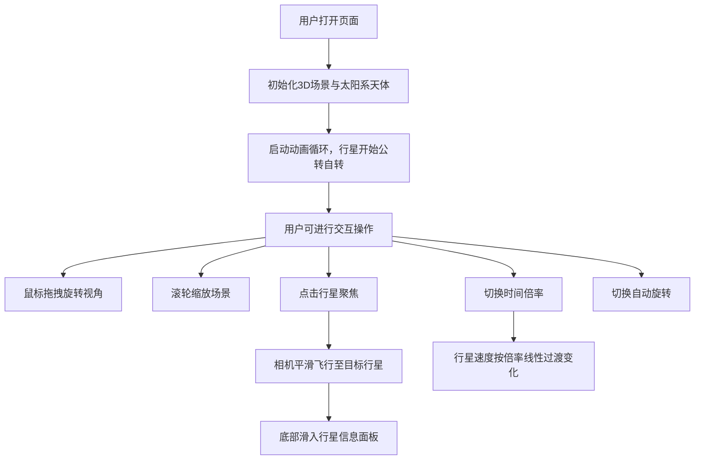

## 1. 产品概述

PlanetariumWeb是一个面向天文爱好者的在线3D太阳系模拟应用，通过交互式3D可视化展示太阳系行星运动，让用户直观了解各行星的公转轨道、相对大小、自转倾角及光晕效果。

- 目标用户：天文爱好者、教育工作者、学生
- 产品价值：提供沉浸式、交互式的太阳系学习体验，将抽象的天文知识转化为可视化的3D动画

## 2. 核心功能

### 2.1 功能模块
1. **天体模拟模块**：太阳和8大行星的3D渲染、公转自转运动、轨道线条
2. **用户交互模块**：视角控制（拖拽/缩放）、行星聚焦、时间加速控制、信息面板

### 2.2 页面详情
| 页面名称 | 模块名称 | 功能描述 |
|---------|---------|---------|
| 主场景页 | 太阳系3D场景 | 全屏深空背景，渲染太阳、8大行星及其轨道，支持实时动画 |
| 主场景页 | 视角控制 | 鼠标拖拽旋转视角，滚轮缩放，点击行星相机平滑飞行 |
| 主场景页 | 信息面板 | 底部滑入式面板，显示当前选中行星的详细数据 |
| 主场景页 | 时间控制 | 右侧悬浮按钮组，切换1x/5x/10x/50x/100x时间倍率 |
| 主场景页 | 自动旋转 | 顶部悬浮按钮，切换视角自动环绕旋转模式 |

## 3. 核心流程

## 4. 用户界面设计

### 4.1 设计风格
- **主色调**：深空蓝黑渐变（#0A0E27 → #081024）
- **高亮色**：金色 #F1C40F（用于关键数据高亮）
- **辅助色**：半透明白色（用于UI元素）
- **按钮风格**：毛玻璃效果，背景rgba(255,255,255,0.08)，边框1px rgba(255,255,255,0.2)，圆角8px
- **字体**：无衬线现代字体，整体极简科幻风格
- **动效**：面板0.4s缓动滑入，悬停0.2s过渡，速度切换0.3s线性插值，相机飞行2s缓动

### 4.2 页面设计概述
| 页面名称 | 模块名称 | UI元素 |
|---------|---------|-------|
| 主场景页 | 3D画布 | 全屏渲染，深空径向渐变背景，太阳发光黄色球体，行星带轨道线 |
| 主场景页 | 时间控制按钮 | 右侧垂直排列5个毛玻璃按钮（1x-100x），当前倍率高亮 |
| 主场景页 | 自动旋转按钮 | 左上角悬浮毛玻璃按钮，图标切换旋转/暂停状态 |
| 主场景页 | 行星信息面板 | 底部居中，宽度最大640px，白色文字，关键数据金色高亮 |

### 4.3 响应式
- **桌面端**（≥768px）：按钮标准尺寸，面板最大宽度640px，内边距24px
- **移动端**（<768px）：按钮缩小至32px，面板宽度90%，降低透明度优化视觉

### 4.4 3D场景指导
- **环境**：深空径向渐变背景，营造宇宙沉浸感
- **光照**：太阳为点光源（黄色发光体），配合环境光保证行星可见度
- **相机设置**：PerspectiveCamera，初始位置可观测整个太阳系，OrbitControls控制视角
- **行星组成**：
  - 太阳：自发光黄色球体（半径3）+ 光晕粒子特效
  - 八大行星：按真实比例缩放（轨道×0.1，大小×0.02），球体几何体+自定义颜色材质
  - 土星：额外添加光环（圆环几何体）
  - 地球：表面添加经纬网格线装饰
  - 所有行星：公转轨道半透明白色圆环线（LineLoop）
- **动画**：每帧更新行星公转角度和自旋转角，地球自转周期约24秒为基准
- **性能优化**：场景更新帧率≥45fps，相机飞行期间暂停非必要更新
