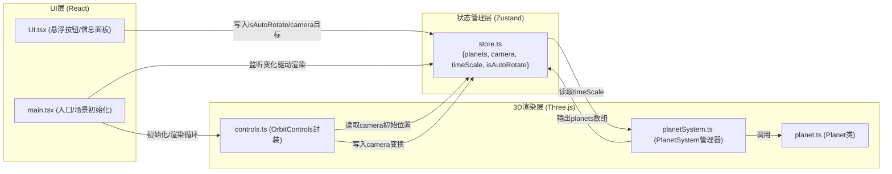

## 1. 架构设计



## 2. 技术描述
- **前端框架**: React@18 + TypeScript
- **构建工具**: Vite
- **3D渲染**: Three.js + OrbitControls
- **状态管理**: Zustand
- **样式方案**: 原生CSS + CSS Modules (内联样式)
- **初始化工具**: vite-init (react-ts模板)

## 3. 项目文件结构与调用关系

| 文件路径 | 职责 | 依赖/被调用关系 |
|---------|------|----------------|
| `package.json` | 项目依赖配置 (react@18, react-dom@18, three, zustand, vite) | 启动脚本: npm run dev |
| `vite.config.js` | Vite构建配置 | 配置路径别名@指向src |
| `tsconfig.json` | TypeScript严格模式配置 | strict: true |
| `index.html` | 入口HTML页面 | 挂载#app，全屏容器 |
| `src/simulation/planet.ts` | Planet类: 定义行星属性，生成Mesh和LineLoop轨道 | 被PlanetSystem调用 |
| `src/simulation/planetSystem.ts` | PlanetSystem: 管理所有行星实例，每帧更新位置和自转 | 依赖planet.ts; 订阅store.timeScale，更新后写入store.planets |
| `src/interaction/controls.ts` | 封装OrbitControls: 处理拖拽/缩放，监听isAutoRotate | 读取store.camera初始位置，写入最终变换 |
| `src/interaction/UI.tsx` | React组件: 渲染悬浮按钮和信息面板 | 通过store写入isAutoRotate和camera目标位置 |
| `src/store/store.ts` | Zustand store: 共享行星数据、camera状态、timeScale、isAutoRotate | 被所有模块读写 |
| `src/main.tsx` | React入口: 挂载App，初始化场景和动画循环 | 监听store变化驱动渲染 |

## 4. 数据模型

### 4.1 Store数据结构定义

```typescript
// src/store/store.ts
interface PlanetData {
  name: string;
  radius: number;
  orbitRadius: number;
  orbitSpeed: number;
  rotationSpeed: number;
  color: string;
  orbitPeriod: number;    // 公转周期(地球年)
  rotationPeriod: number; // 自转周期(地球日)
  distanceFromSun: number; // 与太阳距离(天文单位)
  mesh: THREE.Mesh | null;
  orbitLine: THREE.LineLoop | null;
  currentAngle: number;
}

interface CameraState {
  target: THREE.Vector3;
  zoom: number;
  isFlying: boolean;
}

interface PlanetariumStore {
  planets: PlanetData[];
  camera: CameraState;
  timeScale: number;
  targetTimeScale: number;
  isAutoRotate: boolean;
  selectedPlanet: string | null;
  setSelectedPlanet: (name: string | null) => void;
  setTimeScale: (scale: number) => void;
  setIsAutoRotate: (auto: boolean) => void;
  setCameraTarget: (target: THREE.Vector3, zoom?: number) => void;
  setCameraFlying: (flying: boolean) => void;
  updatePlanets: (planets: PlanetData[]) => void;
}
```

### 4.2 行星参数配置 (真实数据缩放)

| 名称 | 半径(km) | 轨道半径(AU) | 公转周期(年) | 自转周期(日) | 颜色 |
|-----|---------|------------|------------|-----------|------|
| 太阳 | 696,340 | - | - | 25.4 | #FDB813 |
| 水星 | 2,440 | 0.39 | 0.24 | 58.6 | #B5B5B5 |
| 金星 | 6,052 | 0.72 | 0.62 | 243 | #E6C229 |
| 地球 | 6,371 | 1.00 | 1.00 | 1.00 | #2E86AB |
| 火星 | 3,390 | 1.52 | 1.88 | 1.03 | #C1440E |
| 木星 | 69,911 | 5.20 | 11.86 | 0.41 | #C88B3A |
| 土星 | 58,232 | 9.58 | 29.46 | 0.45 | #E8D4A8 |
| 天王星 | 25,362 | 19.20 | 84.01 | 0.72 | #D1E7E7 |
| 海王星 | 24,622 | 30.05 | 164.8 | 0.67 | #3B5DF6 |

## 5. 核心算法流程

### 5.1 动画循环流程
```
requestAnimationFrame → 计算deltaTime → timeScale线性插值过渡
  → 相机飞行检查(飞行中暂停更新)
  → 遍历行星数组:
      - 更新公转角度: angle += orbitSpeed * deltaTime * timeScale
      - 计算新位置: x = cos(angle)*orbitRadius, z = sin(angle)*orbitRadius
      - 更新mesh.position
      - 更新mesh.rotation.y (自转)
  → 同步行星数据到store
  → renderer.render(scene, camera)
```

### 5.2 相机飞行算法
```
起始位置/目标 → THREE.Vector3.lerp → 每帧插值t∈[0,1]
t缓动函数: easeInOutCubic(t) = t<0.5 ? 4t³ : 1-(-2t+2)³/2
总时长: 2秒 → 每帧t += deltaTime/2
飞行期间: setCameraFlying(true)，暂停行星更新，完成后恢复
```

### 5.3 速度过渡算法
```
切换倍率时: targetTimeScale = 新值
每帧过渡: timeScale += (targetTimeScale - timeScale) * (deltaTime / 0.3)
0.3秒线性插值趋近目标值
```
