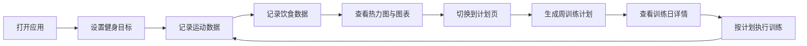

## 1. 产品概述

FitTracky是一款在线健身记录与训练计划生成应用，帮助用户记录每日运动和饮食数据，并基于历史数据和个人目标自动生成个性化周训练计划。

- **核心价值**：通过数据驱动的方式，为用户提供科学、个性化的健身规划
- **目标用户**：健身爱好者、希望保持规律运动的上班族、有明确健身目标的人群
- **市场定位**：轻量级、数据可视化强、智能规划的个人健身管理工具

## 2. 核心功能

### 2.1 用户角色

| 角色 | 注册方式 | 核心权限 |
|------|----------|----------|
| 普通用户 | 无需注册，本地数据存储 | 记录运动饮食、查看数据图表、生成训练计划 |

### 2.2 功能模块

1. **记录页面**：运动记录表单、饮食记录表单、日历热力图、数据混合图表、目标设定
2. **计划页面**：周训练计划展示、训练日详情、计划生成功能

### 2.3 页面详情

| 页面名称 | 模块名称 | 功能描述 |
|----------|----------|----------|
| 记录页 | 目标设定 | 设置健身目标（减脂/增肌/维持）、每日运动时长目标 |
| 记录页 | 运动记录表单 | 选择运动类型、输入时长、自动估算卡路里消耗 |
| 记录页 | 饮食记录表单 | 输入食物名称、份量、估算摄入卡路里 |
| 记录页 | 日历热力图 | 按月展示每日总消耗卡路里，颜色分五档，支持横向滚动12个月 |
| 记录页 | 数据混合图表 | 近四周每日消耗（柱状）与摄入（折线）对比图 |
| 记录页 | 目标达成徽章 | 当日运动时长达标时显示绿色徽章，带动画效果 |
| 计划页 | 计划生成按钮 | 基于历史数据和目标生成周训练计划 |
| 计划页 | 训练日卡片 | 展示每日推荐运动、时长、预期消耗，点击展开详情 |
| 计划页 | 训练日详情 | 替换运动建议、休息提醒等详细信息 |

## 3. 核心流程

用户打开应用 → 在记录页设置个人目标 → 输入每日运动和饮食数据 → 查看日历热力图和数据图表 → 切换到计划页 → 生成个性化周训练计划 → 查看每日训练详情

## 4. 用户界面设计

### 4.1 设计风格

- **主题风格**：暗色健身风格，科技感与运动活力结合
- **主背景色**：#1A1A2E（深蓝紫色）
- **卡片背景色**：#16213E（深海军蓝）
- **侧边栏背景**：#0F3460（深海蓝）
- **主题强调色**：#E94560（亮红色）
- **成功色**：#4CAF50（绿色）
- **警告色**：#FF5722（橙红色）
- **正文文字**：#EEEEEE（浅灰白色）
- **按钮风格**：圆角8px，背景色#E94560，白色文字，悬停变暗至#C0392B，点击缩放0.95
- **输入框风格**：背景#0F3460，边框#533483，聚焦时边框变为#E94560，过渡0.2s
- **卡片风格**：圆角12px，盒子阴影0 4px 12px rgba(0,0,0,0.1)
- **字体**：现代无衬线字体，标题加粗

### 4.2 页面设计概述

| 页面名称 | 模块名称 | UI元素 |
|----------|----------|--------|
| 记录页 | 侧边栏导航 | 宽度240px，导航项高50px，悬停左侧4px亮红竖条，底部用户头像和昵称 |
| 记录页 | 目标设定区 | 下拉选择目标类型，数字输入时长目标 |
| 记录页 | 运动表单 | 下拉选择运动类型，数字输入时长，实时显示估算卡路里 |
| 记录页 | 饮食表单 | 文本输入食物名称，数字输入份量，显示估算卡路里 |
| 记录页 | 日历热力图 | 28x28px单元格，五档颜色（浅绿#C8E6C9到深红#B71C1C），悬浮提示，横向滚动12个月 |
| 记录页 | 混合图表 | 柱状+折线图，90%宽度最大1200px，容器背景#16213E，圆角12px，内边距20px |
| 记录页 | 目标徽章 | 32x32px，绿色背景，白色打勾，缩放弹入动画 |
| 计划页 | 计划生成按钮 | 醒目位置，主色调按钮 |
| 计划页 | 训练日卡片 | 300px宽，圆角12px，阴影，白色背景（卡片内），点击展开 |

### 4.3 响应式

- 桌面端优先设计，侧边栏固定宽度
- 页面主体区域自适应宽度
- 图表容器宽度占页面90%，最大宽度1200px
- 训练日卡片可换行排列

### 4.4 动画与过渡

- 页面切换：0.3s fade-in过渡
- 按钮悬停：背景色过渡
- 按钮点击：0.1s scale 0.95缩放
- 输入框聚焦：边框颜色0.2s过渡
- 目标徽章：0.3s缩放弹入，重复触发时闪烁
- 训练卡片展开/收起：平滑过渡
