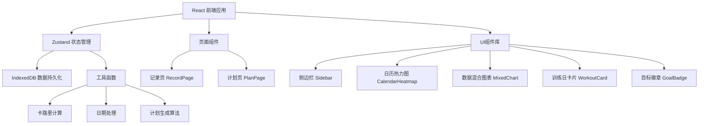
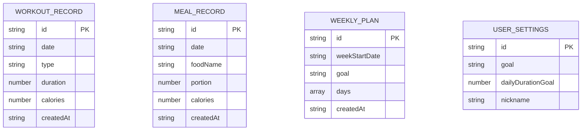

## 1. 架构设计



## 2. 技术描述

- **前端框架**：React@18 + TypeScript
- **构建工具**：Vite
- **状态管理**：Zustand
- **数据持久化**：IndexedDB（本地浏览器存储）
- **图表库**：Recharts
- **日期处理**：date-fns
- **唯一ID生成**：uuid
- **样式方案**：原生CSS + CSS变量

## 3. 路由定义

| 路由 | 页面 | 用途 |
|------|------|------|
| / | RecordPage | 记录页面，运动与饮食记录、热力图、图表 |
| /plan | PlanPage | 计划页面，周训练计划展示与生成 |

## 4. 数据模型

### 4.1 数据模型定义



### 4.2 IndexedDB 存储结构

- **数据库名**：FitTrackyDB
- **版本**：1
- **对象仓库**：
  - `workoutRecords` - 运动记录，keyPath: `id`，索引: `date`
  - `mealRecords` - 饮食记录，keyPath: `id`，索引: `date`
  - `weeklyPlans` - 周计划，keyPath: `id`，索引: `weekStartDate`
  - `userSettings` - 用户设置，keyPath: `id`

## 5. 状态管理（Zustand Store）

### Store 状态

```typescript
interface FitTrackyStore {
  // 运动记录
  workoutRecords: WorkoutRecord[];
  // 饮食记录
  mealRecords: MealRecord[];
  // 周计划
  weeklyPlans: WeeklyPlan[];
  // 用户设置
  userSettings: UserSettings;
  
  // 动作方法
  addWorkoutRecord: (record: Omit<WorkoutRecord, 'id' | 'createdAt'>) => void;
  addMealRecord: (record: Omit<MealRecord, 'id' | 'createdAt'>) => void;
  generateWeeklyPlan: (weekStartDate: string) => WeeklyPlan;
  updateUserSettings: (settings: Partial<UserSettings>) => void;
  loadFromIndexedDB: () => Promise<void>;
  
  // 计算方法
  getDailyTotalCalories: (date: string) => { burned: number; consumed: number };
  getWeeklyStats: (weekStartDate: string) => WeeklyStats;
  getWorkoutTypePreference: () => Record<string, number>;
}
```

## 6. 文件结构

```
src/
├── App.tsx              # 主应用组件，路由管理，侧边栏布局
├── store.ts             # Zustand状态管理
├── types.ts             # TypeScript类型定义
├── utils/
│   ├── calories.ts      # 卡路里计算工具
│   ├── dateUtils.ts     # 日期处理工具
│   ├── planGenerator.ts # 训练计划生成算法
│   └── db.ts            # IndexedDB封装
├── pages/
│   ├── RecordPage.tsx   # 记录页面
│   └── PlanPage.tsx     # 计划页面
├── components/
│   ├── Sidebar.tsx      # 侧边栏导航
│   ├── CalendarHeatmap.tsx  # 日历热力图
│   ├── MixedChart.tsx   # 混合数据图表
│   ├── WorkoutCard.tsx  # 训练日卡片
│   ├── GoalBadge.tsx    # 目标达成徽章
│   ├── WorkoutForm.tsx  # 运动记录表单
│   └── MealForm.tsx     # 饮食记录表单
└── styles/
    └── index.css        # 全局样式
```

## 7. 性能优化

- **日历热力图**：使用CSS Grid布局，避免重排重绘，200个单元格帧率不低于30fps
- **图表更新**：Zustand状态更新后，Recharts增量渲染，延迟不超过200ms
- **IndexedDB**：异步读写，不阻塞主线程
- **组件优化**：合理使用React.memo，避免不必要的重渲染
- **CSS动画**：使用transform和opacity属性，启用GPU加速

## 8. 核心算法

### 8.1 卡路里估算

根据运动类型和时长估算消耗卡路里：
- 跑步：约10卡/分钟
- 游泳：约12卡/分钟
- 骑行：约8卡/分钟
- 瑜伽：约5卡/分钟
- 力量训练：约7卡/分钟

### 8.2 周计划生成算法

输入：过去一周运动数据、用户目标
输出：7天训练计划

算法步骤：
1. 分析过去一周运动类型偏好和平均每日消耗
2. 根据目标类型设定周总消耗目标
3. 分配每日训练强度（休息日、轻度训练、中度训练、高强度训练）
4. 基于运动偏好推荐具体运动类型
5. 计算每日建议时长和预期消耗
6. 添加详细建议（替换运动、休息提醒等）
