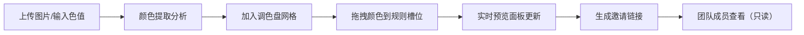
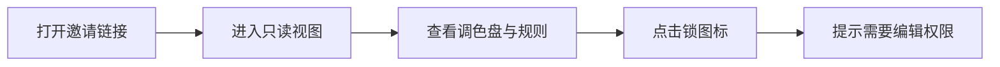

## 1. 产品概述

ColorSync 是一款面向设计团队的远程协作工具，帮助设计师和前端开发者快速提取、分享和同步项目中的颜色变量，解决团队间反复沟通色值的痛点。

- **核心价值**：消除设计与开发之间的颜色沟通成本，确保色彩一致性，提升协作效率
- **目标用户**：UI 设计师、前端开发者、设计团队负责人
- **产品定位**：轻量级、高颜值的颜色协作工具

## 2. 核心功能

### 2.1 用户角色

| 角色 | 注册方式 | 核心权限 |
|------|----------|----------|
| 编辑者 | 本地使用 | 创建项目、编辑调色盘、管理颜色规则、生成邀请链接 |
| 只读用户 | 通过邀请链接访问 | 查看调色盘和规则、复制色值、不可修改 |

### 2.2 功能模块

1. **调色盘模块**：图片颜色提取、手动添加颜色、颜色网格展示、点击复制
2. **项目协作模块**：多项目管理、颜色规则定义、实时预览面板、邀请链接生成
3. **只读分享视图**：锁图标标识、权限提示、仅查看模式

### 2.3 功能详情

| 功能名称 | 模块名称 | 功能描述 |
|----------|----------|----------|
| 图片颜色提取 | 调色盘模块 | 上传图片自动分析主色调、辅色调、强调色，显示色值和占比百分比 |
| 手动添加颜色 | 调色盘模块 | 输入十六进制色值快速添加到调色盘 |
| 颜色网格展示 | 调色盘模块 | 网格卡片展示调色盘，圆角 8px，自动切换文字色确保可读性 |
| 点击复制色值 | 调色盘模块 | 点击卡片复制色值，1.5 秒 toast 提示，0.2 秒按压缩放动画 |
| 拖拽颜色卡片 | 调色盘模块 | 支持拖拽颜色卡片到规则槽位 |
| 多项目管理 | 项目协作模块 | 创建多个项目，每个项目有独立调色盘和规则 |
| 颜色规则编辑 | 项目协作模块 | 拖拽颜色到角色槽位，绿色虚线高亮边框，弹性动画反馈 |
| 实时预览面板 | 项目协作模块 | 模拟卡片、按钮、文字块，自动更新颜色，0.3 秒 ease-out 过渡 |
| 邀请链接生成 | 项目协作模块 | 模拟生成邀请链接，点击复制 |
| 只读视图 | 团队共享 | 卡片不可拖拽，显示锁图标，点击提示"需要编辑权限" |

## 3. 核心流程

### 3.1 颜色提取与使用流程

用户上传图片或输入色值 → 系统分析提取颜色 → 颜色自动加入调色盘 → 用户拖拽颜色到规则槽位 → 实时预览面板更新 → 生成邀请链接分享给团队

### 3.2 只读访问流程

用户打开邀请链接 → 进入只读视图 → 查看调色盘和规则 → 可复制色值 → 尝试编辑时显示权限提示

## 4. 用户界面设计

### 4.1 设计风格

- **主色调**：#E94560（珊瑚红，强调色）
- **主背景**：#1A1A2E（深蓝紫底色）
- **卡片背景**：#16213E（稍浅的蓝紫色）
- **文字颜色**：浅色背景用 #2D2D2D，深色背景用白色
- **整体风格**：深色主题、现代简约、富有科技感
- **卡片样式**：圆角 8px，悬停上移 3px + 阴影加深
- **字体**：Inter（Google Fonts）

### 4.2 页面设计概览

| 页面名称 | 模块名称 | UI 元素 |
|----------|----------|---------|
| 主应用 | 调色盘 + 项目 | 顶部项目切换、左侧调色盘网格、右侧规则编辑与预览 |
| 调色盘区 | 调色盘模块 | 颜色提取工具区、颜色卡片网格、复制 toast |
| 规则编辑区 | 项目模块 | 角色槽位列表、拖拽高亮、实时预览面板 |
| 邀请分享区 | 项目模块 | 链接展示、复制按钮、只读状态标识 |

### 4.3 响应式设计

- 桌面端（宽屏）：调色盘网格 4 列，左右分栏布局
- 平板/窄屏：调色盘网格 2 列，上下堆叠布局
- 触控优化：拖拽区域适配手指操作尺寸

### 4.4 动画与交互

- **卡片点击**：0.2 秒按压缩放动画
- **拖拽反馈**：绿色虚线高亮边框 + 弹性动画
- **颜色飞入**：卡片飞入槽位并缩小适配
- **预览更新**：0.3 秒 ease-out 过渡动画
- **悬停效果**：卡片上移 3px + 阴影加深

## 5. 性能指标

- 调色盘渲染：≤ 200ms
- 图片颜色提取（300×300px 内）：≤ 1 秒
- 拖拽响应：流畅无卡顿
