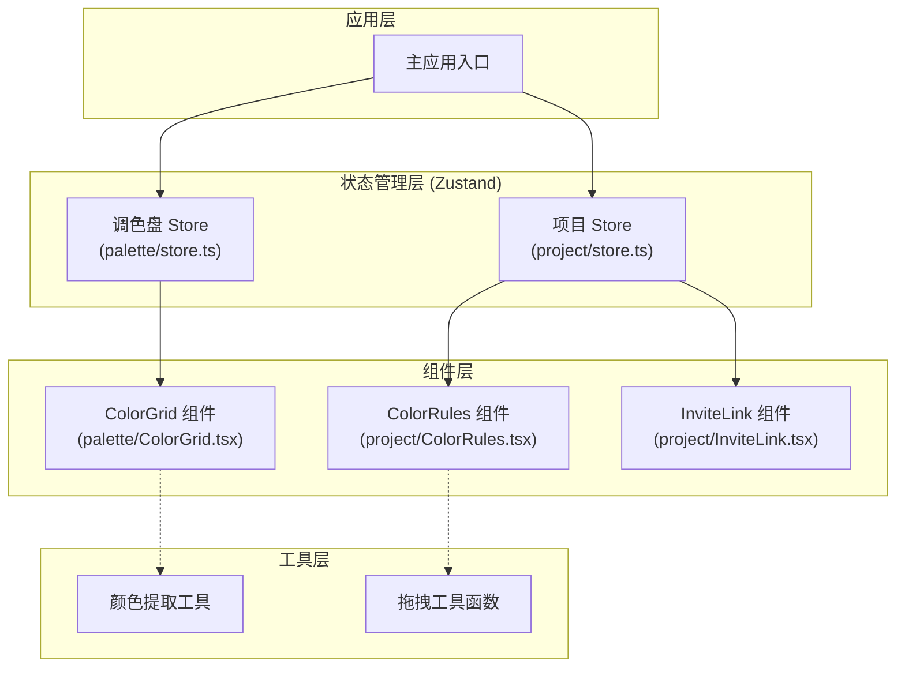

## 1. 架构设计

ColorSync 采用纯前端单页应用架构，使用 Zustand 进行状态管理，模块间通过共享 store 通信。



## 2. 技术栈说明

| 技术 | 版本/说明 | 用途 |
|------|-----------|------|
| React | 18.x | UI 框架 |
| TypeScript | ES2020 目标 | 类型安全 |
| Vite | 5.x | 构建工具 |
| Zustand | 4.x | 状态管理 |
| uuid | 9.x | 生成唯一 ID |
| Google Fonts Inter | - | 字体 |

## 3. 模块与文件结构

```
src/
├── main.tsx              # 应用入口，创建并注入 store
├── palette/
│   ├── store.ts          # 调色盘状态管理
│   └── ColorGrid.tsx     # 颜色网格组件
└── project/
    ├── store.ts          # 项目状态管理
    ├── ColorRules.tsx    # 颜色规则编辑组件
    └── InviteLink.tsx    # 邀请链接组件
```

## 4. 数据模型

### 4.1 颜色数据模型

```typescript
interface Color {
  id: string;
  hex: string;
  name?: string;
  percentage?: number;
  role?: 'primary' | 'secondary' | 'accent';
}
```

### 4.2 项目数据模型

```typescript
interface Project {
  id: string;
  name: string;
  colors: Color[];
  rules: ColorRules;
  inviteLink: string;
  isReadonly: boolean;
}

interface ColorRules {
  background: string | null;
  cardBackground: string | null;
  button: string | null;
  textPrimary: string | null;
  textSecondary: string | null;
  accent: string | null;
}
```

### 4.3 Store 接口

**调色盘 Store (palette/store.ts)**

- Actions:
  - `addColor(hex: string)`: 添加单个颜色
  - `addColorsFromImage(colors: Color[])`: 从图片批量添加颜色
  - `removeColor(id: string)`: 移除颜色
- Selectors:
  - `getPrimaryColors()`: 获取主要颜色
  - `getColorsByRole(role)`: 按角色获取颜色

**项目 Store (project/store.ts)**

- Actions:
  - `createProject(name: string)`: 创建项目
  - `setCurrentProject(id: string)`: 设置当前项目
  - `updateRule(role, colorId)`: 更新颜色规则
  - `generateInviteLink()`: 生成邀请链接
- Selectors:
  - `getCurrentProjectColors()`: 获取当前项目颜色
  - `getRuleColor(role)`: 获取指定规则的颜色
  - `isReadonly()`: 是否为只读模式

## 5. 核心功能实现方案

### 5.1 图片颜色提取

- 使用 Canvas API 读取图片像素数据
- 采用 K-Means 聚类算法分析主色调
- 按像素占比排序，分为主色调、辅色调、强调色
- 限制处理尺寸在 300×300px 内以保证性能

### 5.2 拖拽交互

- 使用原生 HTML5 Drag and Drop API
- 拖拽时槽位显示绿色虚线边框和弹性动画
- 释放时颜色卡飞入槽位并缩小适配
- 只读模式下禁用拖拽，显示锁图标

### 5.3 实时预览

- 维护预览状态，与规则数据双向绑定
- CSS transition 实现 0.3s ease-out 过渡
- 模拟卡片、按钮、文字块三种组件预览

### 5.4 响应式布局

- 使用 CSS Grid 实现调色盘网格
- 媒体查询适配不同屏幕宽度
- 窄屏 2 列，宽屏 4 列

## 6. 性能优化策略

- 颜色组件使用 React.memo 避免不必要重渲染
- 图片提取时先缩放再处理
- 列表渲染使用唯一 key
- 动画使用 CSS transform 而非 top/left
