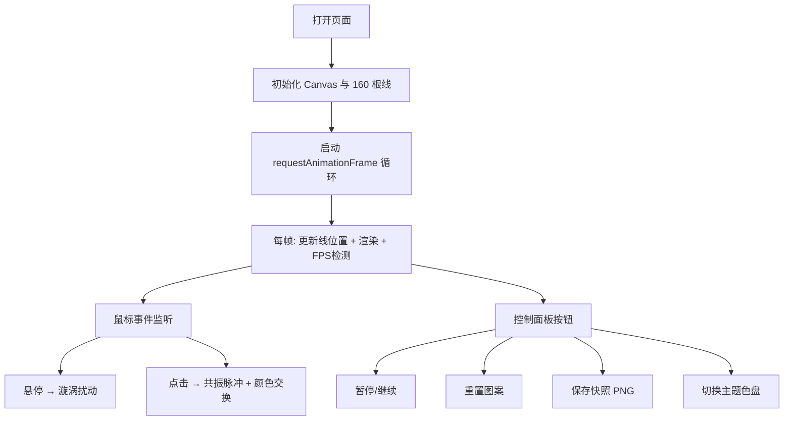

## 1. 产品概述

MagicLoom 是一款基于浏览器的交互式动态魔法挂毯生成器，通过 Canvas 2D 渲染数百根彩色经纬线，配合粒子系统规则（吸引力、排斥力、随机扰动）实时驱动线的颜色与运动，使整体图案呈现如生物般缓慢呼吸、流淌的视觉效果。用户可通过鼠标悬停产生漩涡、点击触发共振脉冲，与挂毯进行沉浸式交互。

- 目标用户：视觉艺术爱好者、创意交互体验探索者
- 产品价值：提供一个可实时交互、极具视觉冲击力的生成式艺术作品

## 2. 核心功能

### 2.1 功能模块

1. **主画布场景**：全屏 Canvas，挂毯居中（占 80% 宽高），左右 10% 金色符文发光边框
2. **编织系统**：80 根经线 + 80 根纬线，共 6400 交织点，每帧匀速运动并随机从色盘取色
3. **鼠标交互**：
   - 悬停产生 80px 半径漩涡，线被吸入旋转并向白色渐变，移开 3s ease-out 恢复
   - 左键点击触发共振脉冲（1.2s，15px 幅度）+ 随机交换相邻线颜色
4. **控制面板**：暂停/继续、重置图案、保存快照（512×512 PNG 下载）、切换主题
5. **性能自适应**：FPS 低于 55 时自动降采样 40% 计算量

### 2.3 页面详情

| 页面名称 | 模块名称 | 功能描述 |
|-----------|-------------|---------------------|
| 主页 | 主画布 | 全屏 Canvas 渲染挂毯、边框符文、动画循环 |
| 主页 | 控制面板 | 顶部透明栏，四按钮控制状态 |
| 主页 | 交互系统 | 鼠标悬停漩涡 / 点击脉冲 |

## 3. 核心流程

用户打开页面 → 初始化 160 根线并启动动画循环 → 挂毯持续呼吸流动  
用户悬停挂毯 → 产生漩涡扰动，颜色渐变 → 移开 → 3s 内缓动恢复  
用户点击挂毯 → 全局脉冲扩散收缩 → 随机交换相邻颜色 → 图案突变  
用户点击保存快照 → 导出 512×512 PNG 下载

## 4. 用户界面设计

### 4.1 设计风格
- 整体风格：神秘魔法、深邃宇宙、金色符文点缀
- 主色调（默认色盘）：紫 #6C5CE7 / 蓝 #0984E3 / 粉 #FD79A8 / 橙 #FDCB6E / 绿 #00B894
- 边框符文：金色 #FFD700，闪烁周期 2s
- 按钮：圆角 8px，深色底 #2D3436 + 白色文字，hover 放大 1.1 倍 + 发光阴影，0.2s 过渡

### 4.2 页面设计概览

| 页面名称 | 模块名称 | UI 元素 |
|-----------|-------------|-------------|
| 主页 | 主画布 | 全屏黑色背景，居中 80% 挂毯，两侧金色符文边框 |
| 主页 | 控制面板 | 顶部 50px 透明条 rgba(0,0,0,0.3)，圆角 20px，四按钮等距 16px |

### 4.3 响应式
- 桌面优先，Canvas 自适应窗口大小
- 控制面板始终居中并适配宽度
- 触摸设备支持：touchstart 触发脉冲，touchmove 触发漩涡
