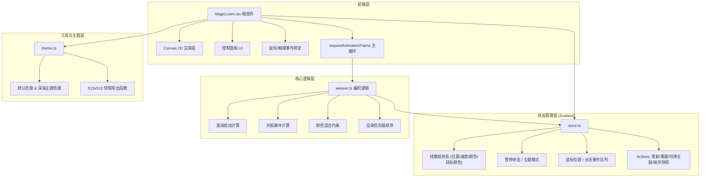

## 1. 架构设计



## 2. 技术描述

- 前端框架：React 18 + TypeScript
- 构建工具：Vite（开发端口 3000）
- 状态管理：Zustand
- 渲染引擎：Canvas 2D API（原生，无第三方库）
- 辅助库：uuid（生成唯一线 ID）
- 后端：无（纯前端）
- 数据库：无

## 3. 路由定义

| 路由 | 用途 |
|-------|---------|
| / | 主页：全屏挂毯 + 控制面板 |

## 4. 核心数据模型

### 4.1 线对象 (Line)

| 字段 | 类型 | 说明 |
|------|------|------|
| id | string | 唯一标识 |
| type | 'warp' \| 'weft' | 经线 (垂直) 或 纬线 (水平) |
| index | number | 在同类型线中的索引 0-79 |
| basePos | number | 基础位置 (百分比 0-1) |
| offset | number | 当前偏移量 (像素) |
| targetOffset | number | 目标偏移量 (用于缓动) |
| speed | number | 速度 (像素/帧)，默认 0.5 |
| direction | 1 \| -1 | 运动方向 |
| color | string | 当前颜色 (hex) |
| targetColor | string | 目标颜色 (hex)，用于颜色渐变 |
| colorMix | number | 颜色混合进度 0-1 |

### 4.2 漩涡状态 (VortexState)

| 字段 | 类型 | 说明 |
|------|------|------|
| active | boolean | 是否激活 |
| x | number | 中心 x 坐标 |
| y | number | 中心 y 坐标 |
| radius | number | 半径 80px |
| recoveryStart | number \| null | 恢复开始时间戳 |

### 4.3 脉冲事件 (PulseEvent)

| 字段 | 类型 | 说明 |
|------|------|------|
| startTime | number | 开始时间戳 |
| duration | number | 持续时间 1200ms |
| amplitude | number | 幅度 15px |

## 5. 文件结构

```
auto50/
├── index.html                    # 入口 HTML
├── package.json                  # 依赖配置
├── vite.config.js                # Vite 配置 (端口 3000)
├── tsconfig.json                 # TS 配置 (严格/ES2020/ESNext)
└── src/
    ├── main.tsx                  # React 入口
    ├── App.tsx                   # 应用根
    ├── MagicLoom.tsx             # 主组件 (画布/事件/动画循环)
    ├── store.ts                  # Zustand 全局状态
    ├── weaver.ts                 # 编织核心逻辑
    ├── theme.ts                  # 色盘 + 快照导出
    └── index.css                 # 全局样式
```

## 6. 性能策略

- FPS 监控：每 500ms 计算一次平均 FPS
- 降采样触发：FPS < 55 时，将线更新步长从每帧变为每 2 帧（减少 40% 计算量）
- 渲染优化：
  - 离屏 Canvas 预渲染边框符文
  - 线宽固定 2px，使用 `lineCap: 'round'` 避免锯齿
  - 仅在可见区域内绘制
- 内存：线数组固定长度 160，避免频繁 GC
