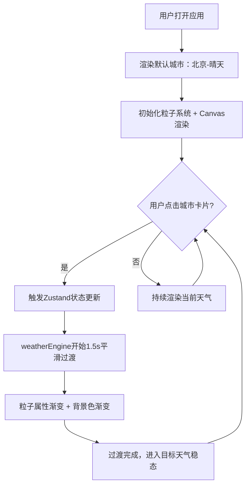

## 1. 产品概述

SkyParticle 是一个在线天气粒子沙盒应用，为前端爱好者和博客访客提供沉浸式的天气视觉体验。用户通过切换预设城市卡片，即可实时感受不同天气类型（晴天、雨天、雪天、雷暴）的动态粒子效果，每种天气都有独特的粒子系统和视觉氛围。

- 核心目标：通过 Canvas 2D 粒子渲染技术，打造可交互、高性能的天气视觉沙盒
- 目标用户：前端爱好者、个人博客访客、视觉效果学习者
- 产品价值：将抽象的天气概念转化为直观、可交互的动态视觉体验

## 2. 核心特性

### 2.1 用户角色
无需注册，所有访客均可使用全部功能。

### 2.2 功能模块
1. **主沙盒页面**：城市选择器、粒子画布、性能监控面板

### 2.3 页面详情
| 页面名称 | 模块名称 | 功能描述 |
|---------|---------|---------|
| 主沙盒页面 | 城市选择器 | 水平滚动的城市卡片列表，点击切换天气场景 |
| 主沙盒页面 | 粒子画布 | Canvas 2D 渲染区域，实时展示天气粒子效果 |
| 主沙盒页面 | 性能监控面板 | 实时显示当前 FPS 和粒子数量 |

## 3. 核心流程

用户打开应用 → 看到默认城市（北京-晴天）的粒子效果 → 点击其他城市卡片 → 粒子系统平滑过渡（1.5秒 ease-in-out）到目标天气 → 背景色渐变切换 → 粒子数量、颜色、大小、运动轨迹平滑变化 → 实时监控 FPS 和粒子数

## 4. 用户界面设计

### 4.1 设计风格
- **整体主题**：深色沉浸式科技风格，背景渐变 #1A1A2E → #16213E
- **色彩系统**：
  - 晴天主题色：#87CEEB（天蓝）+ #FFD700（金色光晕）
  - 雨天主题色：#4A6785（灰蓝）+ #B0C4DE（水雾）
  - 雪天主题色：#DCE3F0（浅灰蓝）+ 白色雪花
  - 雷暴主题色：#2C3E50（深灰蓝）+ #FFD700（闪电金）
- **字体**：monospace 用于性能面板，中文系统字体用于城市名
- **交互风格**：卡片悬停放大 + 阴影，选中发光边框动画
- **图标风格**：Unicode 天气符号 ☀️🌧️❄️⛈️

### 4.2 页面设计概述
| 页面名称 | 模块名称 | UI 元素 |
|---------|---------|---------|
| 主沙盒页面 | 城市选择器 | 固定顶部高度110px，水平滚动，卡片120x160px圆角16px，渐变背景，左上角城市名（14px白+黑text-shadow），右下角温度+天气图标，悬停scale(1.05)+box-shadow，选中发光边框（3px宽+10px扩散，0.3s ease-out） |
| 主沙盒页面 | 粒子画布 | 占满剩余区域，Canvas全屏自适应，背景色随天气渐变 |
| 主沙盒页面 | 性能监控面板 | 固定画布右上角，内边距8px，背景rgba(0,0,0,0.6)圆角8px，14px monospace #00FF88，显示FPS和粒子数 |

### 4.3 响应式设计
- **桌面端**（≥768px）：默认布局，卡片120x160px，字体14px，完整粒子数
- **移动端**（<768px）：卡片缩小80x100px，字体降为12px，粒子数量减半确保流畅

### 4.4 粒子效果详情
- **晴天**：500个淡黄色圆点（半径2-4px），缓慢飘动（0.2-0.8px/帧），闪烁（透明度0.6-1.0，周期2-4s），顶部径向渐变太阳光晕（#FFD700→透明，半径100px）
- **雨天**：1000个蓝色细长椭圆（宽2px，高6-10px），75-85度斜向下落（4-6px/帧），底部水雾（半透明#B0C4DE，每秒生成20个，0.5s消散）
- **雪天**：800个白色六边形（半径3-6px，Canvas路径绘制），正弦波摇摆下落（幅度5px，周期1.5s），地面白色覆盖层累积至透明度0.3
- **雷暴**：600个深灰色矩形（宽3-6px，高2-4px），高速斜下落（8-12px/帧），每3-5s闪电（全屏白0.7透明度100ms）+30个金色高亮粒子（#FFD700，5px）从顶部下坠
