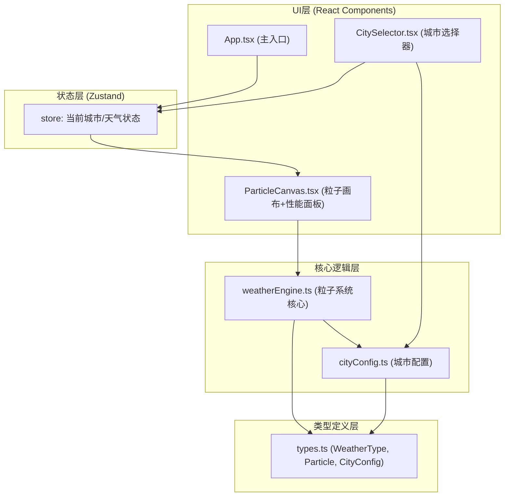

## 1. 架构设计

纯前端架构，基于 React + TypeScript + Vite，使用 Zustand 进行状态管理，Canvas 2D 进行粒子渲染。



**数据流向**：
1. 用户点击 CitySelector 卡片 → 触发 Zustand store 的 setCurrentCity()
2. store 更新 → ParticleCanvas 通过 useEffect 监听变化
3. ParticleCanvas 调用 weatherEngine.transitionTo(targetConfig)
4. weatherEngine 每帧执行 update(deltaTime) + render(ctx)
5. weatherEngine 对外暴露 getParticleCount() 和 getFps() 给性能面板

## 2. 技术描述
- **前端框架**：React@18 + React-DOM@18
- **构建工具**：Vite（vite.config.js 基础配置 + React 插件）
- **语言**：TypeScript（严格模式，target ES2020）
- **状态管理**：Zustand
- **工具库**：uuid
- **渲染技术**：Canvas 2D API
- **无后端，纯前端项目**

## 3. 路由定义
单页应用，无路由。
| 路由 | 用途 |
|------|------|
| / | 主沙盒页面（唯一页面） |

## 4. 项目文件结构

```
auto51/
├── package.json          # 依赖+脚本
├── vite.config.js        # Vite配置(React插件)
├── tsconfig.json         # TS严格模式+ES2020
├── index.html            # 入口页面(meta viewport+标题)
└── src/
    ├── main.tsx          # React挂载入口
    ├── types.ts          # 全局类型定义(WeatherType, Particle, CityConfig)
    ├── cityConfig.ts     # 4个城市配置(北京/伦敦/莫斯科/新加坡)
    ├── weatherEngine.ts  # 粒子系统核心(update/render/transition)
    ├── store.ts          # Zustand store(当前城市+天气)
    └── components/
        ├── App.tsx           # 主容器组件
        ├── CitySelector.tsx  # 城市卡片选择器
        └── ParticleCanvas.tsx # Canvas画布+性能面板
```

## 5. 核心模块说明

### 5.1 types.ts（被所有模块引用）
```typescript
enum WeatherType { Sunny, Rainy, Snowy, Thunderstorm }
interface Particle { x,y,vx,vy,size,color,opacity,shape,... }
interface CityConfig { id,name,weatherType,temperature,humidity,windSpeed,particleParams,themeColors }
```

### 5.2 weatherEngine.ts（核心）
- `constructor()`：初始化空粒子池
- `setConfig(config, canvasSize)`：设置目标配置（用于首次初始化）
- `transitionTo(targetConfig, duration=1500ms)`：启动过渡动画，内部记录startConfig+startTime，每帧ease-in-out插值
- `update(deltaTime)`：更新粒子位置/颜色/大小/透明度；处理过渡插值；处理晴天闪烁/雨天水雾/雪天积雪/雷暴闪电的特殊逻辑
- `render(ctx)`：按粒子shape绘制（圆/椭圆/六边形/矩形）；绘制太阳光晕/水雾/积雪/闪电遮罩
- `getParticleCount()`：返回当前活跃粒子数
- `getFps()`：返回最近10帧平均FPS

### 5.3 cityConfig.ts
导出 `CITIES: CityConfig[]` 和 `DEFAULT_CITY_ID`
- 北京：晴天，温度28°C，粒子淡黄圆点500个，背景#87CEEB
- 伦敦：雨天，温度12°C，蓝色椭圆1000个，背景#4A6785
- 莫斯科：雪天，温度-5°C，白色六边形800个，背景#DCE3F0
- 新加坡：雷暴，温度26°C，深灰矩形600个，背景#2C3E50

### 5.4 store.ts（Zustand）
```typescript
useStore = create({
  currentCityId: DEFAULT_CITY_ID,
  currentCity: CITIES[0],
  setCurrentCity: (id) => {...},
  isMobile: false,
  setIsMobile: (v) => {...}
})
```

### 5.5 CitySelector.tsx
- 使用 useStore 获取 currentCityId 和 setCurrentCity
- 水平滚动容器（overflow-x: auto, scrollbar-hide）
- 卡片：120x160px（移动端80x100px），border-radius 16px
- 背景渐变：使用cityConfig的themeColors.gradient
- 选中卡片：border 3px + box-shadow glow，CSS animation 0.3s ease-out
- 悬停：transform scale(1.05) + box-shadow 0 4px 20px rgba(255,255,255,0.2)，transition 0.2s

### 5.6 ParticleCanvas.tsx
- `<canvas ref={canvasRef} style={{width:'100%',height:'100%'}} />`
- useEffect 1：初始化 weatherEngine 实例，启动 requestAnimationFrame 循环
- useEffect 2：监听 store.currentCity 变化，调用 engine.transitionTo()
- useEffect 3：监听窗口 resize，更新 canvas 实际像素尺寸（devicePixelRatio）
- 性能面板：绝对定位 top:16px right:16px，读取 engine.getFps() 和 getParticleCount()，每帧刷新（用useRef+requestAnimationFrame更新DOM避免React重渲染）

## 6. 性能优化策略
- Canvas 使用 devicePixelRatio 适配高清屏，但避免超高倍率（限制max DPR=2）
- 粒子对象池复用（transition时不重新创建数组，修改现有粒子属性，不足时补充，多余时标记inactive）
- 性能面板更新绕过 React setState，直接操作 DOM（useRef + textContent）
- requestAnimationFrame 循环中使用 deltaTime 控制速度，确保不同帧率下运动一致
- 移动端粒子数减半，粒子尺寸参数也做响应式
- 积雪层使用离屏Canvas预渲染，不每帧重绘整个地面（仅累积叠加）
