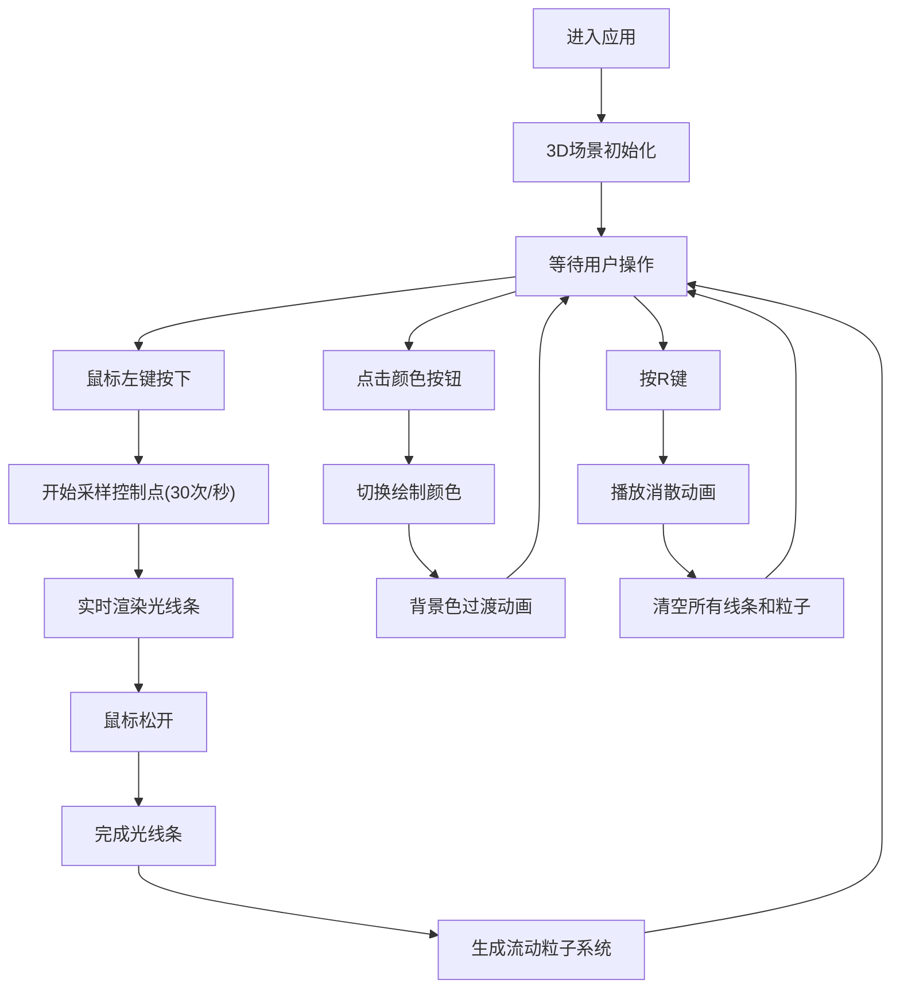

## 1. 产品概述
NeonSculpt是一款交互式3D光线雕塑应用，用户通过鼠标拖拽在三维空间中绘制发光光线条，形成动态立体光效雕塑。应用面向创意工作者、艺术爱好者和普通用户，提供沉浸式的3D创作体验。

- 核心价值：让用户无需专业3D技能即可创作出精美的动态光线雕塑作品
- 目标用户：数字艺术家、创意爱好者、休闲用户

## 2. 核心功能

### 2.1 用户角色
| 角色 | 注册方式 | 核心权限 |
|------|----------|----------|
| 普通用户 | 无需注册 | 使用所有绘制和交互功能 |

### 2.2 功能模块
1. **3D绘制系统**：鼠标拖拽生成光线条，实时渲染发光效果
2. **粒子流动系统**：每条光线条上流动的光粒子轨迹
3. **颜色选择系统**：四种霓虹色切换，背景色联动过渡
4. **重置与动画系统**：一键清除所有线条，带消散动画效果
5. **视角控制系统**：轨道控制器支持自由旋转缩放视角

### 2.3 页面详情
| 页面名称 | 模块名称 | 功能描述 |
|---------|---------|----------|
| 主页面 | 3D画布 | 全屏Three.js渲染场景，支持鼠标拖拽绘制 |
| 主页面 | 颜色选择器 | 右下角4个圆形颜色按钮，点击切换绘制颜色 |
| 主页面 | 操作提示 | 左上角半透明文字提示操作方式 |
| 主页面 | 重置功能 | R键一键清除所有光线条和粒子 |

## 3. 核心流程
用户进入应用后看到深空蓝背景的3D场景，可以通过轨道控制器旋转查看空间。按住鼠标左键拖拽即可在三维空间中绘制发光光线条，线条会自动发光并产生流动粒子。点击右下角颜色按钮可切换绘制颜色并联动背景变化。按R键可一键清除所有内容并播放消散动画。

## 4. 用户界面设计

### 4.1 设计风格
- **主色调**：深空蓝 #0D0D2B（背景）
- **霓虹色盘**：霓虹粉#FF007F、电光蓝#00F0FF、镭射绿#39FF14、紫外紫#BF00FF
- **按钮风格**：圆形32px直径，选中时2px白色描边
- **字体**：现代无衬线字体，14px操作提示文字
- **布局风格**：全屏沉浸布局，UI元素悬浮于3D场景之上
- **视觉效果**：发光材质、粒子流动、平滑过渡动画

### 4.2 页面设计概述
| 页面名称 | 模块名称 | UI元素 |
|---------|---------|--------|
| 主页面 | 3D画布 | TubeGeometry发光线条、Points粒子系统、轨道控制器、平行光+环境光 |
| 主页面 | 颜色选择器 | 4个圆形按钮，固定在右下角(-80px,-80px偏移)，点击反馈动画 |
| 主页面 | 操作提示 | 左上角20px处，半透明白色文字'拖拽绘制 | R重置' |
| 主页面 | 消散动画 | 线条从末端向起点逐段缩小消失，透明度渐变 |

### 4.3 响应性
- Desktop-first设计，全屏渲染
- 支持鼠标拖拽、滚轮缩放、键盘快捷键
- 颜色按钮固定位置，不受窗口大小影响

### 4.4 3D场景指导
- **环境**：深空蓝背景 #0D0D2B，营造宇宙空间感
- **光照**：右上角平行光源(位置5,5,5，强度0.5) + 环境光(强度0.3)
- **相机**：默认位置(3,3,3)朝向原点，缩放范围0.5-5单位
- **构图**：用户绘制内容为焦点，UI元素边缘悬浮不遮挡
- **交互**：鼠标拖拽绘制，轨道控制器旋转缩放，键盘R键重置
- **后处理**：发光材质emissive属性，粒子系统营造流动感
- **性能预算**：最多50条光线条，每条最多50个控制点，总粒子数不超过5000
